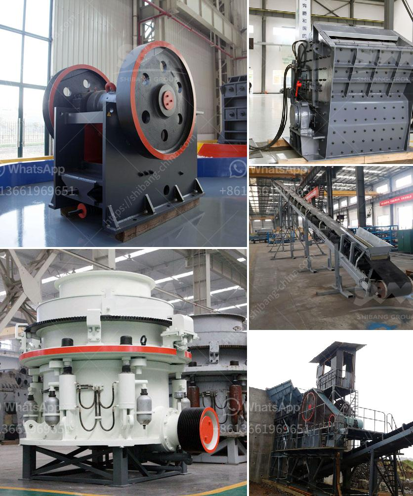

<h3>آلات وتجهيزات تسمين الجير</h3>
تعتبر آلات وتجهيزات تسمين الجير جزءًا هامًا من صناعة تربية الحيوانات، حيث تساهم في زيادة وزن الجير بفعالية، وبالتالي زيادة العائد المالي للمربين. تأتي هذه الآلات والتجهيزات بأشكال وأحجام متنوعة اعتمادًا على نوع الحيوان المطلوب تسمينه وطول فترة التسمين.

أحد أهم أنواع هذه الآلات هو العلفيات الآلية. تعتبر العلفيات الآلية أكثر فعالية في تسمين الجير بالمقارنة مع العلفيات اليدوية التقليدية، حيث تتميز بتوفير العمالة والوقت وتحسين جودة العلف الذي يتناوله الجير. تحتوي هذه الآلات على خزانات لتخزين العلف وأنابيب ومضخات لضخ العلف داخل الأكواب أو الصواني المخصصة للجير. بالإضافة إلى ذلك، تحتوي العلفيات الآلية على آليات تحكم آلي تسمح بتحديد كمية العلف المطلوبة لكل جير وتوزيعها بشكل مناسب.

تتضمن التجهيزات الأخرى التي تُستخدم في تسمين الجير أجهزة المياه الآلية. يعتبر توفير مياه نظيفة وصالحة للشرب من أهم العوامل التي تؤثر في صحة ونمو الجير. لذلك، فإن استخدام أجهزة المياه الآلية يضمن توفير مياه نظيفة ومنعشة للحيوانات. تتكون هذه الأجهزة من خزانات مياه وأنابيب ومضخات، يتم استخدامها لضخ المياه من الخزانات وتوزيعها بشكل منتظم داخل الأقفاص أو المرافق المخصصة لتسمين الجير.

بالإضافة إلى ذلك، يمكن استخدام آلات الوزن الآلية في عملية تسمين الجير. تعتبر آلات الوزن الآلية ضرورية في عملية تقييم زيادة وزن الجير ورصدها بشكل دقيق. تحتوي هذه الآلات على أرضية مصنوعة من مواد متينة وأنظمة وزن دقيقة، تسمح برصد زيادة الوزن بشكل مستمر ودقيق. يتم توزيع الجير في الأقفاص أو الأحواش وفقًا لأوزانهم الحالية والمستهدفة، وبالتالي، يتم توفير نظام تغذية متوازن للجير.

استخدام آلات وتجهيزات تسمين الجير يعتبر أمرًا حاسمًا لتحسين كفاءة تربية الحيوانات وزيادة العائد المالي للمربين. فهي تسهم في تقديم رعاية ممتازة للجير وتوفير بيئة صحية ومريحة لهم. كما أن استخدام هذه الآلات يساعد في توفير العمالة والوقت وتقليل التكاليف العامة للمربين. لذا، يجب على المربين الاستثمار في هذه الآلات والتجهيزات لضمان النمو الصحي والمربح للجير.
<h3>Contact us</h3><ul><li><strong>Whatsapp:&nbsp;<a href="https://wa.me/8613661969651">+8613661969651</a></strong></li><li><a href="https://swt.shibang-china.com/?git&amp;zhl&amp;آلات وتجهيزات تسمين الجير"><strong>Online Service(chat now)</strong></a></li></ul><h3>Related</h3><ul><li><a href='كسارة لفة مسننة جاجيد.md'>كسارة لفة مسننة جاجيد</a></li><li><a href='موزعون للأحزمة والناقلات في إندونيسيا.md'>موزعون للأحزمة والناقلات في إندونيسيا</a></li><li><a href='مصنع تكسير حجر الجرانيت في كينيا.md'>مصنع تكسير حجر الجرانيت في كينيا</a></li><li><a href='معدات كسارة الفك للبيع في الفلبين.md'>معدات كسارة الفك للبيع في الفلبين</a></li><li><a href='استفادة من خام الحديد بوسائل جافة.md'>استفادة من خام الحديد بوسائل جافة</a></li></ul>