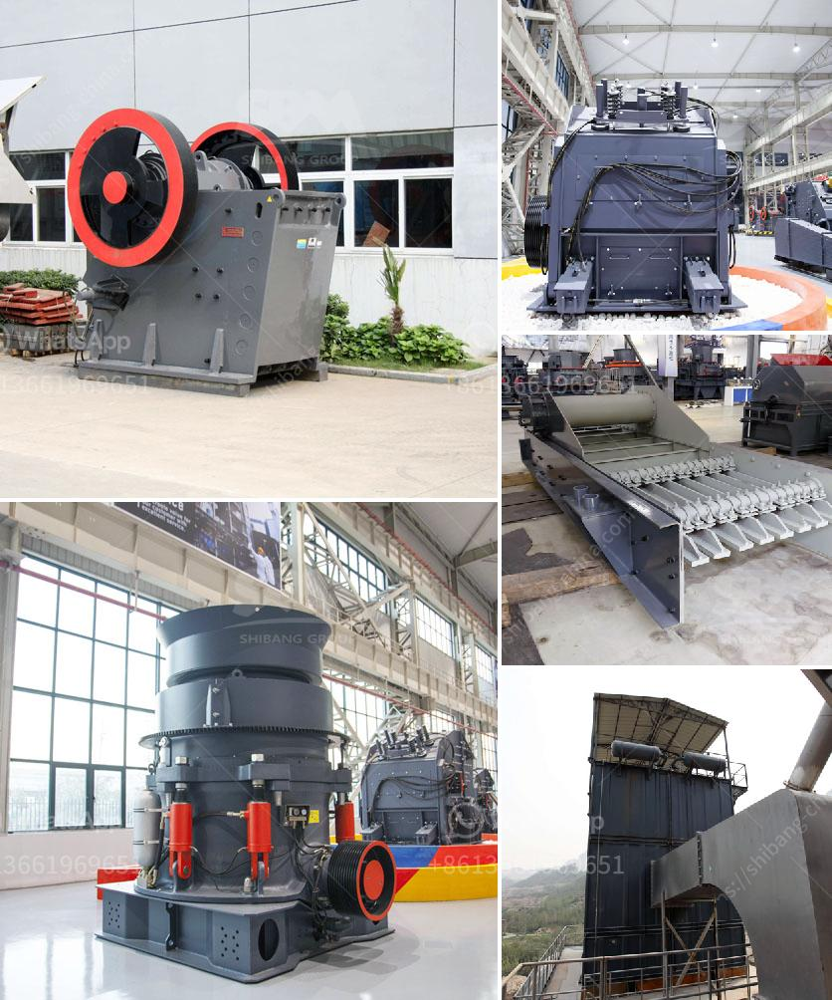

<h3>آلات ومعدات تعدين واستغلال المحاجر</h3>
في مجال التعدين واستغلال المحاجر، تعتبر الآلات والمعدات من العوامل الرئيسية التي تساهم في تحقيق الكفاءة والإنتاجية المرتفعة. يعتمد استخدام الآلات على نوعية المعدن المستخرج ونطاق العمل المطلوب، وفي ما يلي سنتطرق إلى بعض الآلات والمعدات الرئيسية المستخدمة في هذه الصناعة.

أولاً، للتعدين السطحي تستخدم آلات حفر الجرافات والبكرات الضخمة. تستخدم الجرافات لنقل الصخور والتربة من الفحم أو الخامات المعدنية ونقلها إلى الشاحنات أو الناقلات. أما البكرات الضخمة فتقوم بحفر منحدرات وشقوق في الأرض لسحب الخامات المعدنية.

ثانيًا، يستخدم في العمليات المتعلقة بالنقل والتوزيع آلات أخرى مثل الشاحنات الضخمة والحفارات. تستخدم الشاحنات الضخمة لنقل الخامات من المواقع إلى المصانع أو المناطق الأخرى للتجهيز والتصنيع. أما الحفارات فتستخدم لتكسير الصخور وتفتيتها لجعل عملية النقل أسهل وأكثر فعالية.

ثالثًا، يستخدم آلات الطحن والكسر في التعدين واستغلال المحاجر. يتم استخدام آلات الطحن لسحق الخامات المعدنية والصخور إلى حجم صغير جداً يمكن من خلاله فصل العناصر المعدنية عن الصخور العادية. أما الكسارات فتستخدم لتكسير الصخور الكبيرة إلى قطع صغيرة قابلة للطحن.

رابعًا، تعتبر آلات الفصل وفصل المغناطيسي من الآلات الرئيسية في هذه الصناعة. تستخدم آلات الفصل لفصل العناصر المعدنية عن غيرها من المواد، حيث يتم اعتماد المغناطيسية في عملية الفصل. تعتمد كفاءة هذه الآلات على قدرتها على فصل العناصر المعدنية بدقة وسرعة.

في النهاية، يجب الإشارة إلى أن استخدام الآلات والمعدات المتطورة يعزز من كفاءة عمليات التعدين واستغلال المحاجر، حيث يتم تحسين تحقيق الإنتاجية والدقة في العمليات. وعلى الرغم من أهمية الآلات والمعدات في هذه الصناعة، يجب أن يكون التركيز دائمًا على توفير الصيانة الدورية والتدريب المستمر للعمال على استخدامها بهدف الحفاظ على السلامة والجودة في مواقع التعدين والمحاجر.
<h3>Contact us</h3><ul><li><strong>Whatsapp:&nbsp;<a href="https://wa.me/8613661969651">+8613661969651</a></strong></li><li><a href="https://swt.shibang-china.com/?git&amp;zhl&amp;آلات ومعدات تعدين واستغلال المحاجر"><strong>Online Service(chat now)</strong></a></li></ul><h3>Related</h3><ul><li><a href='شركة مبيعات كسارة الحجر في كينيا.md'>شركة مبيعات كسارة الحجر في كينيا</a></li><li><a href='سعر آلات كسارة المحجر.md'>سعر آلات كسارة المحجر</a></li><li><a href='آلة طحن الكرة من المنغنيز.md'>آلة طحن الكرة من المنغنيز</a></li><li><a href='كسارة حجرية للبيع.md'>كسارة حجرية للبيع</a></li><li><a href='كيفية حساب كفاءة الكسارة.md'>كيفية حساب كفاءة الكسارة</a></li></ul>