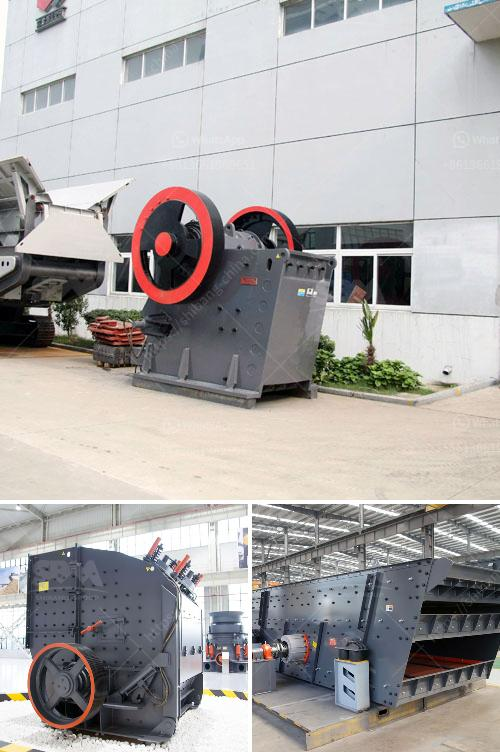

<h3>آلة التكسير للبيع في نيجيريا</h3>
تعد آلة التكسير من الآلات الهامة في قطاع البناء والهندسة المدنية في نيجيريا. تلعب الآلة دورًا حاسمًا في عملية تكسير الصخور والحصى لإنتاج مواد بناء عالية الجودة للمشاريع المختلفة. تتوفر آلات التكسير للبيع في نيجيريا في مجموعة واسعة من الأحجام والقدرات، ويتراوح سعرها عادة بين 200 إلى 400 ألف نيرة.

تحظى آلات التكسير بشعبية كبيرة بين المقاولين وأصحاب المشروعات في نيجيريا، حيث توفر الآلات الحلول المبتكرة والمؤكدة لعملية تكسير المواد الصلبة. تعتبر الآلات هذه مناسبة لمختلف أنواع المواد مثل الصخر الطبيعي والحصى والحجارة الصلبة الأخرى. وتتوفر آلات التكسير بتصميمات متنوعة تتيح تكسير المواد بطرق مختلفة، مثل التكسير الأولي والثانوي والتكسير النهائي.

يتميز سوق بيع آلات التكسير في نيجيريا بتوفر العديد من الشركات المصنعة المعروفة، مما يعزز التنافسية ويحفز مستوى الجودة والأداء للآلات المعروضة في الأسواق. يتم توفير هذه الآلات عن طريق وكلاء وموزعين معتمدين في مختلف المدن والمناطق الرئيسية في البلاد.

أحد أمثلة رائجة لآلة التكسير المتاحة في نيجيريا هي الكسارة الفكية. تعتبر الكسارة الفكية من الآلات المشهورة والموثوقة في تكسير المواد الصلبة، حيث تستخدم لتحطيم الصخور إلى قطع صغيرة تصلح للاستخدام في مشاريع البناء المختلفة. تتوفر الكسارات الفكية بأحجام مختلفة لتناسب احتياجات المشروع والمتطلبات الفنية.

بالنظر إلى التنمية المستدامة المستقبلية لنيجيريا ونمو قطاع البناء، فإن آلة التكسير للبيع تعد استثمارًا ذكيًا للمقاولين والمشاريع العقارية. فهي تساهم في تحقيق وفورات كبيرة في تكلفة المشروع ووقت التنفيذ، بالإضافة إلى زيادة الكفاءة والإنتاجية.

في الختام، يمكن القول أن آلة التكسير للبيع في نيجيريا تلعب دورًا حاسمًا في تعزيز وتنمية قطاع البناء والهندسة المدنية. تتوفر هذه الآلات بأحجام ومواصفات مختلفة، وتوفر الحلول المثلى لتلبية احتياجات المشروع وتحقيق الفوائد الاقتصادية والتنموية.
<h3>Contact us</h3><ul><li><strong>Whatsapp:&nbsp;<a href="https://wa.me/8613661969651">+8613661969651</a></strong></li><li><a href="https://swt.shibang-china.com/?git&amp;zhl&amp;آلة التكسير للبيع في نيجيريا"><strong>Online Service(chat now)</strong></a></li></ul><h3>Related</h3><ul><li><a href='أفضل آلة سحق الكوارتز في الهند.md'>أفضل آلة سحق الكوارتز في الهند</a></li><li><a href='مصنع معالجة الإسمنت.md'>مصنع معالجة الإسمنت</a></li><li><a href='صورة خط إنتاج الكلنكر الاسمنتي.md'>صورة خط إنتاج الكلنكر الاسمنتي</a></li><li><a href='آلة معالجة البلانت.md'>آلة معالجة البلانت</a></li><li><a href='عملية سحق الصخور في الركام.md'>عملية سحق الصخور في الركام</a></li></ul>