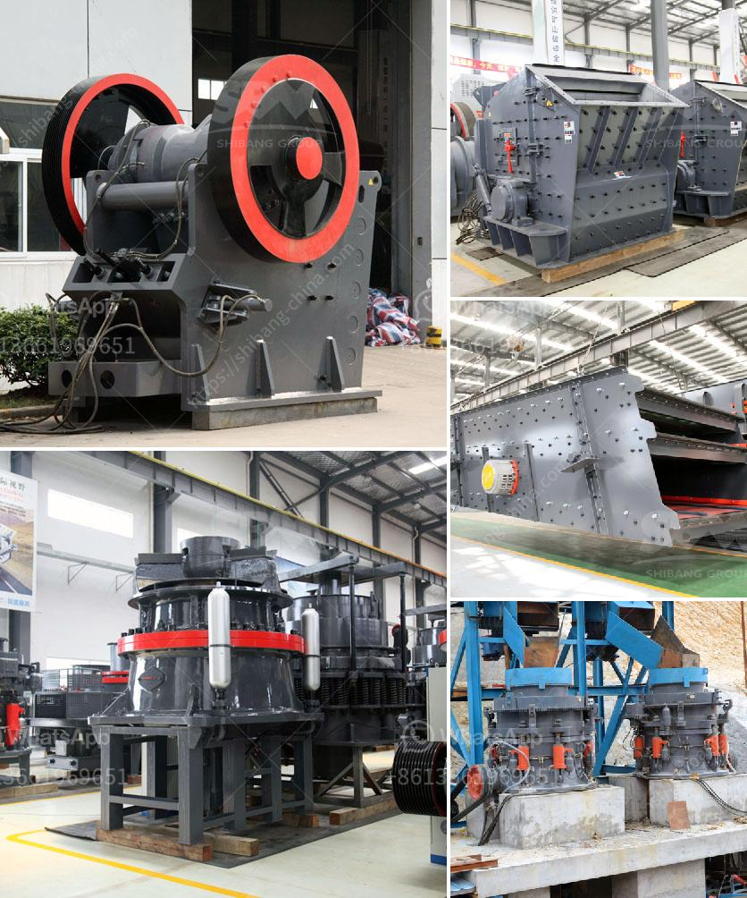

<h3>آلة الجبس في ألمانيا</h3>
تعتبر آلة الجبس واحدة من الأدوات الهامة في صناعة البناء والتشييد. وتتميز ألمانيا بأنها من الدول الرائدة في هذا المجال، حيث تعتبر ألمانيا من أكبر منتجي ومصدري آلات الجبس عالميا.

تعد آلة الجبس عبارة عن أداة تستخدم لتطبيق وتشكيل الجبس على الأسطح والجدران. وتتوفر العديد من الأنواع المختلفة لآلات الجبس في ألمانيا، مثل آلات الجبس اليدوية وآلات الجبس الآلية. وتتميز هذه الآلات بالدقة والكفاءة في تطبيق الجبس على الأسطح، مما يجعلها أدوات لا غنى عنها في صناعة البناء.

تعمل آلات الجبس في ألمانيا بواسطة قوة المحرك الكهربائي، وتأتي مزودة بفوهات وفراشي لتوزيع الجبس على الأسطح. وتتميز بسهولة الاستخدام والتحكم في سماكة الجبس وتوزيعه بشكل متساوي على الأسطح.

تستخدم آلات الجبس في ألمانيا في العديد من التطبيقات مثل تشكيل الجدران والأسقف الجبسية في المنازل والمباني التجارية. وتساهم في إيجاد تشطيبات عالية الجودة واحترافية في الأعمال البنائية.

تعتبر آلات الجبس في ألمانيا من الأدوات الحديثة والتقنية، وتتميز بالكفاءة والتوفير في العمل والموارد. حيث يمكن للعمال استخدام هذه الآلات لتركيب الجبس على المساحات الكبيرة بطريقة أسرع وأكثر دقة.

من المهم أن نذكر أن صناعة البناء والتشييد في ألمانيا تهتم بتطوير وتحسين تقنيات ألات الجبس باستمرار، وتعمل على توفير آلات أكثر تطورا وكفاءة. وذلك لتلبية احتياجات السوق وتحقيق معايير الجودة.

بإختصار، آلة الجبس في ألمانيا تعد أداة حديثة وفعالة في صناعة البناء. وتمتاز بالكفاءة والدقة في تطبيق الجبس على الأسطح، مما يسهم في الحصول على تشطيبات عالية الجودة. وتعكس الريادة والابتكار في هذا المجال التي تتمتع بها ألمانيا كدولة رائدة في صناعة البناء.
<h3>Contact us</h3><ul><li><strong>Whatsapp:&nbsp;<a href="https://wa.me/8613661969651">+8613661969651</a></strong></li><li><a href="https://swt.shibang-china.com/?git&amp;zhl&amp;آلة الجبس في ألمانيا"><strong>Online Service(chat now)</strong></a></li></ul><h3>Related</h3><ul><li><a href='موردين لسحق الصخور في بريتوريا.md'>موردين لسحق الصخور في بريتوريا</a></li><li><a href='سعر فحص الرمل بسعة كبيرة للبيع.md'>سعر فحص الرمل بسعة كبيرة للبيع</a></li><li><a href='كسارة الكرة النحاس آلة كسارة النحاس.md'>كسارة الكرة النحاس آلة كسارة النحاس</a></li><li><a href='مطحنة الأسطوانة للطحن.md'>مطحنة الأسطوانة للطحن</a></li><li><a href='قائمة أسعار الشاشات الاهتزازية.md'>قائمة أسعار الشاشات الاهتزازية</a></li></ul>