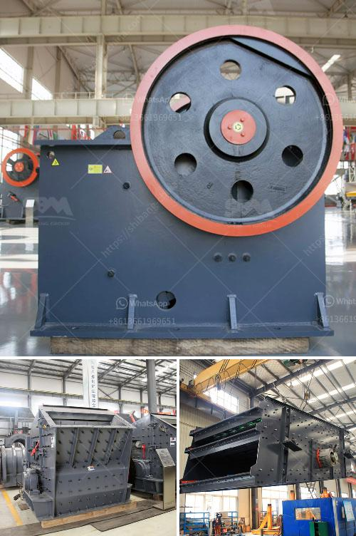

<h3>آلة الكالسيوم كاربونات الحجر</h3>
تُعد آلة الكالسيوم كاربونات الحجر أحد الآلات الحديثة التي تستخدم في صناعة الحجر الجيري. هذه الآلة مهمة جدًّا في العديد من الصناعات، بما في ذلك البناء والتشييد وصناعة الزجاج والسيراميك والمواد الكيميائية، حيث يتم استخدامها لإنتاج الكالسيوم كاربونات الحجر.

تعمل آلة الكالسيوم كاربونات الحجر عن طريق طحن الحجارة الجيرية إلى جزيئات صغيرة ومن ثمّ تخليطها مع الماء لإنتاج محلول مائي غني بالكالسيوم كاربونات. يتم بعدها استخدام عملية الترسيب الكيميائي أو عملية البلورة لتحويل المحلول المائي إلى الشكل النهائي للمنتج المطلوب.

من المهم أن نُشير إلى أن آلة الكالسيوم كاربونات الحجر ليست فقط سهلة الاستخدام وفعالة من حيث التكلفة، ولكنها أيضًا صديقة للبيئة. فعملية إنتاج الكالسيوم كاربونات الحجر عن طريق آلة الكالسيوم كاربونات الحجر لا تسبب آثار سلبية على البيئة، بالإضافة إلى أن المنتج النهائي يتمتع بخصائص فريدة مثل القدرة على امتصاص الماء والتحكم في التربة وتحسين نوعية التربة.

يستخدم الكالسيوم كاربونات الحجر في صناعة البناء كمادة رابطة للأسمنت ومواد الحشو، ويستخدم أيضًا في صناعة الألواح والأرضيات الخشبية والبلاستيكية، حيث يُضاف لها لتحسين خصائصها الميكانيكية والفيزيائية.

بالإضافة إلى ذلك، تستخدم آلة الكالسيوم كاربونات الحجر في صناعة الزجاج والسيراميك لتحسين خصائصهما، مثل قوة المرونة ومقاومة التآكل. كما يُستخدم أيضًا في صناعة المواد الكيميائية مثل الدهانات والمستحضرات الصيدلانية.

في النهاية، تُعد آلة الكالسيوم كاربونات الحجر حلاً مهمًا ومتكاملًا في الصناعات المختلفة، حيث توفر منتجًا عالي الجودة وصديقًا للبيئة لمجموعة واسعة من التطبيقات. إن تواجدها واستخدامها يعزز الاستدامة والكفاءة في العملية الإنتاجية للصناعات المختلفة.
<h3>Contact us</h3><ul><li><strong>Whatsapp:&nbsp;<a href="https://wa.me/8613661969651">+8613661969651</a></strong></li><li><a href="https://swt.shibang-china.com/?git&amp;zhl&amp;آلة الكالسيوم كاربونات الحجر"><strong>Online Service(chat now)</strong></a></li></ul><h3>Related</h3><ul><li><a href='كسارة صخرية صناعية.md'>كسارة صخرية صناعية</a></li><li><a href='كسارة الجرانيت المحمولة.md'>كسارة الجرانيت المحمولة</a></li><li><a href='تكلفة الآلات لمصنع الأسمنت.md'>تكلفة الآلات لمصنع الأسمنت</a></li><li><a href='إنتاج مطحنة الأسمنت في أفريقيا.md'>إنتاج مطحنة الأسمنت في أفريقيا</a></li><li><a href='مصنع تكسير الحجر في نيجيريا.md'>مصنع تكسير الحجر في نيجيريا</a></li></ul>