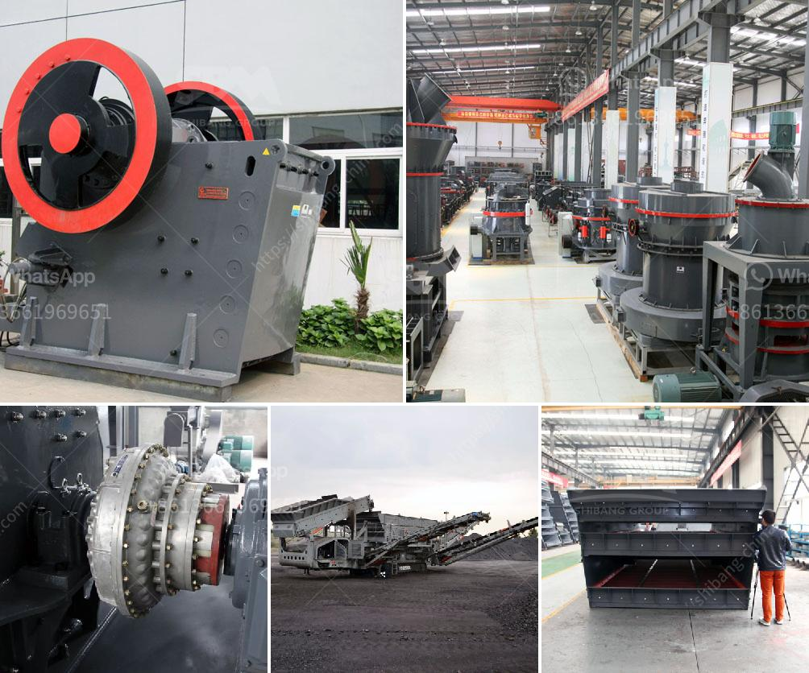

<h3>آلة الكوك البترولية</h3>
تُعد آلة الكوك البترولية أحد الأدوات الرئيسية المستخدمة في صناعة البترول. تهدف هذه الآلة إلى تحويل البتروكيماويات الثقيلة إلى منتجات صناعية مثل الكوك البترولي الصلب، الذي يمكن استخدامه في العديد من الصناعات المختلفة. يعتبر الكوك البترولي مادة مسحوقية ذات سعر حراري عالي ومقاومة ممتازة للحرارة، ولذلك يستخدم في توليد الطاقة والصناعات الحديدية والألومنيومية.

تتكون آلة الكوك البترولية من عدة مراحل. يتم خلال المرحلة الأولى تحميل البتروكيماويات الثقيلة في غلاية مشتعلة بدرجة حرارة مرتفعة، الأمر الذي يسمح بتحويل الكتلة العضوية إلى مركبات ثنائية السلفور ومركبات تحتوي على النيتروجين. بعد ذلك، يتم تحويل المركبات العضوية الثقيلة إلى كوك بترولي في الأماكن الخالية من الأوكسجين.

تتم المرحلة الثانية من آلة الكوك البترولية من خلال تفعيل عملية التحويل الكيميائي للكتلة العضوية إلى كوك بترولي. يتم ذلك بوضع البتروكيماويات الثقيلة في برج تحتوي على كتل حفزية تتفاعل مع الرؤوس الكبريتية لتشكيل مركبات ثنائية السلفور. وفي النهاية، يتم إعادة استخدام الغازات المتولدة في هذه العملية.

تعتبر آلة الكوك البترولية جزءًا حاسمًا من صناعة البترول، حيث يتم استخدام الكوك البترولي في عدة صناعات. فعلى سبيل المثال، يمكن استخدام الكوك البترولي في صناعة الحديد والصلب، حيث يُضاف إلى الأفران العالية لتوليد الحرارة اللازمة لصهر المواد الخام. كما يمكن استخدامه في صناعة الألومنيوم، حيث يلعب دورًا حاسمًا في عمليات تحسين وصهر الألمنيوم.

بالإضافة إلى ذلك، تعتبر آلة الكوك البترولية هامة في توليد الطاقة الكهربائية. فالكوك البترولي يمكن استخدامه كوقود في المراجل لتسخين المياه وتحويلها إلى بخار لتشغيل المحركات التوربينية التي تولد الكهرباء.

باختصار، تعد آلة الكوك البترولية أداة حيوية في صناعة البترول، حيث تقوم بتحويل البتروكيماويات الثقيلة إلى منتجات صناعية قيمة مثل الكوك البترولي. ونظرًا لاستخداماته العديدة في الصناعات المختلفة، يجب على الشركات البترولية الاستثمار في تطوير تلك الآلات وتحسين كفاءتها لتلبية الاحتياجات المتزايدة للسوق.
<h3>Contact us</h3><ul><li><strong>Whatsapp:&nbsp;<a href="https://wa.me/8613661969651">+8613661969651</a></strong></li><li><a href="https://swt.shibang-china.com/?git&amp;zhl&amp;آلة الكوك البترولية"><strong>Online Service(chat now)</strong></a></li></ul><h3>Related</h3><ul><li><a href='آلة فحص الرمل في ماليزيا.md'>آلة فحص الرمل في ماليزيا</a></li><li><a href='كسارة الفك هي.md'>كسارة الفك هي</a></li><li><a href='مطحنة أسطوانية الكالسيوم.md'>مطحنة أسطوانية الكالسيوم</a></li><li><a href='كسارات للركام الجرانيت.md'>كسارات للركام الجرانيت</a></li><li><a href='الجيوكيمياء التطبيقية لمعالجة اللميكا.md'>الجيوكيمياء التطبيقية لمعالجة اللميكا</a></li></ul>