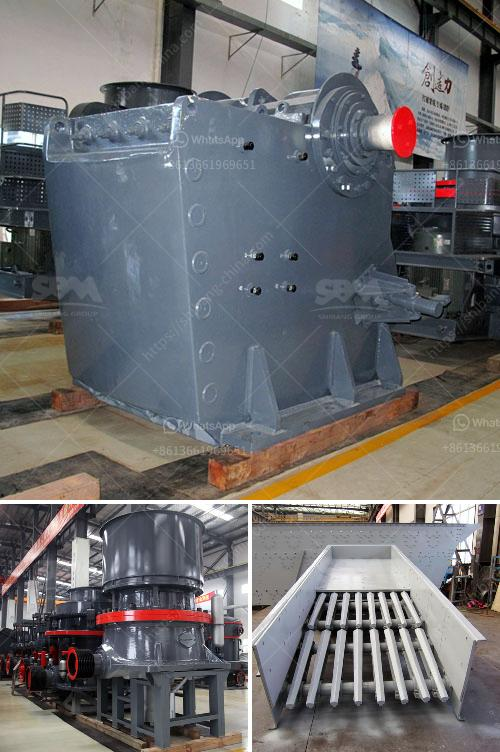

<h3>آلة المحجر للبيع</h3>
تعتبر آلة المحجر من الآلات الهامة في صناعة البناء والإنشاءات، فهي تستخدم لنقل وتحريك المواد الثقيلة والحجارة الكبيرة بطرق سريعة وفعالة. تتوفر آلات المحاجر بمختلف الأحجام والقدرات ، وتعتبر من أكثر الآلات التي تتطلبها المشاريع الكبيرة في مجال البناء.

إن آلة المحجر تتكون عادةً من هيكل قوي مصنوع من الفولاذ المقاوم للصدأ والحديد المثبت على عجلات للتحرك بسهولة. بالإضافة إلى ذلك ، تحتوي آلة المحجر على سلة متحركة وميكانيكية تستخدم للرفع وحمل المواد الثقيلة مثل الحجارة والحصى.

هناك العديد من الاستخدامات المختلفة لآلة المحجر، فهي تستخدم على نطاق واسع في مشاريع البناء والأعمال العامة. يتم استخدامها لنفخ وتسوية الأرض وتجميع ونقل المواد الثقيلة في المواقع الكبيرة. بفضل قدرتها على تحمل الأحمال الثقيلة والتحرك بسهولة على التضاريس الوعرة ، تعتبر آلة المحجر أداة قوية مطلوبة في أعمال البناء والإنشاءات.

يتوفر آلة المحجر للبيع بأسعار متفاوتة حسب المواصفات والحجم والعلامة التجارية. تتراوح الأسعار عادةً بين 200 و 400 دولار ، ولكن يجب مراعاة أيضًا تكاليف صيانة وتشغيل الآلة بالإضافة إلى تكاليف النقل والتسليم.

عند شراء آلة المحجر، يجب أن تنتبه إلى الجودة والأداء العام للآلة. يجب أن تكون قوية ومتينة للتحمل والاستخدام طويل الأمد. تحتاج أيضًا إلى التأكد من توافر قطع الغيار والصيانة السهلة للحفاظ على أداء الآلة على أعلى مستوى.

بالاعتماد على احتياجاتك وميزانيتك، يمكنك العثور بسهولة على آلة المحجر المناسبة لعملك. يمكنك البحث في المحلات المتخصصة في معدات البناء والإنشاء أو البحث عبر الإنترنت للعثور على اختيارات متنوعة من آلات المحاجر المتاحة للبيع.

في النهاية، يعد شراء آلة المحجر استثماراً جيداً لأي مشروع بناء كبير. بفضل قدرتها على تحمل الأحمال الثقيلة وتحركها بكفاءة ، تساعد آلة المحجر على زيادة إنتاجية موقع البناء وتقليل التكاليف والجهود البشرية المطلوبة.
<h3>Contact us</h3><ul><li><strong>Whatsapp:&nbsp;<a href="https://wa.me/8613661969651">+8613661969651</a></strong></li><li><a href="https://swt.shibang-china.com/?git&amp;zhl&amp;آلة المحجر للبيع"><strong>Online Service(chat now)</strong></a></li></ul><h3>Related</h3><ul><li><a href='تكسير الحجر المصنوع في ألمانيا.md'>تكسير الحجر المصنوع في ألمانيا</a></li><li><a href='خط إنتاج الخرسانة الثاني.md'>خط إنتاج الخرسانة الثاني</a></li><li><a href='معدات خط إنتاج كبريتات المغنيسيوم.md'>معدات خط إنتاج كبريتات المغنيسيوم</a></li><li><a href='أريد شراء آلة كسارة في باكستان.md'>أريد شراء آلة كسارة في باكستان</a></li><li><a href='موردين طاحونة الفحم.md'>موردين طاحونة الفحم</a></li></ul>