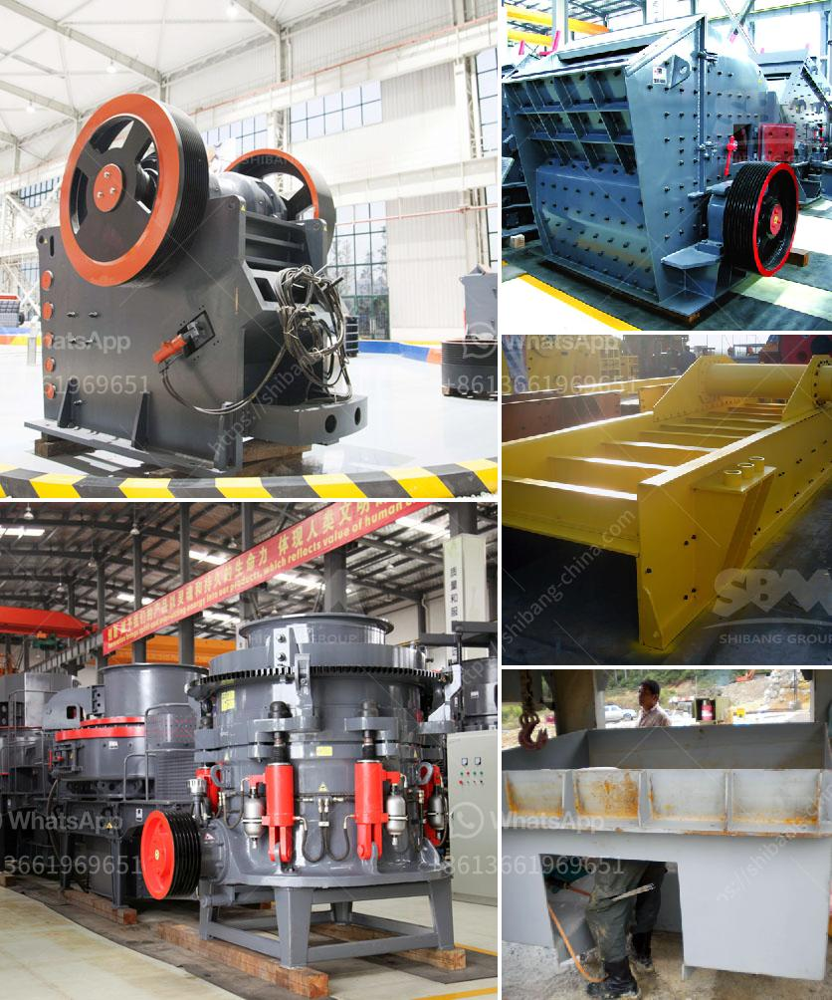

<h3>آلة تحويل الحجر الجيري إلى مسحوق</h3>
يعتبر الحجر الجيري من المواد الطبيعية الهامة التي تستخدم في العديد من الصناعات المختلفة مثل صناعة الإسمنت والحديد والصلب والزجاج والأسمدة. ومن أجل استخدام الحجر الجيري بأكمله في هذه الصناعات، يتم تحويله إلى مسحوق ناعم باستخدام آلة مخصصة لذلك.

تعتبر آلة تحويل الحجر الجيري إلى مسحوق أحد الأدوات الرئيسية في عملية تكسير وطحن الحجر الجيري. تتكون هذه الآلة من العديد من الأجزاء المتخصصة التي تعمل سويًا لتحطيم الحجر الجيري إلى قطع صغيرة ومن ثم تحويلها إلى مسحوق ناعم.

تعمل الآلة بنظام تحطيم وطحن يعتمد على استخدام القوة العالية والسرعة العالية للتأثير والاحتكاك لتحقيق التكسير النهائي. تتمثل عملية تحويل الحجر الجيري إلى مسحوق في الخطوات التالية:

1. التغذية: يتم تحميل الحجر الجيري المكسور في الآلة باستخدام مغذيات اهتزازية لضمان استقرار التغذية وتدفق المواد.

2. التكسير: يتم تحطيم الحجر الجيري الكبير إلى قطع صغيرة باستخدام آلية التأثير أو التأثير المزدوج حسب نوع الآلة.

3. الطحن: تعمل الآلة على طحن القطع الصغيرة من الحجر الجيري إلى مسحوق ناعم باستخدام وسائل الطحن المختلفة مثل الكرات الصلبة أو أسطوانة الطحن.

4. التصنيف: بعد عملية الطحن، يتم فصل الجسيمات المسحوقة تصنيفياً وفقًا لحجمها باستخدام غرابيل وشاشات مختلفة. يتم تصنيف هذه الجسيمات إلى أحجام مختلفة بحسب الاحتياجات والمواصفات المطلوبة.

5. التعبئة والتغليف: في هذه الخطوة، يتم تعبئة المسحوق الجاهز في حاويات أو أكياس بلاستيكية أو صناديق وتغليفها بإحكام للحفاظ على جودتها وسهولة نقلها وتخزينها.

تستخدم آلة تحويل الحجر الجيري إلى مسحوق في العديد من الصناعات حول العالم. يعتمد نجاح عملية التحويل على أداء الآلة وفعاليتها في تحطيم وطحن الحجر الجيري بكفاءة. ويتم تصميم الآلات المستخدمة بحيث تكون قادرة على التعامل مع مجموعة متنوعة من الحجم والصلابة للحجر الجيري.

باختصار، آلة تحويل الحجر الجيري إلى مسحوق هي الأداة الأساسية في عملية استغلال الحجر الجيري بشكل كامل. تتكون العملية من عدة خطوات متتالية تعتمد على استخدام القوة والسرعة لتحويل الحجر الجيري إلى مسحوق ناعم. تُستخدم هذه المساحيق في العديد من الصناعات المختلفة وتعتبر جزءًا أساسيًا في تطوير البنية التحتية للمجتمعات.
<h3>Contact us</h3><ul><li><strong>Whatsapp:&nbsp;<a href="https://wa.me/8613661969651">+8613661969651</a></strong></li><li><a href="https://swt.shibang-china.com/?git&amp;zhl&amp;آلة تحويل الحجر الجيري إلى مسحوق"><strong>Online Service(chat now)</strong></a></li></ul><h3>Related</h3><ul><li><a href='تدفق معالجة البنتونيت.md'>تدفق معالجة البنتونيت</a></li><li><a href='سعر كسارة متنقلة خام الكروم الرئيسية.md'>سعر كسارة متنقلة خام الكروم الرئيسية</a></li><li><a href='مطحنة الطحن الصينية.md'>مطحنة الطحن الصينية</a></li><li><a href='سحق الكلي ٢٠٠ طن في الساعة بمرحلتين.md'>سحق الكلي ٢٠٠ طن في الساعة بمرحلتين</a></li><li><a href='مصنع كسارة البنتونيت.md'>مصنع كسارة البنتونيت</a></li></ul>