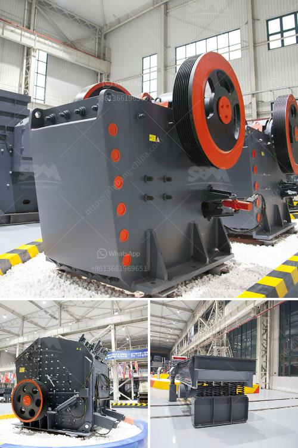

<h3>آلة تسخين حجر الكوارتز للبيع</h3>
تعتبر آلة تسخين حجر الكوارتز من الأجهزة الشائعة في المنازل والمكاتب والعيادات الطبية. تستخدم هذه الآلة لتوفير الحرارة اللازمة للاسترخاء والراحة العضلية، وكذلك لتحسين الدورة الدموية وتخفيف الألم. تعمل آلة تسخين حجر الكوارتز عبر توليد الحرارة من الداخل وتوصيلها للأحجار الكوارتزية.

تتميز آلة تسخين حجر الكوارتز بعدة مزايا، من بينها سهولة الاستخدام والتشغيل البسيط. يمكن ضبط درجة الحرارة المرغوبة بسهولة باستخدام التحكم الذكي الموجود على الجهاز، ومع غلق الجهاز تلقائيًا عند الوصول إلى درجة الحرارة المطلوبة. 

كما تأتي آلة تسخين حجر الكوارتز مع مجموعة متنوعة من الأحجار الكوارتزية للاستخدام المتعدد. تشمل هذه الأحجار أحجارًا كبيرة للاسترخاء العام وتخفيف التوتر والأحجار الأصغر للاستخدام في المناطق المحددة مثل الكتفين أو الرقبة أو الظهر. كما يمكن استخدام الأحجار الساخنة بعد تسخينها في علاجات التدليك وعلاجات الجسم.

تعتبر الآلة المناسبة للأشخاص الذين يعانون من آلام العضلات والمفاصل أو للأشخاص الذين يعانون من ضغوط العمل والتوتر اليومي. يعتبر تطبيق الحرارة العلاجية على الجسم واحدة من أقدم طرق العلاج التي اعتمدها البشر منذ قرون، وتقدمه الآلة من خلال توفير حرارة عميقة ومريحة. 

تتوفر آلة تسخين حجر الكوارتز بأسعار متعددة تتراوح بين 200 و 400 دولار حسب الطراز والمواصفات. يمكن العثور على هذه الآلات في المحلات التجارية والمتاجر عبر الإنترنت. قبل الشراء، يجب التأكد من جودة المنتج ودراسة ميزات ومواصفات الآلة للتأكد من أنها تلبي الاحتياجات الشخصية.

في الختام، تعد آلة تسخين حجر الكوارتز جهازًا شائعًا وفعالًا لتوفير الحرارة العلاجية والاسترخاء العضلي. بفضل سهولة الاستخدام والتحكم في درجة الحرارة والأحجار المتوفرة، تلبي هذه الآلة احتياجات العديد من الأشخاص وتحسن نوعية حياتهم اليومية.
<h3>Contact us</h3><ul><li><strong>Whatsapp:&nbsp;<a href="https://wa.me/8613661969651">+8613661969651</a></strong></li><li><a href="https://swt.shibang-china.com/?git&amp;zhl&amp;آلة تسخين حجر الكوارتز للبيع"><strong>Online Service(chat now)</strong></a></li></ul><h3>Related</h3><ul><li><a href='أنا أبحث عن كسارة في ماليزيا.md'>أنا أبحث عن كسارة في ماليزيا</a></li><li><a href='جميع نماذج كسارة البازلت.md'>جميع نماذج كسارة البازلت</a></li><li><a href='مصنع غسيل رمل السيليكا في الهند.md'>مصنع غسيل رمل السيليكا في الهند</a></li><li><a href='كسارة الحجر للبيع في باكستان.md'>كسارة الحجر للبيع في باكستان</a></li><li><a href='كسارات محمولة في اليابان.md'>كسارات محمولة في اليابان</a></li></ul>