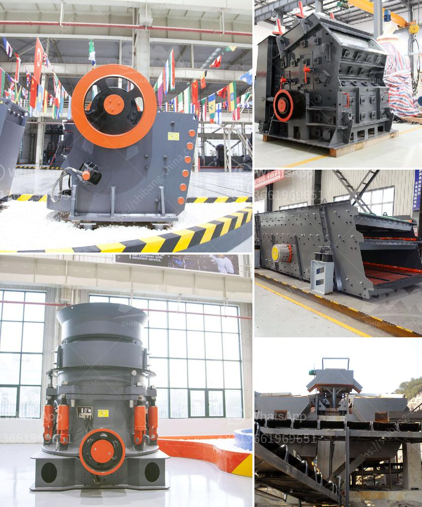

<h3>آلة تصنيع الجبس</h3>
تتميّز آلة تصنيع الجبس بقدرتها على إنتاج الجبس بكفاءة عالية وجودة ممتازة. تُستخدم هذه الآلة في صناعة الجبس لاستخدامه في العديد من التطبيقات المختلفة مثل صناعة الأسقف والجدران الداخلية.

تتكون آلة تصنيع الجبس عادةً من عدة أجزاء رئيسية. أهم هذه الأجزاء هي الفرن، حيث يتم تسخين كبريتات الكالسيوم المائية لإزالة الماء منها. يتم ذلك بواسطة تطبيق حرارة عالية على المادة الخام في فرن الحرق. بعد ذلك، يتم نقل الكلنكر إلى جهاز التكسير حيث يتم طحنه ليصبح بودرة ناعمة.

بعد عملية الطحن، يتم نقل البودرة إلى جهاز الخلط. في هذا الجهاز، يتم مزج مكونات الجبس مع بعضها للحصول على تركيبة مثالية. يتم إضافة الإضافات المطلوبة مثل المواد المضادة للتكتل ومثبتات البناء وغيرها، لضمان الحصول على جودة عالية وأداء مثالي للجبس الناتج.

بعد عملية الخلط، يتم نقل الخليط إلى الآلة التشكيل. يتم استخدام أسطوانة دوارة لتشكيل الجبس بناءً على الشكل المطلوب، سواء كان ذلك عبارة عن ألواح أو قطع أو مجموعات من الجبس. يتم تحديد سمك الجبس المنتج وأبعاده وتشكيله بدقة باستخدام هذه الآلة.

بعد عملية التشكيل، يتم نقل الجبس إلى المجفف حيث يتم تجفيفه بعناية لإزالة أي رطوبة قد تبقى. يتم التحكم في درجة الحرارة والرطوبة في المجفف لضمان الحصول على جبس جاف تمامًا وجاهز للتعبئة والتغليف.

تتميز آلات تصنيع الجبس بأنها سهلة الاستخدام وتعمل بكفاءة عالية. كما أنها تتطلب صيانة بسيطة وتعتبر متينة وموثوقة في العمل. بفضل التطور التكنولوجي، توجد الآن آلات تصنيع الجبس التي تعمل بنظام تحكم أوتوماتيكي متقدم، مما يجعل عملية الإنتاج أكثر سهولة ودقة.

باستخدام آلات تصنيع الجبس، يمكن تلبية الطلب المتزايد على الجبس بجودة عالية وكفاءة أكبر. يعد الجبس من المواد الأساسية في صناعة البناء، وتوفيره بكفاءة يعزز من تطور الصناعة والبنية التحتية في العديد من البلدان.
<h3>Contact us</h3><ul><li><strong>Whatsapp:&nbsp;<a href="https://wa.me/8613661969651">+8613661969651</a></strong></li><li><a href="https://swt.shibang-china.com/?git&amp;zhl&amp;آلة تصنيع الجبس"><strong>Online Service(chat now)</strong></a></li></ul><h3>Related</h3><ul><li><a href='مطحنة الفحم في محطة توليد الطاقة.md'>مطحنة الفحم في محطة توليد الطاقة</a></li><li><a href='شركة تصنيع الكسارات في الصين.md'>شركة تصنيع الكسارات في الصين</a></li><li><a href='عملية تعدين الذهب.md'>عملية تعدين الذهب</a></li><li><a href='مواصفات كسارة المخروط.md'>مواصفات كسارة المخروط</a></li><li><a href='مصنع كسارة الحجر بسعة 100 طن.md'>مصنع كسارة الحجر بسعة 100 طن</a></li></ul>