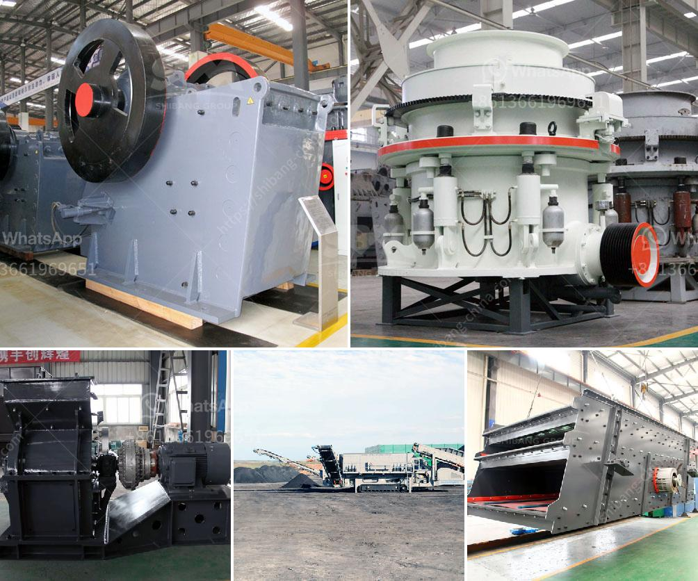

<h3>آلة تصنيع الحجر من جنوب أفريقيا</h3>
تُعد آلة تصنيع الحجر من جنوب أفريقيا من الآلات الحديثة التي تستخدم في صناعة وتصنيع الحجر بشكل فعال ومربح. تعد جنوب أفريقيا واحدة من أهم الأسواق العالمية في مجال صناعة الحجر، حيث تتميز بتوفر موارد طبيعية غنية وجودة عالية من الحجر.

تعتمد آلة تصنيع الحجر في جنوب أفريقيا على تقنيات حديثة ومتطورة لإنتاج الحجر بشكل أسرع وأكثر دقة وجودة. تُستخدم الآلة لقطع الحجر وتشكيله بأحجام وأشكال مختلفة بحسب احتياجات العملاء ومتطلبات المشاريع المختلفة.

تتميز آلة تصنيع الحجر في جنوب أفريقيا بأدائها العالي وفعاليتها في استغلال الموارد وتحسين إنتاجية صناعة الحجر. يتم استخدام تقنيات القطع بالليزر والقطع بالماء وأدوات الحفر الآلية للحصول على نتائج دقيقة وعالية الجودة.

تعد آلة تصنيع الحجر في جنوب أفريقيا مفيدة في عدة مجالات، بما في ذلك صناعة البناء والديكور الداخلي والخارجي وتصميم المناظر الطبيعية. يمكن استخدام الحجر الذي يتم صنعه بواسطة هذه الآلة في بلاط الأرضيات وكسوة الجدران وأعمدة الدعامة والأعمال المعمارية الأخرى.

بالإضافة إلى ذلك، تعتبر آلة تصنيع الحجر في جنوب أفريقيا مصدرًا هامًا للوظائف والنمو الاقتصادي. فإن صناعة الحجر قائمة على العمالة المهرة والتكنولوجيا المتطورة، وهذا يساهم في توفير فرص عمل للكثير من الأشخاص وتعزيز النمو والازدهار الاقتصادي.

على الرغم من الفوائد العديدة لآلة تصنيع الحجر في جنوب أفريقيا، إلا أنها تواجه بعض التحديات أيضًا. فمثلاً، قد تتطلب هذه الآلة استخدام مصادر طاقة كبيرة واستخدام المياه بكميات كبيرة، مما قد يؤثر على البيئة والموارد الطبيعية. لذا، يجب اتخاذ تدابير بيئية صارمة للحفاظ على التوازن والاستدامة.

في الختام، تعد آلة تصنيع الحجر من جنوب أفريقيا أحد الأجهزة الحديثة والفعالة في صناعة الحجر. تساهم هذه الآلة في توفير فرص العمل وتعزيز النمو الاقتصادي، بالإضافة إلى إنتاج الحجر عالي الجودة المستخدم في مجالات مختلفة. ومع ذلك، يتعين علينا أيضًا أن نهتم بالتدابير البيئية للاستدامة والحفاظ على البيئة المحيطة.
<h3>Contact us</h3><ul><li><strong>Whatsapp:&nbsp;<a href="https://wa.me/8613661969651">+8613661969651</a></strong></li><li><a href="https://swt.shibang-china.com/?git&amp;zhl&amp;آلة تصنيع الحجر من جنوب أفريقيا"><strong>Online Service(chat now)</strong></a></li></ul><h3>Related</h3><ul><li><a href='مطحنة المطرقة لتركيز السعر.md'>مطحنة المطرقة لتركيز السعر</a></li><li><a href='كسارات مستعملة في نيجيريا.md'>كسارات مستعملة في نيجيريا</a></li><li><a href='شركات المحاجر في بوكواس وأماسامان.md'>شركات المحاجر في بوكواس وأماسامان</a></li><li><a href='سعر آلة غسيل الرمل الكوارتز.md'>سعر آلة غسيل الرمل الكوارتز</a></li><li><a href='عمل المطحنة الكرة بالهندية.md'>عمل المطحنة الكرة بالهندية</a></li></ul>