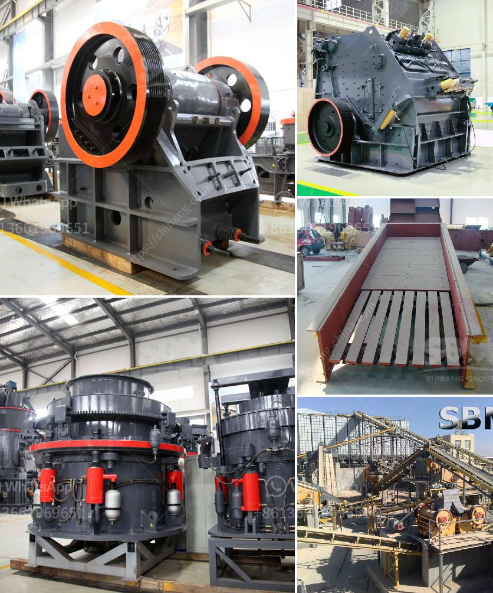

<h3>آلة تصنيع الرمل M</h3>
آلة تصنيع الرمل M هي آلة متقدمة تستخدم في عملية تصنيع الرمل الاصطناعي. تستخدم هذه الآلة التكنولوجيا المتقدمة لتحويل الصخور الصلبة إلى رمل صغير الحجم بشكل فعال وسريع.

تعتبر آلة تصنيع الرمل M من الآلات الحديثة والتي تتميز بكفاءتها العالية في تحويل الصخور إلى رمل ناعم وعالي الجودة. تتكون الآلة من جزئين رئيسيين، الجزء العلوي المعروف بالجزء الدوار والجزء السفلي المعروف بالجزء الثابت.

يتم تغذية الصخور من الجزء العلوي للآلة حيث يتم تفتيتها بواسطة اللوحة الدوارة التي تدور بسرعة عالية. وعندما يصطدم الصخر باللوحة، يتم تحويله إلى رمل صغير الحجم. بعد ذلك، يتم إدخال الرمل الناعم في الجزء السفلي للآلة حيث يتم فصله عن الأجزاء الخشنة. تتم هذه العملية باستخدام شبكات تصفية متعددة الطبقات.

تعد آلة تصنيع الرمل M فعالة للغاية في عملية تصنيع الرمل الاصطناعي. تنتج هذه الآلة رمل عالي الجودة وذو حجم صغير يمكن استخدامه في مجموعة متنوعة من التطبيقات مثل صناعة البناء والمواد الكيميائية والخزف والزجاج والحديد والصلب.

توفر آلة تصنيع الرمل M العديد من المزايا. فهي قادرة على تحويل الصخور الصلبة إلى رمال ناعمة بجودة عالية في وقت قصير. تتميز الآلة بكفاءتها العالية واستهلاك الطاقة المنخفض، مما يوفر تكاليف التشغيل. كما أنها سهلة الصيانة وتوفر عمرًا طويلًا للخدمة.

باختصار، آلة تصنيع الرمل M هي آلة حديثة وفعالة لتحويل الصخور الصلبة إلى رمل عالي الجودة. تساهم في تلبية احتياجات العديد من الصناعات المختلفة. بفضل تكنولوجيتها المتقدمة وكفاءتها العالية، تعد هذه الآلة اختيارًا مثاليًا في عملية تصنيع الرمل الاصطناعي.
<h3>Contact us</h3><ul><li><strong>Whatsapp:&nbsp;<a href="https://wa.me/8613661969651">+8613661969651</a></strong></li><li><a href="https://swt.shibang-china.com/?git&amp;zhl&amp;آلة تصنيع الرمل M"><strong>Online Service(chat now)</strong></a></li></ul><h3>Related</h3><ul><li><a href='مصنع معالجة التنغستن في الهند.md'>مصنع معالجة التنغستن في الهند</a></li><li><a href='تكلفة حزام الناقل للتعدين.md'>تكلفة حزام الناقل للتعدين</a></li><li><a href='تصميم كسارة الحجر.md'>تصميم كسارة الحجر</a></li><li><a href='مورد آلة طحن التنتالوم على نطاق صغير.md'>مورد آلة طحن التنتالوم على نطاق صغير</a></li><li><a href='مصنع تحسين الجرافيت للبيع.md'>مصنع تحسين الجرافيت للبيع</a></li></ul>