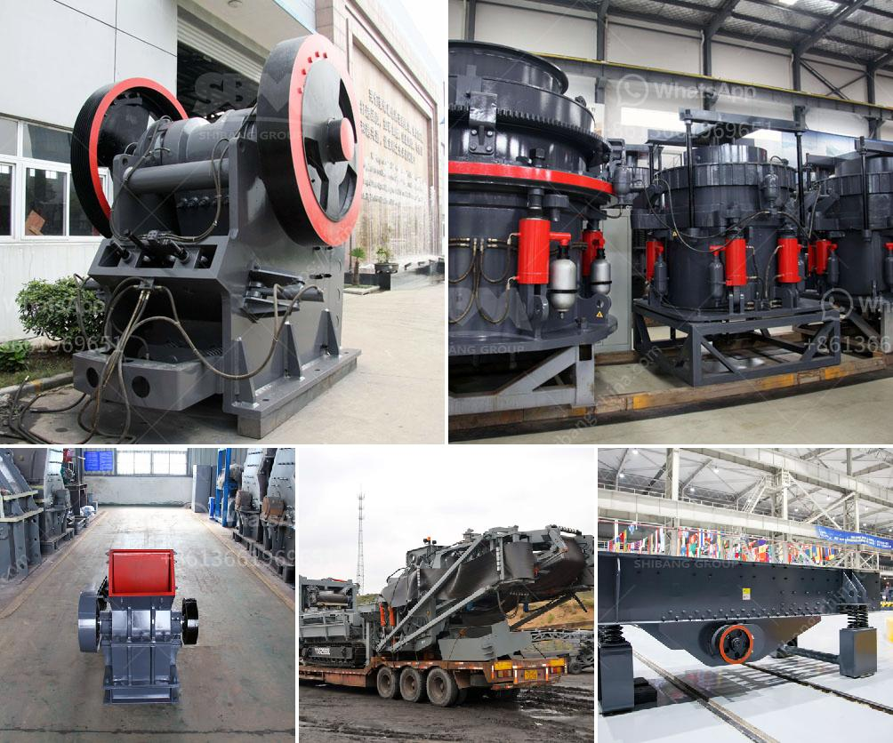

<h3>آلة تصنيع الكرة الجبسية</h3>
تعد آلة تصنيع الكرة الجبسية واحدة من الآلات الحديثة التي لها دور هام في صناعة البناء والديكور. تستخدم الكرة الجبسية على نطاق واسع في تشييد الجدران الداخلية والسقوف المستعارة والديكورات الأخرى التي تحتاج إلى سطح سلس وجميل. تعمل الآلة على صنع الكرة الجبسية بشكل آلي وفعال، مما يوفر الوقت والجهد بشكل كبير للعمال.

تتكون الآلة الجبسية الأوتوماتيكية من عدة أجزاء رئيسية، بما في ذلك الجزء الذي يخلط المواد الأساسية مثل الجبس والماء معًا، والجزء الذي يشكل الكرة الجبسية ويعطيها الشكل والحجم المطلوب، والجزء الذي يجفف الكرة الجبسية بالحرارة المناسبة لضمان تجفيفها بشكل صحيح وسريع.

يتم إدخال مواد الجبس والماء في الآلة من خلال إبرة تغذية خاصة، ويتم خلط المواد بشكل جيد في الآلة للحصول على خليط متجانس. بعد ذلك، يتم حقن الخليط في قوالب تشكيل خاصة بحجم وشكل الكرة الجبسية المطلوبة. بعد وضع الخليط في القوالب، تحرك القوالب داخل الآلة بحركة دورانية مستمرة للسماح بتشكيل الكرة الجبسية بشكل متجانس ودقيق.

بعد تشكيل الكرة الجبسية، تنتقل إلى مجفف الحرارة المناسبة لتجفيفها بشكل صحيح. يتم توفير درجات حرارة معينة للمجفف، وبالتالي فإن فترة التجفيف تختلف وفقًا لحجم الكرة الجبسية المطلوبة. يضمن التجفيف الصحيح للكرة الجبسية خروجها بحالة جيدة وجامدة وجاهزة للاستخدام في عمليات البناء والديكور.

يعتبر استخدام آلة تصنيع الكرة الجبسية مفيدًا للشركات والأفراد الذين يعملون في مجال صناعة البناء والديكور، حيث يمكنهم توفير الوقت والموارد عن طريق استخدام هذه الآلة. بفضل تقدم التكنولوجيا، يمكن ضبط معايير الجودة والأحجام والأشكال بدقة باستخدام الآلة، مما يزيد من كفاءة الإنتاج وجودة المنتجات.

في النهاية، يمكن القول إن آلة تصنيع الكرة الجبسية هي دمج مثالي لتكنولوجيا التصنيع والبناء، وتعزز من سرعة وجودة الإنتاج، وتسهم في توفير المزيد من الوقت والجهد للعمال في هذا المجال المهم.
<h3>Contact us</h3><ul><li><strong>Whatsapp:&nbsp;<a href="https://wa.me/8613661969651">+8613661969651</a></strong></li><li><a href="https://swt.shibang-china.com/?git&amp;zhl&amp;آلة تصنيع الكرة الجبسية"><strong>Online Service(chat now)</strong></a></li></ul><h3>Related</h3><ul><li><a href='كسارة صغيرة للبيع في المحجر.md'>كسارة صغيرة للبيع في المحجر</a></li><li><a href='قطع غيار آلة المطحنة ووظيفتها.md'>قطع غيار آلة المطحنة ووظيفتها</a></li><li><a href='مورد سير ناقل في الصين.md'>مورد سير ناقل في الصين</a></li><li><a href='معدات فاصل المغناطيس للبيع.md'>معدات فاصل المغناطيس للبيع</a></li><li><a href='مطحنة رايموند في ماليزيا.md'>مطحنة رايموند في ماليزيا</a></li></ul>