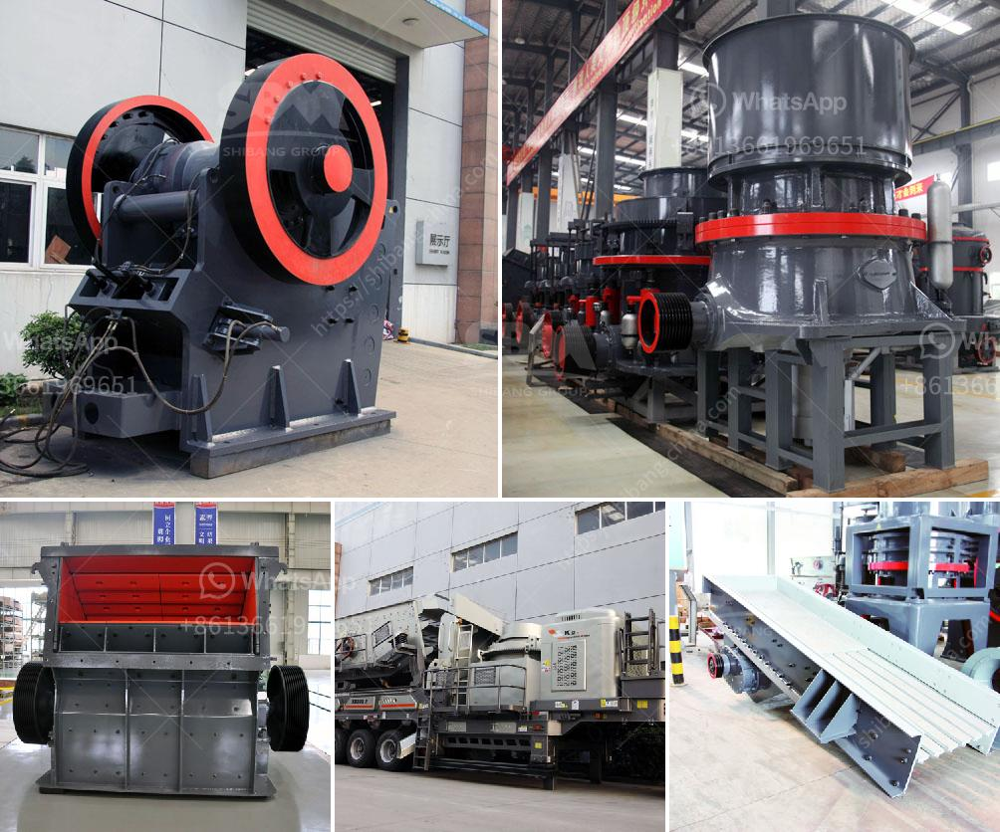

<h3>آلة تصنيع مسحوق الميكا</h3>
تعتبر آلة تصنيع مسحوق الميكا من الآلات الحديثة والمتقدمة التي تستخدم في عمليات استخلاص مسحوق الميكا من الخامة الأولية. يعتبر مسحوق الميكا مادة هامة في صناعات عديدة مثل الطلاء، والصناعات البلاستيكية، ومواد العزل، والصناعات الكيميائية.

تعمل آلة تصنيع مسحوق الميكا عن طريق طحن الخامة الأولية للميكا إلى حجم صغير جداً. يتم ذلك باستخدام مطحنة خاصة تعمل على تفتيت الخامة وتحويلها إلى مسحوق رقيق. يتم ضبط حجم الجسيمات المنتجة وفقًا لاحتياجات العملاء المختلفة. يعتمد حجم الجسيمات المنتجة على إعدادات آلة التصنيع وسرعة الدوران وغيرها من العوامل.

تتميز آلة تصنيع مسحوق الميكا بالدقة العالية والسرعة في العمل. يمكن للآلة إنتاج الكميات الكبيرة من مسحوق الميكا في وقت قصير. يستخدم النظام الأوتوماتيكي في التحكم بعملية تصنيع المسحوق وتجنب الأخطاء البشرية. كما أنه يحتوي على أجهزة السلامة والحماية لمنع حوادث العمل.

تتميز آلة تصنيع مسحوق الميكا أيضًا بمرونة الاستخدام. يمكن للمشغلين ضبط الآلة وفقًا لاحتياجاتهم المحددة. يمكن تعديل معدل الطحن وحجم الجسيمات بسهولة لتناسب متطلبات العملاء المختلفة. بالإضافة إلى ذلك، فإنها تتميز بالكفاءة العالية والتشغيل السهل، مما يجعلها أداة مثالية لمصانع التصنيع.

من الجوانب الإيجابية الأخرى لآلة تصنيع مسحوق الميكا هو أنها صديقة للبيئة. تعمل الآلة على تقليل تكوين الغبار والرواسب الناتجة عن عملية الطحن. يتم تجهيز الآلة بأنظمة تنقية الهواء وتصفية الغبار لتقليل تأثير العملية على البيئة المحيطة.

باختصار، تعتبر آلة تصنيع مسحوق الميكا أداة حديثة ومهمة في صناعات استخلاص الميكا. توفر هذه الآلة مسحوق ميكا عالي الجودة وسرعة الإنتاج، مما يساعد في تلبية احتياجات العديد من الصناعات المختلفة. كما أنها تتميز بالمرونة والكفاءة العالية، مما يجعلها اختيارًا مثاليًا للمصانع والشركات التصنيعية.
<h3>Contact us</h3><ul><li><strong>Whatsapp:&nbsp;<a href="https://wa.me/8613661969651">+8613661969651</a></strong></li><li><a href="https://swt.shibang-china.com/?git&amp;zhl&amp;آلة تصنيع مسحوق الميكا"><strong>Online Service(chat now)</strong></a></li></ul><h3>Related</h3><ul><li><a href='إنتاج ٣٠٠ طن سنوياً من خط إنتاج مسحوق الجبس.md'>إنتاج ٣٠٠ طن سنوياً من خط إنتاج مسحوق الجبس</a></li><li><a href='مطحنة الفحم في محطة توليد الطاقة.md'>مطحنة الفحم في محطة توليد الطاقة</a></li><li><a href='تكلفة مطحنة مسحوق صغيرة.md'>تكلفة مطحنة مسحوق صغيرة</a></li><li><a href='آلة غسيل الرمل في المملكة العربية السعودية.md'>آلة غسيل الرمل في المملكة العربية السعودية</a></li><li><a href='سعر كسارة الحجر سعة طن في الساعة.md'>سعر كسارة الحجر سعة طن في الساعة</a></li></ul>