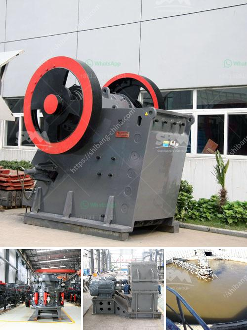

<h3>آلة تعبئة مسحوق التلك</h3>
تتميز آلة تعبئة مسحوق التلك بقدرتها على تغليف المسحوق بشكل آمن وسريع، وهي تستخدم في صناعات متعددة مثل صناعة العناية الشخصية والمستحضرات الصيدلانية وصناعة البلاستيك.

تعتبر آلة تعبئة مسحوق التلك من الآلات الأوتوماتيكية التي تعمل بتقنية حديثة. تتكون الآلة من عدة أجزاء رئيسية مثل حاوية الفلترة، وحاوية التعليق، وآلية وضع الكمية المناسبة من المسحوق في العبوة، وجهاز إغلاق العبوات.

يتم تشغيل الآلة بواسطة نظام التحكم الأوتوماتيكي ويتم ضبط جميع المعلمات اللازمة مثل الوزن والسرعة والوقت. تعمل آلة تعبئة مسحوق التلك عن طريق سحب المسحوق من حاوية التعليق باستخدام نظام الشفط ونقله إلى حاوية الفلترة لتجفيفه وتنقيته من الجزيئات الصلبة الصغيرة.

بعد تنقية المسحوق، يتم نقله إلى آلية الوزن والتعبئة. تحتوي هذه الآلية على معاير مسحوق التلك الذي يقوم بتحديد الكمية المناسبة من المسحوق لكل عبوة. يتم وضع الكمية المحددة من المسحوق في كيس أو عبوة مخصصة لتعبئة المنتج. بعد ذلك، يتم إغلاق العبوة بواسطة جهاز الإغلاق المتاح في الآلة.

تمتاز آلة تعبئة مسحوق التلك بالدقة والسرعة العالية في أداء عملية التعبئة. كما أنها تعمل بكفاءة عالية مع إمكانية تعديل الإعدادات لتلبية متطلبات العملاء. بالإضافة إلى ذلك، فإن استخدام الآلة يساعد في تقليل التكاليف والمخاطر المرتبطة بعملية التعبئة اليدوية.

في الختام، آلة تعبئة مسحوق التلك هي آلة ممتازة لصناعات مختلفة تستخدم المسحوق في منتجاتها. تساهم الآلة في زيادة الإنتاجية وتقليل التكاليف وتحسين جودة المنتج النهائي. علاوة على ذلك، تعد الآلة ذات تصميم حديث وآمن للاستخدام، مما يجعلها اختيارًا مثاليًا للشركات الراغبة في تحسين عمليات الإنتاج والتعبئة والتغليف.
<h3>Contact us</h3><ul><li><strong>Whatsapp:&nbsp;<a href="https://wa.me/8613661969651">+8613661969651</a></strong></li><li><a href="https://swt.shibang-china.com/?git&amp;zhl&amp;آلة تعبئة مسحوق التلك"><strong>Online Service(chat now)</strong></a></li></ul><h3>Related</h3><ul><li><a href='كسارات حجر بسيطة من زيفيث في كينيا.md'>كسارات حجر بسيطة من زيفيث في كينيا</a></li><li><a href='مصنع الكرة.md'>مصنع الكرة</a></li><li><a href='سعات مطحنة الأسطوانة العمودية.md'>سعات مطحنة الأسطوانة العمودية</a></li><li><a href='تصميم آلة تكسير الحجر.md'>تصميم آلة تكسير الحجر</a></li><li><a href='مطاحن الكرة للكالسيوم.md'>مطاحن الكرة للكالسيوم</a></li></ul>