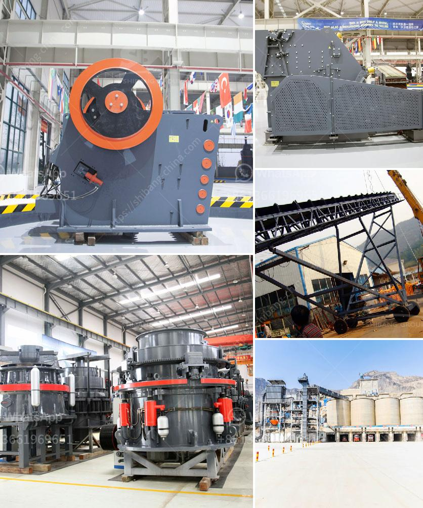

<h3>آلة تعبئة مسحوق الجير</h3>
تعد آلة تعبئة مسحوق الجير واحدة من الآلات المهمة في صناعة البناء والأعمال الإنشائية. تستخدم هذه الآلة لتعبئة المسحوق بشكل دقيق وفعال، وتقوم بضبط الكمية المناسبة من المسحوق وتغليفها في حاويات مختلفة، مما يساعد في تسهيل وتحسين عملية التعبئة والتغليف.

تتكون آلة تعبئة مسحوق الجير عادةً من عدة أجزاء أساسية، منها:

1. حوض العرض: حيث يتم تخزين المسحوق قبل التعبئة. يتم تصميم الحوض بحجم مناسب لتخزين المسحوق بفاعلية وسهولة.

2. جهاز الوزن: يتم استخدامه لقياس الكمية المطلوبة من المسحوق وتحديد الوزن المناسب لكل حزمة أو حاوية. يتم ضبط الجهاز للحصول على الوزن المطلوب ضمن نطاق القيم المحددة.

3. الحاوية/الحقيبة: تستخدم لتعبئة المسحوق، حيث يتم نقل الحاوية تلقائيًا تحت جهاز الوزن وتعبأ بالمسحوق حتى يتم الوصول إلى الوزن المحدد.

4. الناقل: يتم استخدامه لنقل الحاويات المعبأة من جهاز الوزن إلى منطقة التعبئة والتغليف الأخيرة.

بفضل هذه الآلة، يتم تحسين كفاءة عملية تعبئة مسحوق الجير ويتم التحكم في كمية التعبئة بدقة، مما يقلل من الأخطاء والتلاعب البشري ويحسن جودة المنتج النهائي. توفر آلة تعبئة مسحوق الجير أيضًا الوقت والجهد اللازمين للقيام بعملية التعبئة يدويًا، وتساهم في زيادة الإنتاجية وتقليل التكاليف العمالية.

علاوة على ذلك، تقدم هذه الآلة مزايا أخرى مثل توفير المساحة، حيث يمكن تركيبها في مساحة صغيرة وتوفير الطاقة وتحسين بيئة العمل. وبفضل التحكم الآلي المتقدم، يمكن برمجة الآلة للعمل بأكثر من نمط تعبئة وفقًا لمتطلبات المستخدم.

اختيار آلة تعبئة مسحوق الجير المناسبة يعتبر أمرًا هامًا للشركات والمصانع للحصول على منتج نهائي ذو جودة عالية بطريقة سريعة وفعالة. وباستخدام هذه الآلة، يمكن للشركات زيادة إنتاجيتها وتقديم منتجاتها بشكل موحد ومتسق للعملاء.
<h3>Contact us</h3><ul><li><strong>Whatsapp:&nbsp;<a href="https://wa.me/8613661969651">+8613661969651</a></strong></li><li><a href="https://swt.shibang-china.com/?git&amp;zhl&amp;آلة تعبئة مسحوق الجير"><strong>Online Service(chat now)</strong></a></li></ul><h3>Related</h3><ul><li><a href='كسارة الكوارتز السيليكون.md'>كسارة الكوارتز السيليكون</a></li><li><a href='آلة فحص متنقلة في جنوب أفريقيا.md'>آلة فحص متنقلة في جنوب أفريقيا</a></li><li><a href='كسارة حجر الجرانيت المحمولة.md'>كسارة حجر الجرانيت المحمولة</a></li><li><a href='قائمة جهات الاتصال لشركات التعدين في ألمانيا.md'>قائمة جهات الاتصال لشركات التعدين في ألمانيا</a></li><li><a href='خط إنتاج مسحوق الجبس بمقياس صغير.md'>خط إنتاج مسحوق الجبس بمقياس صغير</a></li></ul>