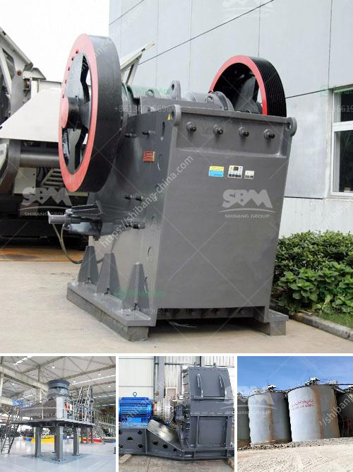

<h3>آلة تعدين الذهب في الصين</h3>
تعتبر الصين واحدة من أكبر منتجي ومستهلكي الذهب في العالم، حيث تعد صناعة التعدين من الصناعات الرئيسية في البلاد. تستند عمليات تعدين الذهب في الصين على تكنولوجيا حديثة ومتقدمة، وتعتمد بشكل كبير على الآلات والمعدات المتطورة.

تستخدم الصين العديد من الآلات في عمليات تعدين الذهب، وتشمل هذه الآلات المطارق الهيدروليكية والمكائن الحفارة والكسّارات والمصافي الذهبية. تستخدم هذه الآلات في استخراج الذهب من الصخور وتحويله إلى خام ذهب قابل للتجهيز.

تتميز آلات تعدين الذهب في الصين بالكفاءة والسرعة في العمل، حيث تعمل بجهد كبير وتستخدم تقنيات متقدمة للكشف عن الذهب واستخراجه. تستخدم هذه الآلات تقنيات متطورة مثل التصوير بالأشعة السينية والاهتزازات الأرضية والأنظمة البؤرية المتعددة لتتمكن من اكتشاف الذهب بكفاءة عالية.

تعتبر مناجم الذهب في الصين من أعمق مناجم التعدين في العالم، حيث يمكن أن تبلغ عمق المناجم حوالي 4000 متر. ولذلك، تحتاج عمليات التعدين إلى آلات ومعدات قوية ومتينة للتعامل مع الظروف الصعبة تحت الأرض.

توفر آلات تعدين الذهب في الصين العديد من المزايا للصناعة، حيث تحسن من كفاءة الإنتاج وتقلل من التكاليف، مما يساعد على زيادة إنتاجية المناجم وربحيتها. كما أن استخدام الآلات الحديثة يساهم في تقليل الضرر البيئي الناتج عن عمليات التعدين.

تواصل الصين الاستثمار في تطوير التكنولوجيا المتعلقة بآلات تعدين الذهب، حيث تعتبر هذه الصناعة من قطاعات الأعمال الحيوية التي تسهم في تعزيز اقتصاد البلاد. بفضل التطور المستمر، تعتبر الصين رائدة في مجال تقنيات التعدين واستخدام الآلات المتطورة.

باختصار، آلة تعدين الذهب في الصين تعكس التقدم التكنولوجي والجهود المبذولة لتحسين إنتاجية وربحية صناعة التعدين. بفضل استخدام الآلات المبتكرة والتقنيات الحديثة، تعتبر الصين واحدة من أكبر منتجي الذهب في العالم، وتعزز دورها في سوق الذهب العالمي.
<h3>Contact us</h3><ul><li><strong>Whatsapp:&nbsp;<a href="https://wa.me/8613661969651">+8613661969651</a></strong></li><li><a href="https://swt.shibang-china.com/?git&amp;zhl&amp;آلة تعدين الذهب في الصين"><strong>Online Service(chat now)</strong></a></li></ul><h3>Related</h3><ul><li><a href='كسارة الحجر الجيري للبيع.md'>كسارة الحجر الجيري للبيع</a></li><li><a href='آلة كسارة الصخور في ماليزيا.md'>آلة كسارة الصخور في ماليزيا</a></li><li><a href='عمل كسارة الفك.md'>عمل كسارة الفك</a></li><li><a href='كسارة تأثير تنزانيا.md'>كسارة تأثير تنزانيا</a></li><li><a href='كسارة محمولة للبيع.md'>كسارة محمولة للبيع</a></li></ul>