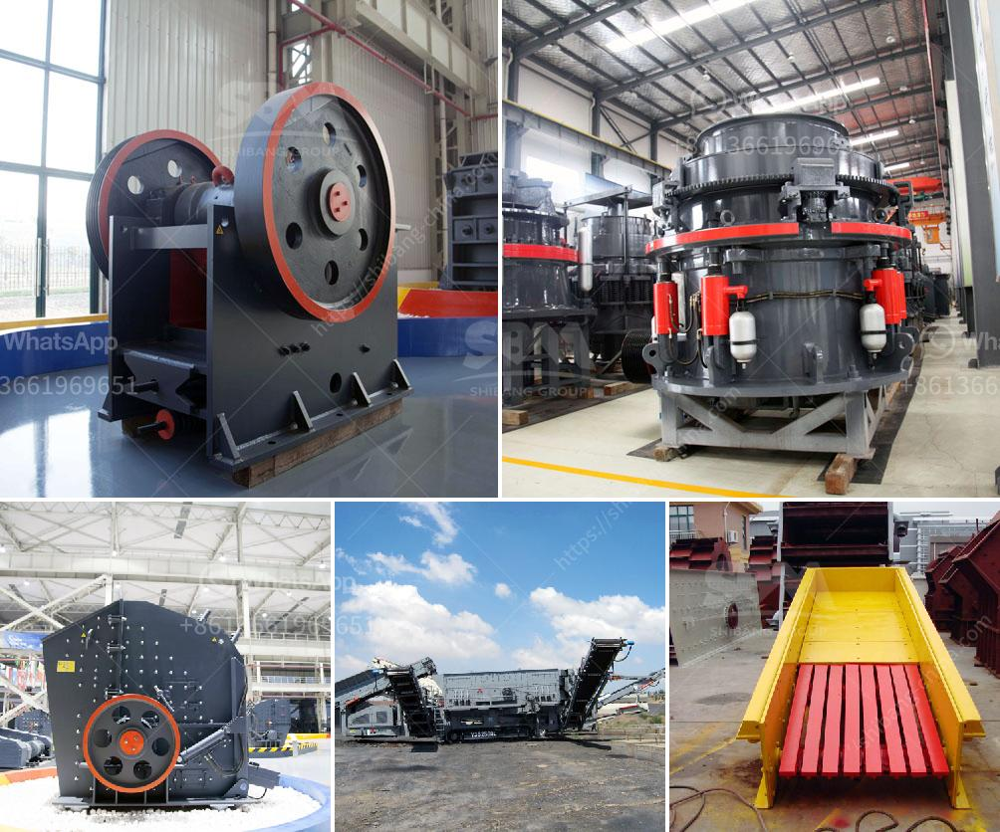

<h3>آلة تعدين الرمال التقليدية في ماليزيا</h3>
تعتبر آلة تعدين الرمال التقليدية في ماليزيا من أهم وسائل استخراج الرمال والحصى في هذا البلد. تستخدم هذه الآلة بشكل شائع في أعمال البناء والمشاريع العمرانية الأخرى حيث تعتبر الرمال والحصى مواد أساسية لإنجاز هذه المشاريع.

تعتمد آلة تعدين الرمال التقليدية في ماليزيا على الطريقة التقليدية لاستخراج الرمال من المصادر الطبيعية المتاحة في البلاد. تتمثل عملية التعدين في استخلاص الرمال من قاع الأنهار والبحيرات والمصادر المائية الأخرى باستخدام معدات بسيطة ويدوية.

تتألف آلة تعدين الرمال التقليدية في ماليزيا من مجموعة من الأدوات والمعدات البسيطة مثل الجرافات الصغيرة والشوك والمآلة. يتم استخدام الجرافة الصغيرة لجمع الرمال من القاع ونقلها إلى الشوك الذي يستخدم لفصل الرمال عن الحصى والأتربة الأخرى. بعد ذلك، يتم استخدام المآلة لنقل الرمال إلى المكان المحدد لتجميعها واستخدامها في المشاريع.

تعتبر آلة تعدين الرمال التقليدية في ماليزيا رخيصة التكلفة ومناسبة للاستخدام في المشاريع الصغيرة والمتوسطة. يعمل العديد من العمال بشكل يدوي في هذه العملية، مما يعطيها طابعًا تقليديًا ويحافظ على توظيف الكثير من العمال المحليين.

من الجوانب الإيجابية لاستخدام آلة تعدين الرمال التقليدية في ماليزيا، يمكن ذكر المرونة في التشغيل، حيث يمكن نقل الآلة بسهولة إلى الموقع المناسب للتعدين. بالإضافة إلى ذلك، يعد استخدام الرمال المستخرجة بواسطة هذه الآلة آمنًا وصحيًا، حيث تتم عملية التنقيب بطريقة تجنب التلوث البيئي.

مع ذلك، يوجد بعض العيوب في استخدام آلة تعدين الرمال التقليدية في ماليزيا. قد تكون العملية بطيئة وتحتاج إلى الكثير من الوقت للاستكمال، كما أنها تعتمد على العمالة اليدوية مما يزيد من التعب والمشقة المادية والبدنية.

باختلاف تطور التكنولوجيا، يتم استخدام آلات تعدين الرمال الحديثة بشكل متزايد في ماليزيا. هذه الآلات غالبًا ما تكون أكثر كفاءة وسرعة في العمل، مما يسمح بزيادة الإنتاجية وتوفير المزيد من الوقت والموارد. ومع ذلك، يظل استخدام آلة تعدين الرمال التقليدية ممارسة شائعة في بعض المشاريع الصغيرة والتي لا تتحمل تكاليف الاستثمار العالية للآلات الحديثة.

باختصار، آلة تعدين الرمال التقليدية في ماليزيا تعد أداة مهمة في صناعة البناء والتشييد. بالرغم من وجود آلات حديثة تستخدم في هذا المجال، ما زالت هذه الآلة تستخدم على نطاق واسع بسبب تكلفتها المنخفضة وسهولة الاستخدام. إنها تعكس تقليديات العمل في القطاع وتعتبر مصدراً هاماً لتوفير الرمال والحصى للمشاريع المحلية.
<h3>Contact us</h3><ul><li><strong>Whatsapp:&nbsp;<a href="https://wa.me/8613661969651">+8613661969651</a></strong></li><li><a href="https://swt.shibang-china.com/?git&amp;zhl&amp;آلة تعدين الرمال التقليدية في ماليزيا"><strong>Online Service(chat now)</strong></a></li></ul><h3>Related</h3><ul><li><a href='كسارة متنقلة في فيجي.md'>كسارة متنقلة في فيجي</a></li><li><a href='كسارة الرخام إيطاليا.md'>كسارة الرخام إيطاليا</a></li><li><a href='مطاحن تحضير الدولوميت.md'>مطاحن تحضير الدولوميت</a></li><li><a href='تكسير الحجر المصنوع في ألمانيا.md'>تكسير الحجر المصنوع في ألمانيا</a></li><li><a href='سعر مصنع كسارة الحجر في ألمانيا.md'>سعر مصنع كسارة الحجر في ألمانيا</a></li></ul>