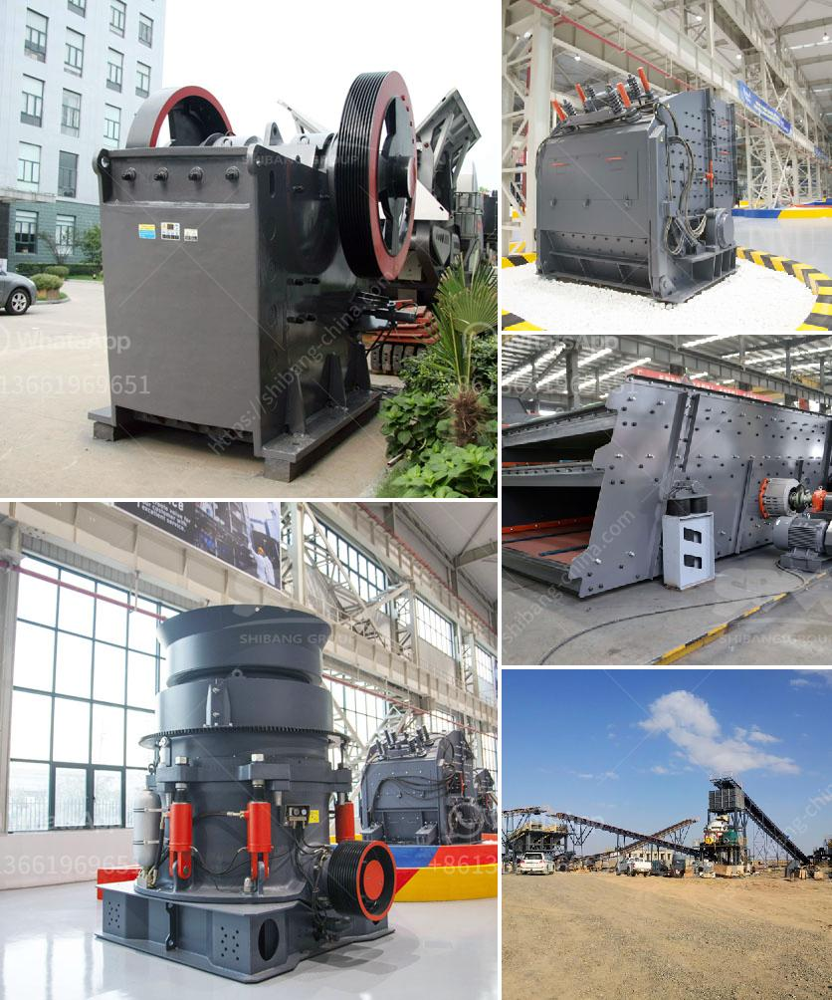

<h3>آلة تعدين الكسارة</h3>
تعد آلة تعدين الكسارة واحدة من الآلات الرئيسية المستخدمة في صناعة التعدين. تهدف هذه الآلة إلى سحق المواد الصخرية الكبيرة إلى جسيمات أصغر. يتم استخدامها بشكل شائع في صناعات مثل التعدين ومواد البناء والبناء والمواد المعدنية الغير معدنية وغيرها. تتميز هذه الآلة بقدرتها الهائلة على سحق الصخور الكبيرة إلى قطع صغيرة بسهولة وكفاءة.

تعتمد آلة تعدين الكسارة على قوة ضاغطة عالية تتولد داخل الآلة لسحق المواد الصخرية الكبيرة. يتم تغذية الصخور الكبيرة إلى فتحة التغذية في الجزء العلوي من الكسارة حيث يتم سحقها عن طريق آلية الضغط الداخلي للجهاز.

تتكون آلة التعدين الكسارة من العديد من الأجزاء الأساسية بما في ذلك جزء الفك الثابت والمتحرك والفك الحامل. تمتاز هذه الأجزاء بقوتها وصلابتها العالية للتعامل مع الصخور الكبيرة بشكل فعال. وعلاوة على ذلك، تحتوي الآلة أيضا على آلية تحكم بسيطة وفعالة لضبط حجم المواد المسحوقة.

تعتبر آلة التعدين الكسارة أداة فعالة لإعادة تدوير المواد الصخرية الكبيرة المستخدمة في البناء وصناعة الطرق والسكك الحديدية وغيرها من التطبيقات العديدة. توفر هذه الآلة طريقة اقتصادية وفعالة لاستغلال المواد الطبيعية وتقليل النفايات. علاوة على ذلك، فهي تعمل بسرعة عالية وتحتاج إلى صيانة بسيطة وتكلفة تشغيل منخفضة، مما يجعلها اختيارًا مثاليًا للعديد من الصناعات.

بشكل عام، فإن آلة تعدين الكسارة تعتبر أداة مهمة في صناعة التعدين وتعطي تلك الصناعة دفعة كبيرة. توفر هذه الآلة الكفاءة والقدرة على معالجة الكميات الكبيرة من المواد الصخرية بسرعة وسهولة، مما يساهم في زيادة الإنتاجية وتحسين كفاءة العمل. كما أنها تساعد في الحفاظ على البيئة بتقليل النفايات وإعادة تدوير المواد الصخرية الكبيرة. في المجمل، تعد آلة تعدين الكسارة عنصراً حاسماً في صناعة التعدين وتلبية احتياجات البناء والبناء في العديد من القطاعات.
<h3>Contact us</h3><ul><li><strong>Whatsapp:&nbsp;<a href="https://wa.me/8613661969651">+8613661969651</a></strong></li><li><a href="https://swt.shibang-china.com/?git&amp;zhl&amp;آلة تعدين الكسارة"><strong>Online Service(chat now)</strong></a></li></ul><h3>Related</h3><ul><li><a href='سيور ناقلة معدنية في الألواح.md'>سيور ناقلة معدنية في الألواح</a></li><li><a href='كسارة الفك بالديزل sp 60x100.md'>كسارة الفك بالديزل sp 60x100</a></li><li><a href='مطحنة طحن في ألمانيا.md'>مطحنة طحن في ألمانيا</a></li><li><a href='شاشة تهتز الفحم المصنعين في جنوب أفريقيا.md'>شاشة تهتز الفحم المصنعين في جنوب أفريقيا</a></li><li><a href='تكلفة معدات سحق الجرانيت.md'>تكلفة معدات سحق الجرانيت</a></li></ul>