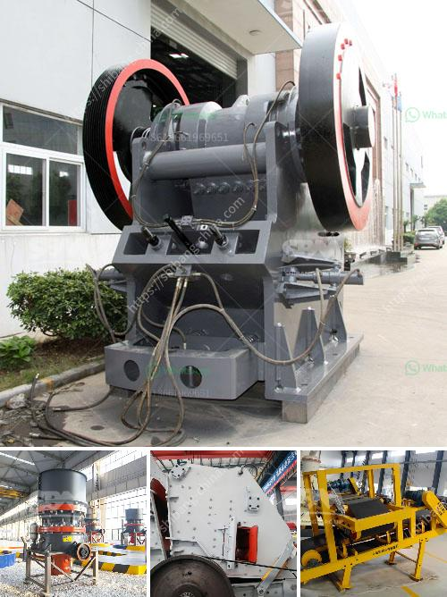

<h3>آلة تعدين النحاس</h3>
تعتبر آلة تعدين النحاس أحد الأدوات الرئيسية في صناعة التعدين، حيث تستخدم لاستخراج واستخلاص النحاس من الصخور والتربة. تعتبر النحاس واحدًا من أهم المعادن في العالم، حيث يستخدم في العديد من الصناعات مثل الصناعات الكهربائية والبناء وصناعة السيارات. تتألف آلة التعدين من عدة مكونات رئيسية تعمل معًا لاستخراج النحاس بكفاءة وفعالية.

أحد المكونات الأساسية لآلة تعدين النحاس هو الحفارة، وهي تستخدم لحفر الثقوب في الأرض للوصول إلى الرواسب المحتملة للنحاس. تتم عملية الحفر بواسطة الحفارات الدوارة أو الحفارات المتحركة. تستخدم الحفارات المتحركة عادةً عندما يحتاج الحجم الكبير لحفر الثقوب.

بعد الحفر ، يتم استخدام آلة التفتيت لكسر الصخور وتحويلها إلى قطع صغيرة قابلة للاستخراج. تتم عملية التفتيت عن طريق استخدام المتفجرات، حيث يتم وضعها في الثقوب وتفجيرها. الجزيئات الناتجة عن الانفجار تتم تجويعها وإزالتها من الموقع باستخدام آلة التكسير.

الخطوة التالية في عملية تعدين النحاس هي استخلاص النحاس من القطع الصغيرة المستخلصة من الصخور. تتم هذه العملية بواسطة آلة الفصل اللوني أو الطفو، حيث يتم تعليق الجزيئات الصغيرة في الماء وزيادة قابليتها للعملية التركيزية. يتم استخدام المناديل والفقاعات المعدلة للتخلص من الجزيئات الأخرى واستخلاص النحاس.

الخطوة الأخيرة في عملية تعدين النحاس هي تنقية وتكرير المعدن المستخلص. تتم هذه العملية عادةً في مجمعات تكرير خاصة حيث يتم استخدام آلات ومعدات متخصصة لإزالة الشوائب والشوائب الأخرى من المعدن. بعد الانتهاء من هذه العملية ، يكون النحاس جاهزًا للاستخدام في الصناعات المختلفة.

تعد آلة تعدين النحاس واحدة من أهم الأدوات في عملية التعدين واستخراج المعادن، حيث تساهم في تحسين الكفاءة وزيادة الإنتاجية. تعتمد فعالية الآلات على نوع الصخور والتربة المستهدفة وكمية النحاس المحتملة في الموقع. بفضل التكنولوجيا المتقدمة ، يتم تحسين وتطوير آلات التعدين باستمرار لزيادة الكفاءة وتقليل التكاليف وتحسين استدامة عمليات التعدين.
<h3>Contact us</h3><ul><li><strong>Whatsapp:&nbsp;<a href="https://wa.me/8613661969651">+8613661969651</a></strong></li><li><a href="https://swt.shibang-china.com/?git&amp;zhl&amp;آلة تعدين النحاس"><strong>Online Service(chat now)</strong></a></li></ul><h3>Related</h3><ul><li><a href='مصنع كسارة كامل للبيع في جنوب أفريقيا.md'>مصنع كسارة كامل للبيع في جنوب أفريقيا</a></li><li><a href='مصنع تكسير وفحص متنقل.md'>مصنع تكسير وفحص متنقل</a></li><li><a href='آلات صنع البودرة.md'>آلات صنع البودرة</a></li><li><a href='سعر آلات كسارة المحجر.md'>سعر آلات كسارة المحجر</a></li><li><a href='أسعار مطحنة الكرة في زيمبابوي.md'>أسعار مطحنة الكرة في زيمبابوي</a></li></ul>