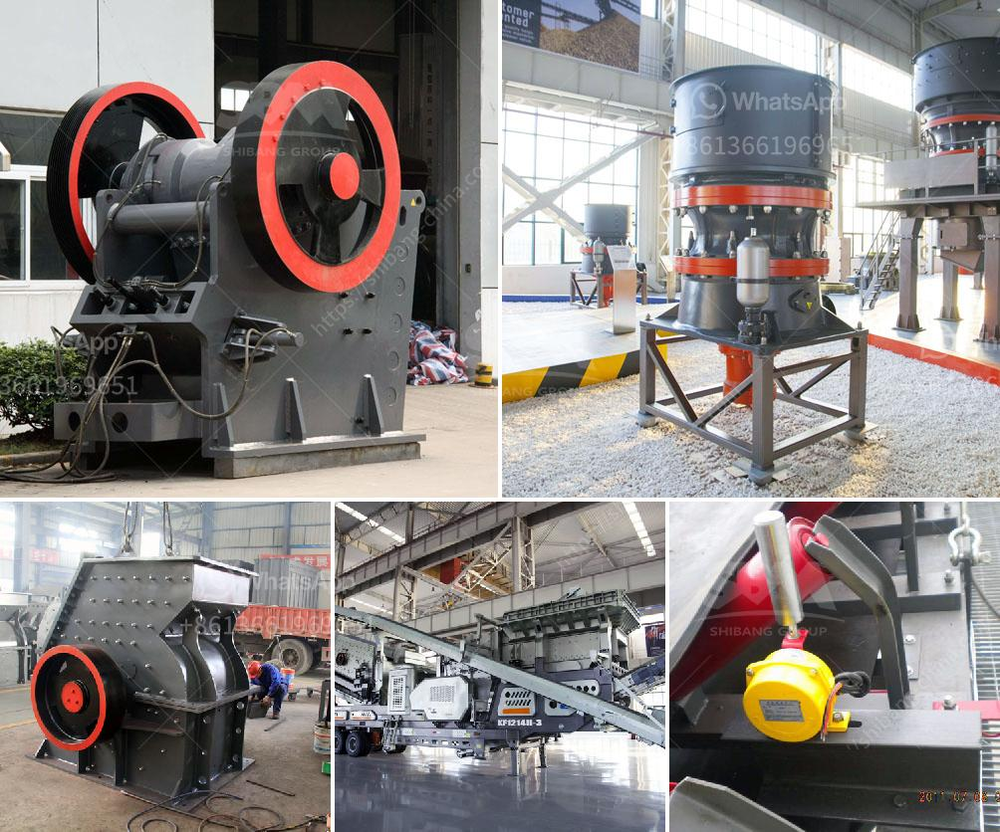

<h3>آلة تكبير الفحم الدقيقة في الهند</h3>
تعد الهند واحدة من أكبر الدول المستهلكة للفحم في العالم، والتي تشهد نموًا سريعًا في الطلب عليه. ومع زيادة الحاجة إلى الفحم ، تم تطوير آلة تكبير الفحم الدقيقة في الهند.

تعمل آلة تكبير الفحم الدقيقة على سحق الفحم إلى قطع أصغر بحجم محدد. حيث يتم تغذية الفحم في آلة الكسارة ، وتعمل شفرات الكسارة على طحن الفحم حتى يتم تحويله إلى حبيبات صغيرة الحجم. يتم تحديد حجم الحبيبات حسب الاحتياجات المحددة للمستخدمين، والتي يتم برمجتها في الآلة.

تعد آلة تكبير الفحم الدقيقة ابتكارًا تكنولوجيًا هامًا في صناعة الفحم في الهند. فبفضل قدرة الآلة على سحق الفحم إلى حجم دقيق بدقة، يمكن استخدامها في العديد من الصناعات مثل صناعة الأسمنت والحديد والمعادن والسيارات والكيماويات. تحقق الآلة أعلى كفاءة في الإنتاج مما يساعد في تحقيق التوفير في الوقت والجهود.

ومن الجوانب الأخرى التي تجعل آلة تكبير الفحم الدقيقة مفيدة هي الحفاظ على البيئة. فبفضل استخدامها ، يمكن تقليل تلوث الهواء والتأثير البيئي السلبي الناتج عن عمليات تكسير الفحم التقليدية. كما أن استخدام الآلة يحقق توفيرًا في الطاقة والموارد بشكل عام.

وتُعتبر آلة تكبير الفحم الدقيقة فعالة من حيث التكلفة أيضًا. فهي تحقق توفيراً في التكاليف الإجمالية لإنتاج الفحم، بالإضافة إلى توفير متانة وصيانة أقل للمعدات. وبذلك، تساهم الآلة في زيادة الربحية للشركات وتعزيز الاقتصاد الهندي.

مع استمرار نمو الصناعات والحاجة المتزايدة إلى الفحم في الهند ، من المتوقع أن تكون آلة تكبير الفحم الدقيقة حلاً مبتكرًا وفعالًا لتلبية الطلب المتزايد على الفحم في البلاد. نظرًا لفوائدها المذكورة ، يتوقع أن تتبنى الشركات الهندية والمنظمات الحكومية هذه التقنية لتحقيق الاستدامة وتحقيق النمو الاقتصادي في القطاع الفحم في الهند.

باختصار ، تعد آلة تكبير الفحم الدقيقة في الهند ابتكارًا تكنولوجيًا يعزز الكفاءة والاستدامة في صناعة الفحم. بفضل قدرتها على سحق الفحم إلى الحجم المطلوب والحفاظ على البيئة والتكلفة المنخفضة ، تمثل هذه الآلة طفرة مهمة في تلبية الاحتياجات المتزايدة للفحم في الهند وتعزيز النمو الاقتصادي.
<h3>Contact us</h3><ul><li><strong>Whatsapp:&nbsp;<a href="https://wa.me/8613661969651">+8613661969651</a></strong></li><li><a href="https://swt.shibang-china.com/?git&amp;zhl&amp;آلة تكبير الفحم الدقيقة في الهند"><strong>Online Service(chat now)</strong></a></li></ul><h3>Related</h3><ul><li><a href='مطاحن الكرة الأرجنتينية.md'>مطاحن الكرة الأرجنتينية</a></li><li><a href='كسارة الحجر كسارة الحجر.md'>كسارة الحجر كسارة الحجر</a></li><li><a href='مصنع تكسير الحصى بمقياس كبير.md'>مصنع تكسير الحصى بمقياس كبير</a></li><li><a href='كسارة الكاولين المحمولة في نيجيريا.md'>كسارة الكاولين المحمولة في نيجيريا</a></li><li><a href='مواصفات مطحنة الأسطوانة 3.md'>مواصفات مطحنة الأسطوانة 3</a></li></ul>