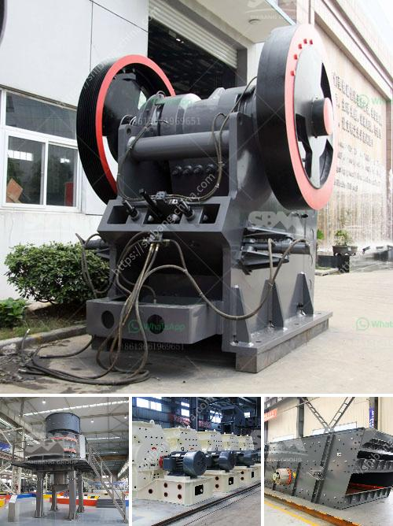

<h3>آلة تكسير الحجر صنعت في باكستان</h3>
تعتبر آلة تكسير الحجر من الأجهزة الهامة في صناعة البناء والتشييد، حيث تستخدم لتحويل الصخور الضخمة إلى حصى صغيرة الحجم تستخدم في مشاريع الطرق والمباني. واحدة من الآلات المتميزة والمستخدمة على نطاق واسع في باكستان هي آلة تكسير الحجر التي تحمل علامة أصلية باكستانية.

تتميز آلة تكسير الحجر الصناعية المصنوعة في باكستان بمزايا عديدة. فهي تعتبر الآلة المثلى لتحويل الصخور الصلبة إلى رمل وحصى صغيرة للاستخدام في البناء والطرق. تعمل هذه الآلة بواسطة محرك كهربائي قوي يساعد في تحريك المطرقة العملاقة التي تقع في الجزء العلوي من الآلة. تقوم المطرقة بتكسير الصخور عن طريق ضربها بقوة عالية، حيث تعمل على تفتيتها إلى قطع صغيرة.

تتميز آلة تكسير الحجر الصناعية المصنوعة في باكستان أيضًا بالقوة والمتانة. فهي مصنوعة من مواد عالية الجودة مثل الفولاذ المقاوم للصدأ والحديد المقاوم للتآكل، مما يجعلها تتحمل الاستخدام الشاق والتحميل الضخم. تستخدم هذه الآلة في مواقع البناء الكبيرة والمتوسطة، حيث تعمل بكفاءة متواصلة دون تلف وتكلفة صيانة باهظة.

تتميز آلة تكسير الحجر المصنوعة في باكستان بتوافرها وسهولة الحصول عليها. فقد تم تصميمها وتصنيعها محليًا في باكستان، مما يعزز الإنتاج المحلي ويوفر فرص عمل للمشغلين المحليين في صناعة الهندسة الكهربائية والتصنيع. وبفضل توافرها المحلي، فإن أسعار هذه الآلة تكون في متناول الجميع، مما يجعلها خيارًا مثاليًا للشركات والمشاريع الصغيرة والمتوسطة.

يمكن استخدام آلة تكسير الحجر المصنوعة في باكستان في جميع أنواع الأعمال الإنشائية والطرق، بدءًا من تفتيت الصخور الكبيرة في مواقع الحفر والتعدين، وصولاً إلى إنتاج الحصى والرمل في مواقع البناء. إن استخدام هذه الآلة يزيد من كفاءة العمل ويقلل من الوقت والجهد المبذولين في عمليات التكسير التقليدية.

في الختام، تُعد آلة تكسير الحجر صنعت في باكستان خيارًا ممتازًا للشركات التي تبحث عن آلة تكسير فعالة وموثوقة. فهي تحمل العلامة التجارية الباكستانية وتتمتع بالقوة والمتانة. بفضل توفرها المحلي وأسعارها المعقولة، تمثل هذه الآلة استثمارًا مثاليًا لتحسين انتاجية الشركات وتحقيق النجاح في مشاريع البناء والتشييد.
<h3>Contact us</h3><ul><li><strong>Whatsapp:&nbsp;<a href="https://wa.me/8613661969651">+8613661969651</a></strong></li><li><a href="https://swt.shibang-china.com/?git&amp;zhl&amp;آلة تكسير الحجر صنعت في باكستان"><strong>Online Service(chat now)</strong></a></li></ul><h3>Related</h3><ul><li><a href='سعر كسارات الفك المحمولة في جنوب أفريقيا.md'>سعر كسارات الفك المحمولة في جنوب أفريقيا</a></li><li><a href='سعر كسارة الحجر المحمولة في.md'>سعر كسارة الحجر المحمولة في</a></li><li><a href='كم عدد شركات تصنيع كسارات الفك في الهند.md'>كم عدد شركات تصنيع كسارات الفك في الهند</a></li><li><a href='مصنع كسارة في كينيا.md'>مصنع كسارة في كينيا</a></li><li><a href='استخراج الحجر في باكستان.md'>استخراج الحجر في باكستان</a></li></ul>