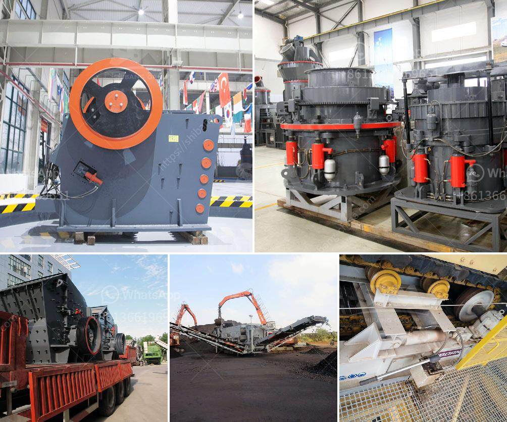

<h3>آلة تكسير الحجر للبيع</h3>
تعتبر آلة تكسير الحجر أحد الأدوات الحديثة والفعالة التي تستخدم في صناعة التعدين والبناء. فهي تستخدم لكسر الحجارة الكبيرة إلى أحجام أصغر قابلة للاستخدام في المشاريع والإنشاءات المختلفة.

تتوفر آلات تكسير الحجر بمجموعة متنوعة من الأحجام والأقدار، بدءًا من الصغيرة التي يمكن حملها بواسطة شخص واحد إلى الكبيرة التي تتطلب استخدام معدات ثقيلة لتحريكها. تعتمد قوة تكسير الحجارة على الحجم والقدرة الجميلة للآلة.

طرق تكسير الحجر تتفاوت، حيث تتضمن بعضها التكسير بالاهتزاز والاختراق، وبعضها الآخر يستخدم قوة الشد والغربلة لتكسير الحجارة. تحتوي الآلات الحديثة على تقنيات متقدمة مثل الأسطوانة المزدوجة والفك المزدوج، وهذا يزيد من كفاءة الآلة ويقلل من الجهد المبذول.

تقدم العديد من الشركات آلات تكسير الحجر للبيع بأسعار تتراوح بين 200 و 400 دولار، ويمكن العثور عليها بسهولة عبر الإنترنت أو من خلال تجار التجزئة المحليين. قبل شراء الآلة، يجب على المشتري أن يحدد احتياجاته ومتطلباته بدقة، وكذلك ينبغي عليه أن يتأكد من قدرة الآلة على تلبية تلك الاحتياجات.

من بين المميزات الأساسية لآلات تكسير الحجر، يمكن ذكر الآتي:

1. قدرة تكسير فعالة: تتميز هذه الآلات بقدرتها على تكسير الحجارة بشكل سريع وفعال، مما يسهل عملية البناء والتعدين.

2- قابلية التحرك: تتوفر بعض الآلات بتصميم محمول، مما يسمح بنقلها بسهولة بين المواقع المختلفة.

3- الاحتفاظ بالهيكل الكامل للحجر: تحتوي بعض الآلات على نظام يسمح بفرز الحجارة وفقًا لأحجامها، مما يجعلها مفيدة للاستخدام في البناء والتشييد.

4- تكاليف منخفضة: تعتبر آلات تكسير الحجر متوفرة بتكاليف معقولة، مما يجعلها ملائمة للعديد من المشروعات والشركات.

باختصار، آلات تكسير الحجر تعتبر أدوات مهمة في صناعة البناء والتعدين، وتتيح للشركات والمشاريع إتمام الأعمال بكفاءة وفعالية. سعرها المتوسط يتراوح بين 200 و 400 دولار، ويتوفر العديد من النماذج والأحجام لتلبية احتياجات المشتري. من المهم تحديد وفهم المتطلبات المحددة قبل شراء الآلة لضمان الحصول على المنتج المناسب.
<h3>Contact us</h3><ul><li><strong>Whatsapp:&nbsp;<a href="https://wa.me/8613661969651">+8613661969651</a></strong></li><li><a href="https://swt.shibang-china.com/?git&amp;zhl&amp;آلة تكسير الحجر للبيع"><strong>Online Service(chat now)</strong></a></li></ul><h3>Related</h3><ul><li><a href='طحن الرمل السيليكا.md'>طحن الرمل السيليكا</a></li><li><a href='مصنع معالجة مسحوق الجبس في الهند.md'>مصنع معالجة مسحوق الجبس في الهند</a></li><li><a href='تقرير مشروع مصنع الرخام بتنسيق PDF.md'>تقرير مشروع مصنع الرخام بتنسيق PDF</a></li><li><a href='آلات مصنع الحصى الكوارتز.md'>آلات مصنع الحصى الكوارتز</a></li><li><a href='مطاحن للبيع في هراري.md'>مطاحن للبيع في هراري</a></li></ul>