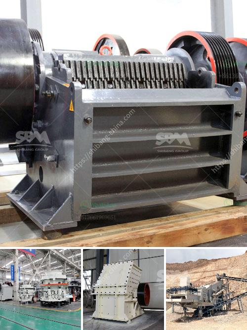

<h3>آلة تكسير الحجر نيجيريا</h3>
تكسير الحجر هو عملية تستخدم لتقليل حجم الصخور الكبيرة إلى قطع صغيرة من الحجم أو الركام. تستخدم الآلات المصممة خصيصاً لهذا الغرض، مثل آلة تكسير الحجر في نيجيريا، لتحقيق هذا الهدف.

تُعتبر آلة تكسير الحجر في نيجيريا أحد أهم الأدوات الهندسية التي تستخدم في صناعة البناء وتعدين الموارد الطبيعية. تتكون هذه الآلة من مكبس يستخدم لتكسير الحجارة وعناصر تحكم تساهم في تنظيم عملية التكسير بإعطاء الإشارات للمكبس بين أن يقوم بالضغط على الحجر أو الانتقال للحجر التالي.

تم استخدام آلة تكسير الحجر في نيجيريا بشكل واسع في قطاعات البناء والتعدين والمواد الكيميائية وصناعة الطرق. فهي تستخدم لتحطيم الصخور الصلبة والمواد غير المعدنية مثل الجرانيت والحجر الجيري والبازلت والخبث المعدنية وغيرها.

يعتبر تكسير الحجر ضروريًا في صناعة البناء، حيث يتم استخدام الحجارة المكسرة كمواد أساسية للخرسانة والطرق والأساسات والأعمدة والجدران. بواسطة هذه الآلة، يمكن تحويل الحجارة الكبيرة إلى حصى مستدامة يمكن تثبيتها وتدوم لفترة طويلة.

تكسير الحجارة يستخدم أيضًا في صناعة التعدين، حيث يتم استخراج المعادن من الصخور وتحطيمها لاستخلاص العناصر أو المواد الثمينة الداخلة فيها. وهي تستخدم أيضًا في صناعة الطرق حيث تقوم بتكسير الحجارة الكبيرة لتحقيق الاستقرار والسلامة للطرق.

تعتبر آلة تكسير الحجارة في نيجيريا ذات أهمية كبيرة، حيث تُسهم في تعزيز البنية التحتية والتطور الاقتصادي والاجتماعي للبلاد. كما أن تحسين تكنولوجيا تكسير الحجارة يساهم في تحقيق الكفاءة وتقليل تكاليف الإنتاج والبيئة وفي النهاية يؤدي إلى تحسين جودة الحياة.

في الختام، تكسير الحجارة يلعب دورًا حيويًا في العديد من الصناعات مثل صناعة البناء والتعدين والطرق. وبوجود آلة تكسير الحجارة في نيجيريا، يمكن للبلاد تحويل الحجارة الكبيرة إلى حصى صالحة للاستخدام مما يؤدي إلى تعزيز التنمية والنمو الاقتصادي.
<h3>Contact us</h3><ul><li><strong>Whatsapp:&nbsp;<a href="https://wa.me/8613661969651">+8613661969651</a></strong></li><li><a href="https://swt.shibang-china.com/?git&amp;zhl&amp;آلة تكسير الحجر نيجيريا"><strong>Online Service(chat now)</strong></a></li></ul><h3>Related</h3><ul><li><a href='كسارة التعدين في تنزانيا.md'>كسارة التعدين في تنزانيا</a></li><li><a href='مصانع مطاحن الأسمنت.md'>مصانع مطاحن الأسمنت</a></li><li><a href='تقرير مشروع مصنع الأسمنت الصغير.md'>تقرير مشروع مصنع الأسمنت الصغير</a></li><li><a href='مصنع غسل الحجارة الكوارتز.md'>مصنع غسل الحجارة الكوارتز</a></li><li><a href='أنظمة ناقلات الحصى للمسافة.md'>أنظمة ناقلات الحصى للمسافة</a></li></ul>