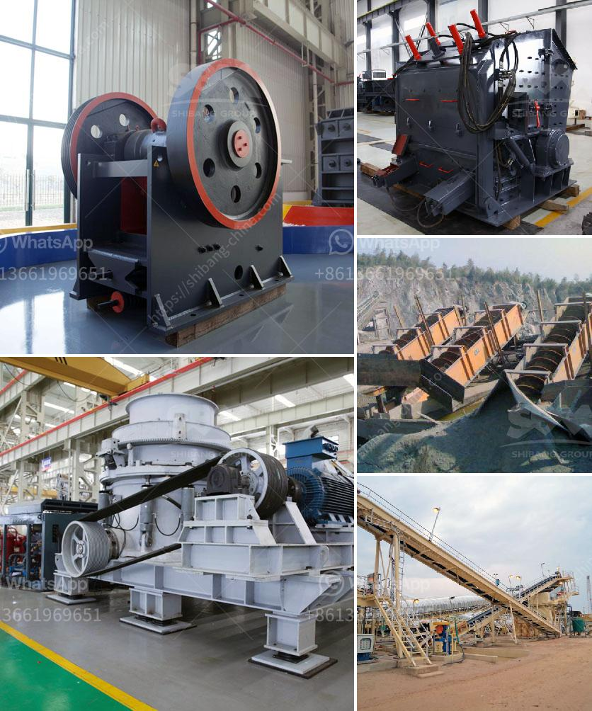

<h3>آلة تكسير الحصى</h3>
تعد آلة تكسير الحصى أداة حيوية في صناعة البناء والبنية التحتية. فهي تستخدم لتحويل الحصى الخشن إلى قطع صغيرة ومتجانسة يمكن استخدامها في مختلف المشاريع الإنشائية. وفيما يلي سنتناول بعض المعلومات المفصلة حول هذه الآلة وأهميتها.

تتكون آلة تكسير الحصى من عدة أجزاء رئيسية، بما في ذلك المغذي المهتز والكسارة والشاشة والناقل. تبدأ عملية التكسير بتغذية الحصى الخام في المغذي المهتز، الذي ينقل الحصى إلى الكسارة عن طريق حزام ناقل. يعمل الكسارة على تكسير الحصى إلى قطع أصغر بواسطة ضربات متكررة من البطاقات المعدنية أو الهامر الموجودة في الداخل. بعد عملية التكسير، تمر القطع الصغيرة من خلال الشاشة لفصلها عن الحصى غير الكافي وتصنيفها حسب الحجم المطلوب. وأخيرًا، يتم نقل الحصى المكسر المصنف من خلال الناقل إلى موقع الاستخدام المطلوب.

من أهم الفوائد التي تقدمها آلة تكسير الحصى هي زيادة فعالية العمل والإنتاجية. فهي تقوم بتحويل الحصى الخام إلى قطع صغيرة ومتجانسة مما يسهل عملية استخدامها في المشاريع البنائية. بالإضافة إلى ذلك، فإن تكسير الحصى يساعد في تقليل تكاليف البناء، حيث يتم استخدام الحصى المكسر كبديل للمواد البنائية الأخرى الأكثر تكلفة.

وفي الوقت نفسه، تعمل آلة تكسير الحصى على تحسين جودة وتجانس المنتج النهائي. حيث أنها تزيل الشوائب والمواد الغريبة من الحصى الخام وتحولها إلى قطع صغيرة أكثر تماثلًا وقوة. وبالتالي، يمكن أن يؤدي استخدام الحصى المكسر في المشاريع البنائية إلى نتائج أكثر استدامة وقوة.

لتلبية احتياجات الصناعة المتزايدة، هناك مجموعة واسعة من آلات تكسير الحصى المتاحة في السوق. تختلف هذه الآلات في الحجم والقدرة والتقنيات المستخدمة. ومن المهم اختيار الآلة المناسبة بناءً على احتياجات المشروع والمواصفات المطلوبة.

في النهاية، يمكن القول أن آلة تكسير الحصى هي أداة حاسمة لإعداد المواد البنائية قبل استخدامها في المشاريع الإنشائية. فهي تساهم في تحسين جودة المنتج النهائي وتقليل التكلفة وزيادة الإنتاجية. ومن المتوقع أن تستمر أهمية هذه الآلة في الزيادة مع تطور صناعة البناء والتعمير.
<h3>Contact us</h3><ul><li><strong>Whatsapp:&nbsp;<a href="https://wa.me/8613661969651">+8613661969651</a></strong></li><li><a href="https://swt.shibang-china.com/?git&amp;zhl&amp;آلة تكسير الحصى"><strong>Online Service(chat now)</strong></a></li></ul><h3>Related</h3><ul><li><a href='سعر كسارة الحجر الصلب.md'>سعر كسارة الحجر الصلب</a></li><li><a href='آلة فحص متنقلة في جنوب أفريقيا.md'>آلة فحص متنقلة في جنوب أفريقيا</a></li><li><a href='تكلفة كسارة المعدات في ماليزيا.md'>تكلفة كسارة المعدات في ماليزيا</a></li><li><a href='مصنع عملية التصنيع في جنوب أفريقيا.md'>مصنع عملية التصنيع في جنوب أفريقيا</a></li><li><a href='مصنع دوامة للبيع لخام الكروم.md'>مصنع دوامة للبيع لخام الكروم</a></li></ul>