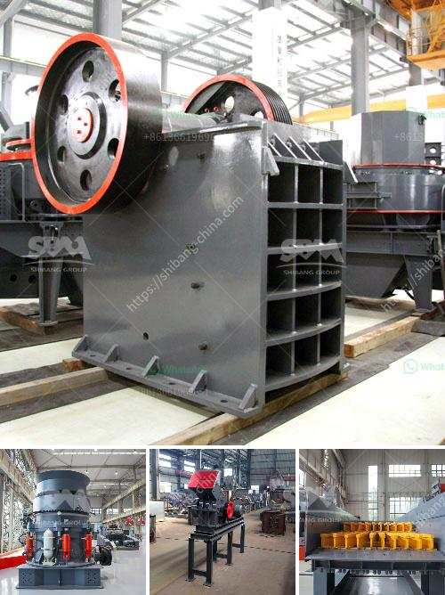

<h3>آلة تكسير الصخور في الفلبين</h3>
تعد الفلبين واحدة من أكبر الدول المنتجة للصخور في جنوب شرق آسيا. يتم استخراج الصخور من الجبال والمناجم في الفلبين، وتستخدم في العديد من الصناعات مثل البناء والبنية التحتية والطرق والجسور وصناعة الزخارف. ومن أجل الاستفادة القصوى من هذه الصخور، يتم استخدام آلات التكسير لتكسير الصخور الكبيرة إلى قطع أصغر وأكثر مناسبة للاستخدام العملي.

تعد آلة تكسير الصخور جهازًا ضروريًا في عملية التعدين وتكسير الصخور في الفلبين. الآلة تستخدم محرك ديزل لتشغيل جهاز التكسير وتحطيم الصخور بفاعلية عالية وقدرة كبيرة. تتميز الآلة بتصميم قوي وقدرة على التحمل للعمل في الظروف الصعبة والبيئات القاسية التي قد يتعرض لها العمال.

يعتبر تكسير الصخور عملية حاسمة في صناعة البناء والتشييد. حيث تكسر الآلات الصخور الكبيرة إلى حجم أصغر، مما يجعلها مناسبة للاستخدام في البناء. وبهذه الطريقة، يتم توفير الوقت والجهد في تكسير الصخور يدويًا. بالإضافة إلى ذلك، تقلل آلة تكسير الصخور من استخدام القوى البشرية وتزيد من سرعة الإنتاج والكفاءة.

تستخدم آلة تكسير الصخور أسلوبين رئيسيين لتحقيق هدف التكسير. تستخدم الطريقة الأولى طاحونة الأنواع بالاصطدام، حيث تقوم بتحطيم الصخر عبر صفائح صلبة تستخدم لتأريض الصخور بينما يتم دفعها بقوة عالية. الطريقة الثانية تعتمد على الضغط الهيدروليكي لضغط الصخور حتى تنكسر تحت القوة العالية.

تتميز آلة تكسير الصخور في الفلبين بأنها قوية وفعالة وقادرة على التعامل مع مجموعة متنوعة من الصخور، بما في ذلك الحجارة الصلبة والمعادن والمواد الخام. تأتي الآلة بمختلف الأحجام والإعدادات، حيث يمكن تخصيصها حسب الاحتياجات المحددة للمشروع.

بالاعتماد على الآلة المستخدمة، يمكن تكسير الصخور في الفلبين إلى أحجام مختلفة. يمكن أن تكون القطع الصغيرة من الصخور مثالية للاستخدام في صناعة الخرسانة أو لتكوين أساس صلب للطرق. تحل آلة تكسير الصخور محل العمل الشاق والمكلف لتكسير الصخور يدويًا، وتحقق توفيرًا ملحوظًا في الوقت والجهد والتكاليف.

في النهاية، تعد آلة تكسير الصخور جهازًا ضروريًا للصناعات المرتبطة بالبناء في الفلبين. تساعد الآلة على تحقيق أقصى استفادة من الموارد الطبيعية المتاحة، وتقلل من العمل الشاق والوقت المستغرق في تكسير الصخور يدويًا. بالاستفادة من قوة التكنولوجيا، يمكن للفلبين الاعتماد على آلات تكسير الصخور لتحقيق التنمية المستدامة والنجاح في صناعاتها المختلفة.
<h3>Contact us</h3><ul><li><strong>Whatsapp:&nbsp;<a href="https://wa.me/8613661969651">+8613661969651</a></strong></li><li><a href="https://swt.shibang-china.com/?git&amp;zhl&amp;آلة تكسير الصخور في الفلبين"><strong>Online Service(chat now)</strong></a></li></ul><h3>Related</h3><ul><li><a href='كسارة الحجر في هيماتشال براديش.md'>كسارة الحجر في هيماتشال براديش</a></li><li><a href='سعر كسارة حجر الركام في جنوب أفريقيا.md'>سعر كسارة حجر الركام في جنوب أفريقيا</a></li><li><a href='آلة تكسير للمواد الكاشطة للبيع.md'>آلة تكسير للمواد الكاشطة للبيع</a></li><li><a href='عملية إنتاج الطين.md'>عملية إنتاج الطين</a></li><li><a href='تأجير كسارة تأجير في غانا.md'>تأجير كسارة تأجير في غانا</a></li></ul>