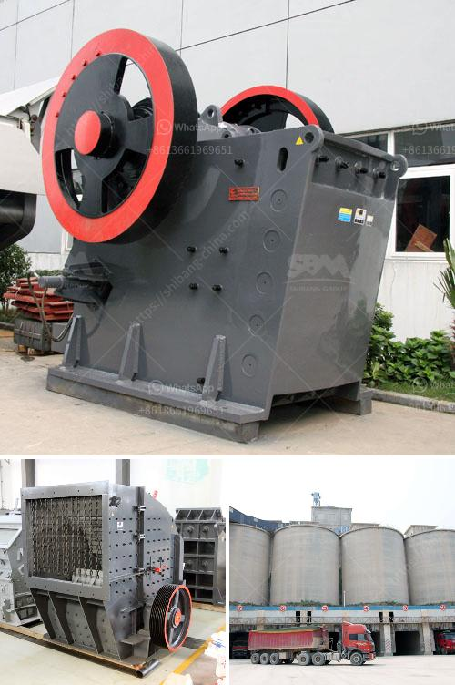

<h3>آلة تكسير الصخور</h3>
تعتبر آلة تكسير الصخور معدة هندسية حديثة وفعالة تستخدم لتحطيم الصخور الكبيرة إلى قطع صغيرة قابلة للنقل والتخزين. تستخدم هذه الآلة على نطاق واسع في صناعات مختلفة مثل البناء والتعدين والتصنيع والهندسة المدنية. يتم استخدامها أيضًا في مشاريع البنية التحتية مثل إنشاء الطرق والجسور والسدود.

تعمل آلة تكسير الصخور بواسطة تطبيق قوة ضغط عالية على الصخور باستخدام آلية هيدروليكية. وتعمل آلة الكسارة الهيدروليكية بالقدرة العالية والكفاءة العالية والتشغيل السلس. تأتي الآلة بعدة أحجام واختلافات في القوة لتناسب الاحتياجات المختلفة للعملاء. تتكون الآلة من جزأين رئيسيين: الفك الثابت والفك المتحرك. يتم تحريك الفك المتحرك بواسطة آلية ميكانيكية أو هيدروليكية لضغط الصخور بين الفكين وتكسيرها.

تتميز آلة تكسير الصخور بالعديد من الفوائد والمزايا. على سبيل المثال، تساعد على توفير الوقت وتقليل الجهد البشري المطلوب لتكسير الصخور يدوياً. تكسير الصخور يدوياً يكون أمرًا صعبًا ومكلفًا ومعقدًا وقد يتطلب توظيف عدد كبير من العمال لإنجاز المهمة. بالمقابل، يمكن لآلة التكسير الهيدروليكية إنجاز المهمة بسرعة وفعالية وبشكل دقيق بواسطة عامل واحد فقط.

بالإضافة إلى ذلك، تقوم آلة تكسير الصخور بتحسين جودة العمل والناتج النهائي. عند استخدام الآلة، يمكن ضبط المقاسات المطلوبة للقطع النهائية، مما يسمح بالحصول على منتج نهائي متوافق مع المواصفات والمتطلبات. هذا يعني أنه يمكن استخدام القطع بسهولة دون الحاجة إلى معالجة إضافية أو تعديل.

ومن الجوانب الإيجابية الأخرى لاستخدام آلة تكسير الصخور أنها تقلل من التآكل وتطيل عمر الأجهزة الأخرى المستخدمة في تكسير الصخور. بدلاً من تكسير الصخور باستخدام معدات أخرى مثل الهامر أو الحفارات، يمكن استخدام الآلة على حد سواء لتوفير الوقت وتقليل الأضرار المحتملة للمعدات الأخرى.

في الختام، تلعب آلة تكسير الصخور دورًا حاسمًا في صناعات مختلفة وتوفر العديد من المزايا المحسوسة والاقتصادية. تساهم في زيادة الإنتاجية وتحسين جودة العمل وتقليل الجهد البشري المطلوب. بفضل هذه الآلة الحديثة، يمكن للشركات والمشاريع إنجاز المهام بكفاءة أكبر وتحقيق نتائج أفضل في أقل وقت وجهد ممكن.
<h3>Contact us</h3><ul><li><strong>Whatsapp:&nbsp;<a href="https://wa.me/8613661969651">+8613661969651</a></strong></li><li><a href="https://swt.shibang-china.com/?git&amp;zhl&amp;آلة تكسير الصخور"><strong>Online Service(chat now)</strong></a></li></ul><h3>Related</h3><ul><li><a href='صورة مطحنة رولر ريموند الموديل 30.md'>صورة مطحنة رولر ريموند الموديل 30</a></li><li><a href='كسارات للركام الجرانيت.md'>كسارات للركام الجرانيت</a></li><li><a href='كسارة الحجر ديربان.md'>كسارة الحجر ديربان</a></li><li><a href='كسارة محمولة للحطام.md'>كسارة محمولة للحطام</a></li><li><a href='تقرير مشروع كسارة الحجر في كارناتاكا.md'>تقرير مشروع كسارة الحجر في كارناتاكا</a></li></ul>