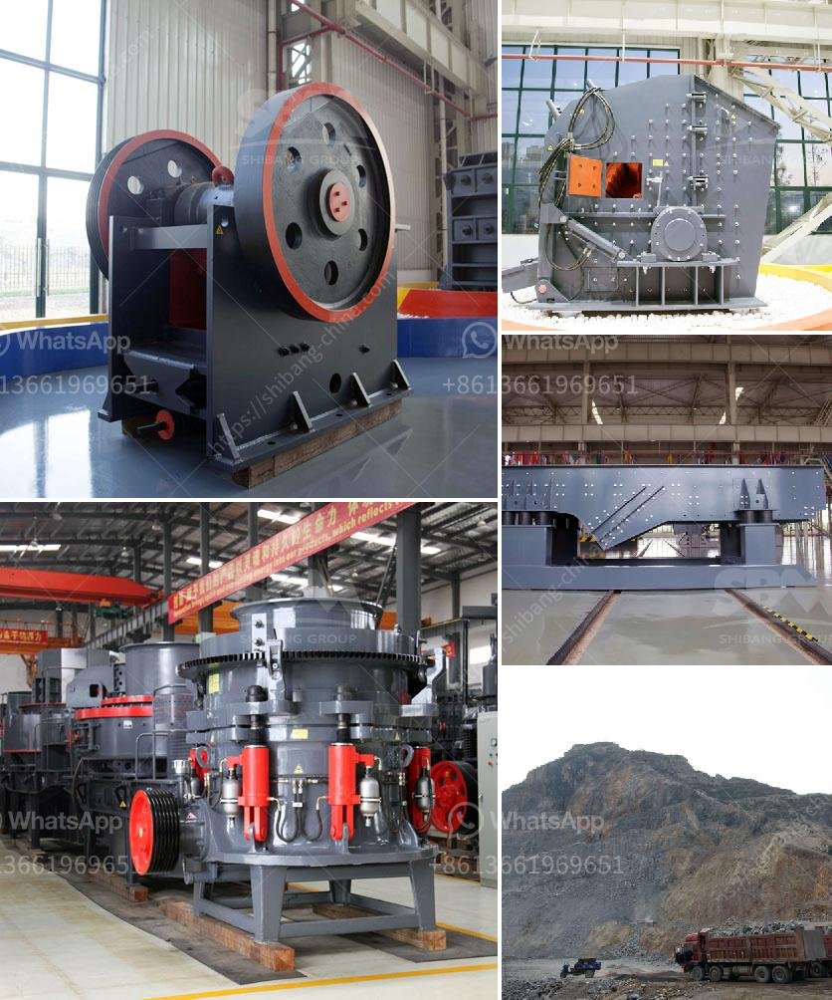

<h3>آلة تكسير الفحم</h3>
تُعد آلة تكسير الفحم أحد الأجهزة الهامة التي تستخدم في عمليات تحطيم وتكسير الفحم إلى جزيئات صغيرة. يُستخدم الفحم عادة كمصدر للطاقة، سواء في مجال التوليد الكهربائي أو في صناعة الحديد والصلب. وبالتالي، فإن وجود آلات تكسير فعالة يصبح أمرًا حيويًا لاستخدام الفحم بكفاءة واستدامة.

تأتي آلة تكسير الفحم بتصاميم متنوعة تعتمد على الوظيفة المطلوبة وكمية الفحم المراد تكسيرها. تضمن هذه الآلات مجموعة متنوعة من الأجزاء والتجهيزات، مثل الفك المُكبس، والأسطوانة، والطاحونة، والمصعد، وناقل الحزام، والغربال الاهتزازي. يتم استخدام هذه الأجزاء بشكل متكامل لتحقيق عملية تكسير فعالة وسلسة.

تبدأ عملية تكسير الفحم بدخول قطع الفحم الكبيرة إلى الآلة. تستخدم الفك المُكبس للضغط على الفحم بقوة كبيرة، مما ينتج عنه تكسير الجزيئات الكبيرة إلى جزيئات أصغر وأكثر سهولة في التعامل معها. يتم نقل الفحم المكسور عن طريق الأسطوانة الموجودة في الآلة، حيث يتم استخدام الطاقة الحركية لضغط الفحم وشده. بعد ذلك، يتم توجيه الجزيئات المكسورة إلى طاحونة الفحم الموجودة في الآلة لمزيد من التكسير والطحن، مما يؤدي إلى حجم نهائي أصغر.

تعتبر آلة تكسير الفحم من الآلات الأساسية في صناعة التعدين والهندسة البيئية، حيث يمكنها تحويل كميات كبيرة من الفحم إلى شكل يسهل نقله واستخدامه. تساهم هذه الآلة في تحسين كفاءة استخدام الفحم، وتحقيق توفير في استهلاك الطاقة، وتقليل تلوث البيئة الناتج عن حرق الفحم.

باستخدام آلة تكسير الفحم، يتم إنتاج جزيئات مكسورة تحتوي على سطح أكبر، مما يسهل عملية احتراق الفحم وزيادة كفاءته الحرارية. بالإضافة إلى ذلك، يتم تحقيق تحسين كبير في استخراج الفحم واستغلاله بشكل أكبر، نظرًا لأن الجزيئات الصغيرة تتفاعل بشكل أفضل مع العمليات الكيميائية لاستخراج المواد القيمة من الفحم.

في الختام، فإن آلة تكسير الفحم تشكل جزءًا أساسيًا في سلسلة عمليات استخراج واستخدام الفحم. بفضل تصميمها الفعال وقدرتها على تحويل الفحم إلى جزيئات أصغر، تساهم هذه الآلة في استدامة استخدام الفحم كمصدر للطاقة وتحقيق كفاءة أعلى في العمليات الصناعية المتعلقة به.
<h3>Contact us</h3><ul><li><strong>Whatsapp:&nbsp;<a href="https://wa.me/8613661969651">+8613661969651</a></strong></li><li><a href="https://swt.shibang-china.com/?git&amp;zhl&amp;آلة تكسير الفحم"><strong>Online Service(chat now)</strong></a></li></ul><h3>Related</h3><ul><li><a href='سحق 100 طن في الساعة.md'>سحق 100 طن في الساعة</a></li><li><a href='تكلفة الكسارة المحمولة للساعة الواحدة.md'>تكلفة الكسارة المحمولة للساعة الواحدة</a></li><li><a href='آلة مسحوق الجير السريع.md'>آلة مسحوق الجير السريع</a></li><li><a href='آلة المحجر للبيع.md'>آلة المحجر للبيع</a></li><li><a href='شراء محطة غسيل الفحم في ألمانيا.md'>شراء محطة غسيل الفحم في ألمانيا</a></li></ul>