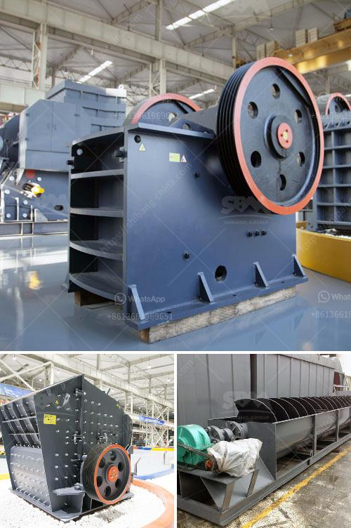

<h3>آلة تكسير الفك</h3>
تعتبر آلة تكسير الفك أحد الأدوات الأساسية في صناعة التعدين ومعالجة الصخور. تستخدم هذه الآلة لتكسير الصخور والمواد الخام بحجم كبير إلى قطع صغيرة قابلة للتحمل. لا تقتصر استخدامات آلة تكسير الفك على التعدين فحسب، بل يمكن استخدامها أيضًا في صناعات أخرى مثل البناء والبناء الطرق والكيمياء والمعادن والزجاج والسيراميك.

تتكون آلة تكسير الفك بشكل عام من إطار رئيسي، فكين فتاحة، مسند الفك، عجلة التمييز، رمح البكرة، نظام التوجيه، نظام إزالة الغبار ونظام التوتر. بالإضافة إلى ذلك، تعمل هذه الآلة بواسطة محرك كهربائي يحرك الحزام الشريطي وينقل الحركة إلى فكي الفك عن طريق الحزام الشريطي والقرص الدوار، مما يؤدي إلى تكسير المواد.

تعد آلة تكسير الفك مفيدة جدًا في صناعة التعدين. فهي تساهم في عملية استخراج المعادن بكفاءة وسرعة. يمكن استخدامها لسحق الصخور المتوسطة والصلبة، مما يتيح الوصول إلى المواد الخام بسهولة. بالإضافة إلى ذلك، يمكن تعديل الفجوة بين فكي الفك، مما يسمح بإنتاج قطع بالأحجام المطلوبة.

تعتبر آلة تكسير الفك مهمة للغاية في صناعة البناء أيضًا. فهي تستخدم لسحق الصخور الكبيرة والحجارة إلى قطع صغيرة، والتي يمكن استخدامها في البناء وتعبيد الطرق. بفضل قدرتها على تحويل الصخور الكبيرة إلى قطع قابلة للنقل، تعزز آلة تكسير الفك سهولة البناء وتوفير الوقت والجهد.

علاوة على ذلك، تتميز آلة تكسير الفك بأنها سهلة الصيانة وآمنة في الاستخدام. تتطلب فقط صيانة منتظمة للحفاظ على أداء عالي وفعالية. يتم تجهيز الآلة بنظام إزالة الغبار لمنع تراكم الأتربة والرواسب، وهو ما يضمن عمرًا أطول وأداءًا أفضل للآلة.

في النهاية، يمكن القول إن آلة تكسير الفك تلعب دورًا هامًا في صناعة التعدين والبناء والصناعات المتعددة الأخرى. تساهم هذه الآلة في تحسين عمليات الاستخراج والبناء والتصنيع، خاصةً فيما يتعلق بتحويل الصخور الكبيرة إلى قطع صغيرة وسهلة النقل. وبفضل سهولة الصيانة والاستخدام الآمنة، تعتبر آلة تكسير الفك اختيارًا شائعًا وموثوقًا به للعديد من الصناعات.
<h3>Contact us</h3><ul><li><strong>Whatsapp:&nbsp;<a href="https://wa.me/8613661969651">+8613661969651</a></strong></li><li><a href="https://swt.shibang-china.com/?git&amp;zhl&amp;آلة تكسير الفك"><strong>Online Service(chat now)</strong></a></li></ul><h3>Related</h3><ul><li><a href='آلة طحن وخلط الكوارتز.md'>آلة طحن وخلط الكوارتز</a></li><li><a href='تجار الكسارات المحمولة في جنوب أفريقيا.md'>تجار الكسارات المحمولة في جنوب أفريقيا</a></li><li><a href='معدات تكسير الحجر زينيث.md'>معدات تكسير الحجر زينيث</a></li><li><a href='كسارة الكرة النحاس آلة كسارة النحاس.md'>كسارة الكرة النحاس آلة كسارة النحاس</a></li><li><a href='آلة مطحنة الكرة في الصين.md'>آلة مطحنة الكرة في الصين</a></li></ul>