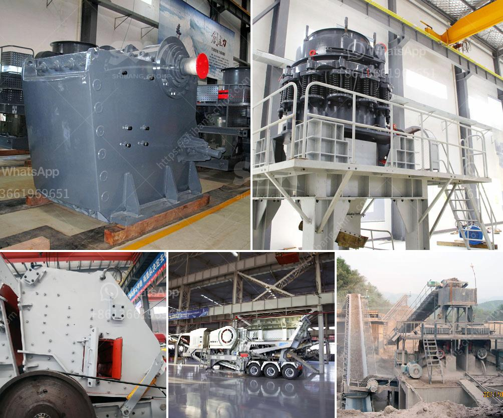

<h3>آلة تكسير للمواد الكاشطة للبيع</h3>
تعتبر آلة تكسير المواد الكاشطة واحدة من الأدوات الحديثة المستخدمة في العديد من الصناعات المختلفة، وتعتبر منتجاً ضرورياً في عالم الهندسة والتشييد. هذه الآلة تقدم عملية تحطيم فعالة للمواد الكاشطة مثل الأسمنت والزجاج والخرسانة والأحجار والخامات الصلبة الأخرى.

يتم استخدام الآلة لتفتيت المواد الكبيرة إلى جسيمات صغيرة، وذلك لتيسير عملية معالجة هذه المواد أو لغرض التخلص منها بطريقة سهلة وفعالة. تحتوي آلة التكسير على محرك قوي يدفع آلية الكسر التي تستخدم القوة الميكانيكية لتفتيت وتحطيم المواد الصلبة.

تعتبر آلة التكسير متعددة الاستخدامات، حيث يمكن استخدامها في عدة صناعات، مثل البناء والتعدين والصناعات الأخرى التي تتطلب تكسير المواد الكاشطة. واحدة من أكثر استخداماتها شيوعًا هي تكسير الصخور والأحجار في صناعة البناء، حيث يتم تحويل الحجارة الكبيرة إلى جزيئات صغيرة منتظمة الشكل، وتسهل بالتالي عملية صنع الخرسانة والأسمنت والرخام والجص وغيرها من المواد البنائية الأخرى.

تأتي آلة التكسير بمجموعة واسعة من الطرز والأحجام والقدرات لتلبية متطلبات المشروع المحدد. إن تردد استخدام هذه الآلة في العديد من الصناعات يعكس فوائدها العديدة، ومنها:

1- زيادة كفاءة العمل: حيث يمكن أن تحل آلة التكسير محل العمل اليدوي البطيء والمتعب، وتقليل الوقت والجهد المبذول في عملية التكسير.

2- تحسين جودة المنتج: حيث يقوم التكسير الميكانيكي بتحويل المواد الكاشطة إلى جزيئات صغيرة ومتوجهة، مما يزيد من تجانس المنتج ويحسن جودته.

3- الاستدامة: تساهم آلة التكسير في تعزيز الممارسات المستدامة، حيث يمكن إعادة استخدام بعض المواد المكسّرة كمواد خام أو تركيبها في منتجات أخرى، وبالتالي الحد من التلوث الناتج عن التخلص من المواد الكاشطة بصورة غير مرغوب بها.

باختصار، تتيح آلة تكسير المواد الكاشطة تحقيق فوائد عديدة في مجالات مختلفة، وتمثل استثمارًا فعالًا لأصحاب الأعمال والمؤسسات التجارية. ومع تطور التقنيات وزيادة الطلب على هذه الآلات، يزداد اهتمام الشركات المصنعة بتحسين أداء وجودة هذه الآلات، وتقديم مجموعة واسعة من الخيارات لتلبية احتياجات السوق المتنوعة.
<h3>Contact us</h3><ul><li><strong>Whatsapp:&nbsp;<a href="https://wa.me/8613661969651">+8613661969651</a></strong></li><li><a href="https://swt.shibang-china.com/?git&amp;zhl&amp;آلة تكسير للمواد الكاشطة للبيع"><strong>Online Service(chat now)</strong></a></li></ul><h3>Related</h3><ul><li><a href='بيان طريقة لناقلات الحزام.md'>بيان طريقة لناقلات الحزام</a></li><li><a href='تكسير صخور صغيرة في لاس فيغاس.md'>تكسير صخور صغيرة في لاس فيغاس</a></li><li><a href='مصنعي آلات سحق النحاس في الصين.md'>مصنعي آلات سحق النحاس في الصين</a></li><li><a href='مصنع محطم للبيع في الإمارات.md'>مصنع محطم للبيع في الإمارات</a></li><li><a href='مطحنة الفحم في محطة توليد الطاقة.md'>مطحنة الفحم في محطة توليد الطاقة</a></li></ul>