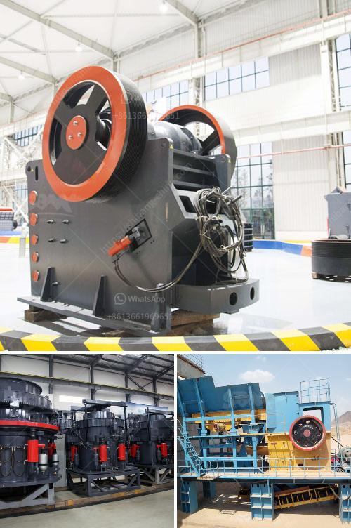

<h3>آلة تكسير وطحن مناجم الذهب</h3>
تعتبر آلة تكسير وطحن مناجم الذهب أداة حاسمة لاستخراج الذهب من باطن الأرض. يعتبر الذهب معدنًا ثمينًا ومطلوبًا على نطاق عالمي، وتُستخدم آلات تكسير وطحن المناجم لفصل الذهب عن الصخور والتربة والمواد الأخرى التي تحتوي عليه.

تتكون آلة تكسير وطحن المناجم من عدة مكونات رئيسية تعمل معًا للقيام بعملية الفصل. الأول منها هو الكسارة، التي تستخدم لتكسير الصخور الكبيرة إلى قطع صغيرة أكثر تجانسًا. يمكن أن تأخذ الكسارة العديد من الأشكال والأحجام، وتتميز بقدرتها على العمل بكفاءة في بيئة قاسية تحت الأرض.

من ثم، تأتي مرحلة طحن المواد الصلبة. تعتمد هذه الخطوة على استخدام ما يسمى بالمطاحن، حيث يتم سحق وطحن الصخور والتربة الخام لتحويلها إلى مسحوق ناعم. يعمل الطحن على تحرير الذهب الموجود في المادة الصلبة وزيادة فعالية عملية استخراجه.

لا يمكن الحديث عن آلات تكسير وطحن المناجم دون الإشارة إلى ماكينات الفصل. تستخدم هذه الماكينات لفصل جزيئات الذهب عن المواد الأخرى بناءً على خصائصها الفيزيائية المختلفة، مثل الكثافة والهيدروديناميكية. يتم تطبيق قوة الجاذبية والحركة الهوائية وتيارات الماء لإجراء عملية الفصل.

تعتبر آلات تكسير وطحن المناجم من الآلات الصناعية الهامة التي يتم تطويرها بشكل مستمر. تحسين تقنيات التكسير والطحن يعني زيادة كفاءة استخراج الذهب وتقليل النفايات وتحسين الأداء البيئي. 

بالإضافة إلى ذلك، فإن آلات تكسير وطحن المناجم تساهم في تعزيز اقتصاد الدول التي تمتلك مناجم ذهب غنية. توفر هذه الصناعة فرص عمل للعديد من العمال وتعزز النمو الاقتصادي.

باختصار، آلة تكسير وطحن المناجم هي أداة حاسمة في صناعة التعدين واستخراج الذهب. تُستخدم لتحويل الصخور الخام إلى مواد قابلة للاستخدام واستخلاص الذهب منها. تعزز هذه الآلات النمو الاقتصادي وتوفر فرص عمل وتحسين الأداء البيئي.
<h3>Contact us</h3><ul><li><strong>Whatsapp:&nbsp;<a href="https://wa.me/8613661969651">+8613661969651</a></strong></li><li><a href="https://swt.shibang-china.com/?git&amp;zhl&amp;آلة تكسير وطحن مناجم الذهب"><strong>Online Service(chat now)</strong></a></li></ul><h3>Related</h3><ul><li><a href='آلة سحق الحديد.md'>آلة سحق الحديد</a></li><li><a href='مصنع غسيل رمال الكروم بأسعار مناسبة.md'>مصنع غسيل رمال الكروم بأسعار مناسبة</a></li><li><a href='كسارة الخرسانة المصنوعة في اليابان.md'>كسارة الخرسانة المصنوعة في اليابان</a></li><li><a href='مطحنة طحن كربونات الكالسيوم.md'>مطحنة طحن كربونات الكالسيوم</a></li><li><a href='معدات تصنيع لوحات الجبس.md'>معدات تصنيع لوحات الجبس</a></li></ul>