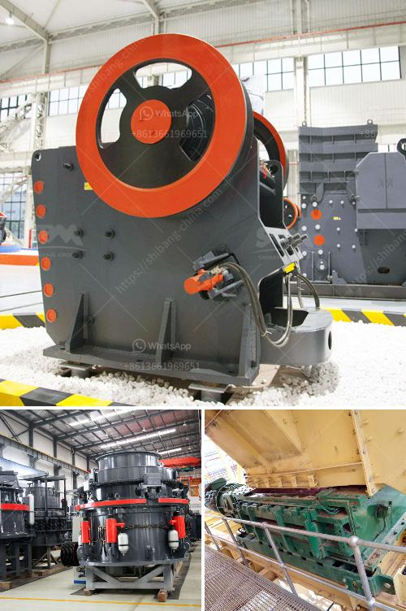

<h3>آلة حبيبات الجبس في الهند</h3>
تُعتبر آلة حبيبات الجبس من الآلات الحديثة والتكنولوجيا المتطورة التي تُستخدم في الهند لإنتاج الجبس بشكل فعال واقتصادي. وتعد الهند واحدة من أكبر الدول المنتجة للجبس في العالم، وتعتبر هذه الصناعة الشريان الرئيسي للاقتصاد المحلي في العديد من مناطق الهند.

تعتمد آلة حبيبات الجبس على تقنية التحبيب لتحويل الجبس الخام إلى حبيبات صغيرة وسطحية. يتم استخدام هذه الحبيبات في العديد من الصناعات مثل صناعة الأسمنت، والجص ، والطلاء ، والتموين الزراعي والحيواني. وهذا ما يعزز التنمية الصناعية في الهند ويوفر فرص عمل للملايين من العمال.

تعتبر آلة حبيبات الجبس متعددة الاستخدامات، حيث يمكنها تلبية متطلبات العديد من الصناعات المختلفة. تُستخدم هذه الآلة في تكسير الجبس الخام، وطحنه، وتجفيفه ، ومن ثم تحويله إلى حبيبات صغيرة. تتمتع هذه الآلة بقدرة إنتاج كبيرة وفعالية في استخدام الطاقة، مما يحسن إنتاجية العمل ويقلل من تكاليف التشغيل.

تعد صناعة حبيبات الجبس في الهند مهمة جدًا، حيث يعود ذلك إلى الاحتياطيات الكبيرة من الموارد الجبسية في البلاد. يتم استخراج الجبس من المناطق الجبلية والصحارى في ولايات مثل راجستان، تاميل نادو، غوجارات وماديا براديش. وتصدر الهند العديد من المنتجات المشتقة من الجبس للأسواق العالمية.

يُعزز قطاع حبيبات الجبس في الهند باستمرار من خلال تطوير التكنولوجيا والابتكار في عمليات الإنتاج. والهند تضم العديد من الشركات المصنعة لهذه الآلات الحديثة، مما يُعزز الاعتماد المحلي ويدعم الاقتصاد المحلي.

بشكل عام، تعتبر آلة حبيبات الجبس في الهند ركيزة أساسية في صناعة الجبس وتعزز التنمية الاقتصادية وتوفر فرص العمل للملايين من العمال المهرة. كما أنها تساهم في تلبية احتياجات السوق المحلية والعالمية للمنتجات المشتقة من الجبس وتحسين جودتها. ومن المتوقع أن يشهد قطاع حبيبات الجبس في الهند المزيد من التطور والنمو في المستقبل مع زيادة الطلب على هذه المنتجات المهمة.
<h3>Contact us</h3><ul><li><strong>Whatsapp:&nbsp;<a href="https://wa.me/8613661969651">+8613661969651</a></strong></li><li><a href="https://swt.shibang-china.com/?git&amp;zhl&amp;آلة حبيبات الجبس في الهند"><strong>Online Service(chat now)</strong></a></li></ul><h3>Related</h3><ul><li><a href='مصانع غسيل الفحم المستخدمة للبيع في الهند.md'>مصانع غسيل الفحم المستخدمة للبيع في الهند</a></li><li><a href='سير الناقل في زامبيا.md'>سير الناقل في زامبيا</a></li><li><a href='آلة صنع مسحوق الدولوميت لخط الإنتاج.md'>آلة صنع مسحوق الدولوميت لخط الإنتاج</a></li><li><a href='سعر كسارة الحجر في الساعة.md'>سعر كسارة الحجر في الساعة</a></li><li><a href='كسارة الحجر الهامر.md'>كسارة الحجر الهامر</a></li></ul>