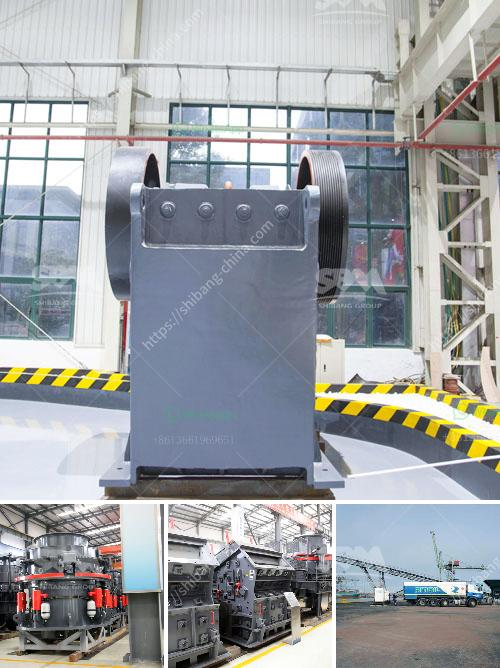

<h3>آلة حزمة مطحنة الكرة</h3>
تعتبر آلة حزمة مطحنة الكرة من الأدوات الهامة في عملية الطحن والتكسير في عدة صناعات مختلفة. تستخدم هذه الآلة بشكل رئيسي في صناعة تعدين الفحم، السيراميك، المواد الكيميائية، الكاولين، الطلاء، وغيرها من الصناعات.

تتكون آلة حزمة مطحنة الكرة من عدة أجزاء رئيسية، منها الغرفة الرئيسية للطحن، وجهاز التغذية، وجهاز التفريغ، والمحرك الكهربائي. يتم إدخال المواد النهائية إلى الغرفة الرئيسة للطحن باستخدام جهاز التغذية، وبشكل تدريجي يتم طحن المواد الخام باستخدام الكرات المعدنية الموجودة في الغرفة. تتحرك الكرات في داخل الغرفة وتعمل على سحق وطحن المواد الخام الموجودة فيها. وبعد انتهاء عملية الطحن، يتم إخراج المواد النهائية بواسطة جهاز التفريغ.

إن استخدام آلة حزمة مطحنة الكرة يعود لعدة مزايا وفوائد. أولاً، تتميز هذه الآلة بقدرتها العالية على الطحن المستمر والفعال، مما يجعلها مناسبة للعمليات الصناعية التي تحتاج إلى كمية كبيرة من المنتجات النهائية. كما أنها توفر توزيعًا جيدًا لحجم الجسيمات، مما يؤدي إلى تحسين جودة المنتج النهائي.

ثانيًا، تتمتع آلة حزمة مطحنة الكرة بكفاءة عالية في استهلاك الطاقة، مما يساهم في تقليل التكاليف التشغيلية للصناعات التي تستخدمها. وبالإضافة إلى ذلك، تتميز هذه الآلة بسهولة الصيانة والتشغيل، مما يوفر الجهد والوقت للعملاء.

وفي الختام، يمكن القول إن آلة حزمة مطحنة الكرة تعد أداة أساسية في صناعة التعدين والتكسير. فهي توفر أداءً متميزًا وكفاءة عالية في الطحن وتوزيع الجسيمات، إلى جانب سهولة الصيانة والتشغيل. تعتبر هذه الآلة الحل الأمثل للشركات التي تحتاج إلى عملية طحن فعالة واقتصادية للمواد الخام المختلفة.
<h3>Contact us</h3><ul><li><strong>Whatsapp:&nbsp;<a href="https://wa.me/8613661969651">+8613661969651</a></strong></li><li><a href="https://swt.shibang-china.com/?git&amp;zhl&amp;آلة حزمة مطحنة الكرة"><strong>Online Service(chat now)</strong></a></li></ul><h3>Related</h3><ul><li><a href='سعر رخيص لآلة تصنيع حبيبات الفحم.md'>سعر رخيص لآلة تصنيع حبيبات الفحم</a></li><li><a href='كسارة الأسطوانة PG 610 x 400.md'>كسارة الأسطوانة PG 610 x 400</a></li><li><a href='خدمة خطة الكسارة.md'>خدمة خطة الكسارة</a></li><li><a href='مطحنة الأسطوانة العمودية في الهند.md'>مطحنة الأسطوانة العمودية في الهند</a></li><li><a href='دراسة الجدوى حول حجر الأبعاد في إثيوبيا.md'>دراسة الجدوى حول حجر الأبعاد في إثيوبيا</a></li></ul>