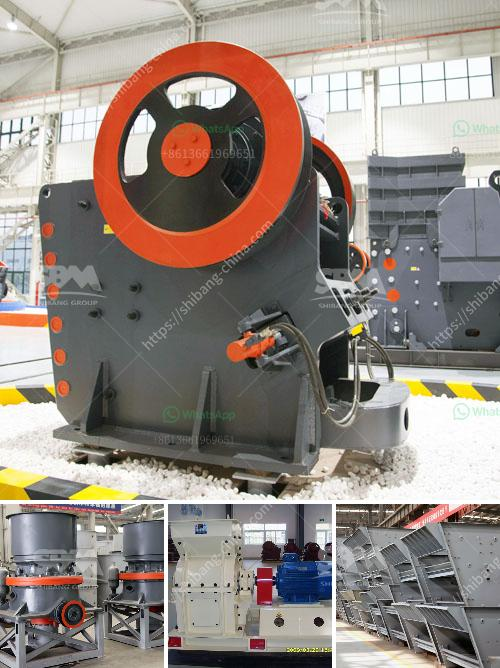

<h3>آلة حفر الحجر الجرانيت في الهند</h3>
تعتبر آلة حفر الحجر الجرانيت في الهند واحدة من أكثر الآلات المتطورة والفعالة في صناعة الحجر في العالم. تستخدم هذه الآلة لحفر وتشكيل الحجر الجرانيت، الذي يعتبر أحد أشهر أنواع الصخور الصلبة وعالية المتانة.

تقع العديد من المحاجر في الهند، وخاصة في منطقة راجاستان وتاميل نادو، وتعد حجر الجرانيت من أكثر المواد المستخدمة في صناعة البناء والديكور والنحت. وتعتبر آلة حفر الحجر الجرانيت في الهند هي الأداة الأساسية لتنفيذ هذا العمل.

تعمل آلة حفر الحجر الجرانيت عن طريق استخدام تقنية الحفر البصرية بالليزر، حيث يتم استخدام شعاع ليزر قوي لقطع وحفر الحجر. تتميز هذه الآلة بالدقة العالية والقوة الكبيرة، مما يتيح قطع وتشكيل الحجر بسهولة وفقًا للتصميم المحدد.

وتعد الهند واحدة من أكبر الدول المنتجة للحجر الجرانيت في العالم، حيث تشتهر بجودة الحجر وتنوعه. وتعتبر آلة حفر الحجر الجرانيت في الهند مفيدة لإنتاج العديد من المنتجات المختلفة مثل الأسطح الداخلية والخارجية للمباني، وتوصيلات الشوارع، والمطابخ، وحمامات السباحة، والحدائق، والنوافير، والتماثيل، إلى غير ذلك.

بفضل تقنية الليزر، يمكن لآلة حفر الحجر الجرانيت في الهند القيام بعمليات النحت والنقش على الحجر بدقة عالية وتفاصيل دقيقة، مما يجعلها الأداة المثلى للحجارة والنحاتين. وتساهم هذه الآلة في توفير الوقت والجهد وتحسين الإنتاجية بشكل عام.

يمكن القول إن آلة حفر الحجر الجرانيت في الهند هي ثورة في صناعة الحجر، حيث تسهم في تحقيق جودة عالية ومتانة للحجر المنتج وفقًا لمعايير الجودة العالمية. إن استخدام هذه الآلة في الهند وفي العديد من دول العالم يعزز القدرة على تلبية الطلب المتزايد على الحجر الجرانيت وتنويع الاستخدامات الممكنة لهذه الصخور في البناء والديكور والنحت.
<h3>Contact us</h3><ul><li><strong>Whatsapp:&nbsp;<a href="https://wa.me/8613661969651">+8613661969651</a></strong></li><li><a href="https://swt.shibang-china.com/?git&amp;zhl&amp;آلة حفر الحجر الجرانيت في الهند"><strong>Online Service(chat now)</strong></a></li></ul><h3>Related</h3><ul><li><a href='الشاشات الاهتزازية في إيطاليا.md'>الشاشات الاهتزازية في إيطاليا</a></li><li><a href='مطحنة ريموند للبنتونيت.md'>مطحنة ريموند للبنتونيت</a></li><li><a href='مصانع تحسين الكوارتز في الهند.md'>مصانع تحسين الكوارتز في الهند</a></li><li><a href='شراء مطحنة الكرة في بيرو.md'>شراء مطحنة الكرة في بيرو</a></li><li><a href='طحن معدات الطحن الطحن.md'>طحن معدات الطحن الطحن</a></li></ul>