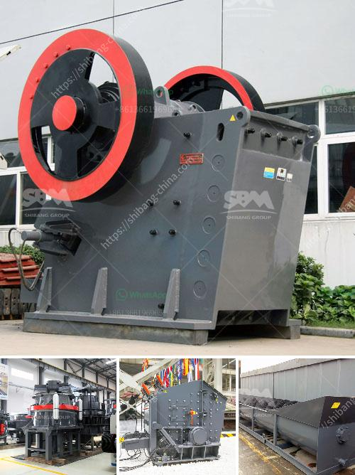

<h3>آلة سحق الأسفلت بسعة 15 طن في الساعة</h3>
تعد آلة سحق الأسفلت بسعة 15 طن في الساعة إحدى التقنيات الحديثة المستخدمة في صناعة الأسفلت. تقوم هذه الآلة بسحق الأسفلت إلى حبيبات صغيرة الحجم لاستخدامها في إعادة تدوير الأسفلت المستخدم في الشوارع والطرق.

وتتألف الآلة من عدة مكونات أساسية تعمل معًا لتنفيذ عملية سحق الأسفلت. تشمل هذه المكونات سير النقل المزود بحزام مغناطيسي لاستخراج المواد المغناطيسية، ومحطم الفك الذي يقوم بسحق الأسفلت إلى حجم صغير، والمغذية التي تقوم بتوجيه الأسفلت إلى المحطم، والغربال الاهتزازي الذي يفصل الحبيبات غير المرغوب فيها عن الحبيبات المرغوب فيها.

تعتبر هذه الآلة فعالة في استخراج الأسفلت من الشوارع وإعادة استخدامها في تعبيد الطرق. فعملية إعادة التدوير تساهم في الحفاظ على الموارد الطبيعية وتقليل تكاليف الإنتاج والتخلص من النفايات. كما أنها تعمل على تقليل استخدام المواد الخام وبالتالي تحسين الاستدامة البيئية.

بالإضافة إلى ذلك، تمتاز آلة سحق الأسفلت بسعة 15 طن في الساعة بكفاءة عالية وقدرة كبيرة على معالجة الأسفلت بسرعة وفعالية. فهي تمكن من سحق الأسفلت بكميات كبيرة في وقت قصير، مما يسهم في زيادة إنتاجية عملية إعادة التدوير وتوفير الوقت والجهد.

وتجد هذه الآلة تطبيقات واسعة في مجالات البناء والصيانة الطرق، حيث يتم استخدامها في تحويل الأسفلت القديم والمكسور إلى مواد جديدة قابلة للتدوير وإعادة استخدامها. كما تستخدم أيضًا في عمليات الهدم لسحق الأسفلت القديم واستخلاصه لاستخدامه في المشاريع القادمة.

باختصار، تعد آلة سحق الأسفلت بسعة 15 طن في الساعة تقنية حديثة وفعالة تساعد في إعادة تدوير الأسفلت وتحويله إلى مواد قابلة للتدوير والاستخدام المستدام. وبفضل سعتها العالية وكفاءتها، تلعب دورًا مهمًا في تحسين صناعة البناء والصيانة الطرق وتعزيز التنمية المستدامة.
<h3>Contact us</h3><ul><li><strong>Whatsapp:&nbsp;<a href="https://wa.me/8613661969651">+8613661969651</a></strong></li><li><a href="https://swt.shibang-china.com/?git&amp;zhl&amp;آلة سحق الأسفلت بسعة 15 طن في الساعة"><strong>Online Service(chat now)</strong></a></li></ul><h3>Related</h3><ul><li><a href='تجهيز مسحوق الكوارتز السيليكا.md'>تجهيز مسحوق الكوارتز السيليكا</a></li><li><a href='تطبيق محطة الكسارة.md'>تطبيق محطة الكسارة</a></li><li><a href='إجراءات تصحيحية لسيور النقل.md'>إجراءات تصحيحية لسيور النقل</a></li><li><a href='سعر كسارة الحجر الصلب.md'>سعر كسارة الحجر الصلب</a></li><li><a href='كم تكلفة بناء مصنع الأسمنت بسعة 100 طن.md'>كم تكلفة بناء مصنع الأسمنت بسعة 100 طن</a></li></ul>