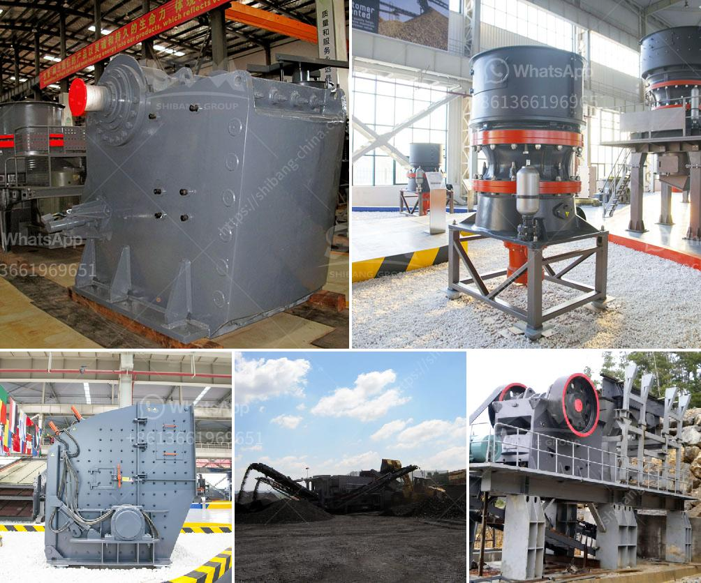

<h3>آلة سحق البلاد</h3>
تعد آلة سحق البلاد أحد الوسائل الحديثة التي تستخدم في تجميع وتفتيت المواد الخام والصخور. تتكون هذه الآلة من محرك قوي يعمل على تحويل الطاقة الكهربائية إلى طاقة ميكانيكية، وآلية تعمل على سحق المواد بفعل قوة الضغط والتوتر المستمر عليها.

تعتبر آلة سحق البلاد ضرورية في عمليات البناء والتعدين وصناعة المحاجر، حيث تساعد في تفتيت المواد الكبيرة إلى أحجام أصغر قابلة للاستخدام في عمليات البناء والإنشاء. فعندما تقوم هذه الآلة بعملية السحق، يتم تفتيت المواد إلى حجم محدد من خلال تعرضها لقوى الضغط والاحتكاك المولدة من الآلة. وبفضل سرعة الدوران العالية لها، تستطيع هذه الآلة سحق المواد الصلبة والقوية بكفاءة عالية.

تعتبر آلة سحق البلاد متعددة الاستخدامات، فهي تستخدم في عمليات تحويل المواد الصلبة إلى درجات أصغر، سواء كانت صخور أو خامات أو خرسانة متصدعة. كما يمكن استخدامها أيضًا في عمليات إعادة تدوير المواد البلاستيكية والزجاجية. فهي تسهم في استخدام الموارد بشكل أكثر فعالية وتحقيق التنمية المستدامة، إذ يمكن إعادة استخدام تلك المواد بدلاً من التخلص منها.

بالإضافة إلى ذلك، تعتبر آلة سحق البلاد ضرورية في إزالة القمامة والأنقاض في عمليات هدم البنايات وإعادة تأهيلها. فتلك الآلة تقوم بسحق الأنقاض وتحويلها إلى مواد أخرى قابلة لإعادة الاستخدام، وبذلك تسهم في تقليل النفايات وتلوث البيئة.

بشكل عام، تلعب آلة سحق البلاد دورًا هامًا في صناعة البناء والتعدين، حيث تساهم في تحسين كفاءة العمل والاستفادة الأمثل من المواد الخام. كما تسهم في توفير الموارد وحماية البيئة من التلوث. وبصفة خاصة، يعتبر استخدام هذه الآلة ضروريًا في عمليات هدم البنايات وإعادة تأهيلها، حيث يتم سحق الأنقاض واستغلالها في إعادة البناء بشكل أكثر استدامة.

باختصار، آلة سحق البلاد تعد وسيلة حديثة وفعالة لتفتيت المواد الصلبة والصخور، وتعتبر ضرورية في صناعة البناء والتعدين وإعادة التدوير. تمكننا هذه الآلة من الاستفادة الأمثل من المواد الخام وتحقيق التنمية المستدامة وحماية البيئة.
<h3>Contact us</h3><ul><li><strong>Whatsapp:&nbsp;<a href="https://wa.me/8613661969651">+8613661969651</a></strong></li><li><a href="https://swt.shibang-china.com/?git&amp;zhl&amp;آلة سحق البلاد"><strong>Online Service(chat now)</strong></a></li></ul><h3>Related</h3><ul><li><a href='مصانع الكسارات الصينية.md'>مصانع الكسارات الصينية</a></li><li><a href='شركات تصنيع آلات الكسارة في شنغهاي.md'>شركات تصنيع آلات الكسارة في شنغهاي</a></li><li><a href='حسابات في مطحنة الأسطوانة العمودية.md'>حسابات في مطحنة الأسطوانة العمودية</a></li><li><a href='سعر كسارة الحجر.md'>سعر كسارة الحجر</a></li><li><a href='مطحنة ريموند للبنتونيت.md'>مطحنة ريموند للبنتونيت</a></li></ul>