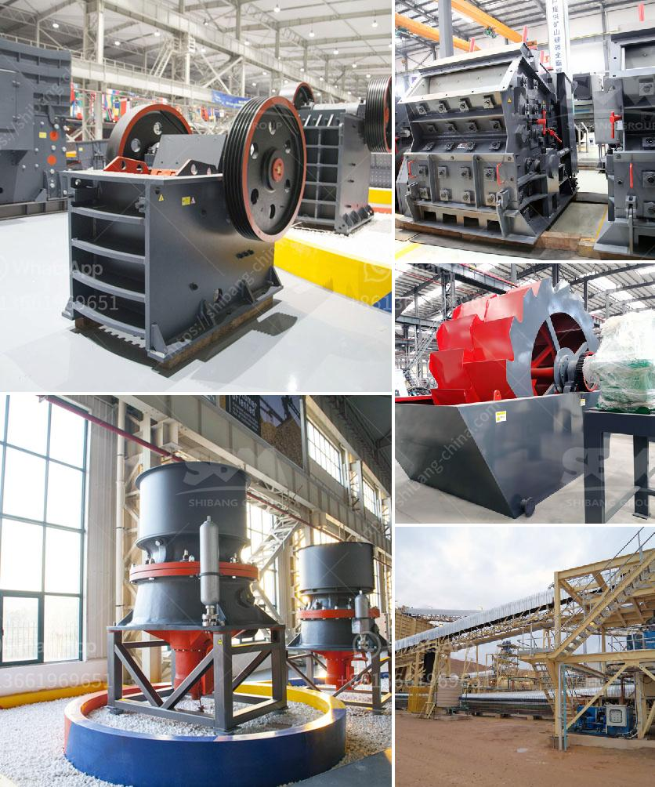

<h3>آلة سحق الحديد</h3>
تتعدد الآلات الصناعية التي تستخدم في مجال تحويل المعادن ومواد البناء، ومن بين هذه الآلات تأتي آلة سحق الحديد التي تستخدم لتكسير الحديد إلى قطع صغيرة. تعد آلة سحق الحديد من الأدوات الأساسية في صناعة التحويل، حيث يتم استخدامها في عمليات التحضير والتكسير لإعادة تدوير الحديد واستخدامه في صناعات أخرى.

تعمل آلة سحق الحديد بواسطة قوة هيدروليكية قوية تضغط على قطعة الحديد المراد تكسيرها. يتم وضع القطعة المراد تكسيرها داخل فتحة الآلة، ثم يتم تشغيل الضاغط الهيدروليكي الذي يبدأ في تطبيق ضغط على الحديد بقوة هائلة حتى يكسره إلى قطع صغيرة. يتم توجيه الحديد أثناء العملية لتحسين كفاءة السحق وخلق قطع قيمة تستخدم في عمليات التصنيع الأخرى.

تتميز آلة سحق الحديد بعدة مميزات. فبفضل تقنية الضغط الهيدروليكي المستخدمة فيها، تعتبر هذه الآلة قوية وفعالة في تكسير الحديد وتحويله إلى قطع صغيرة. كما أنها تساهم في تحسين عمليات إعادة التدوير وتقليل النفايات الصناعية، مما يعزز الاستدامة ويحمي البيئة. بالإضافة إلى ذلك، تساهم آلة سحق الحديد في توفير التكاليف وتحسين كفاءة عمليات التصنيع.

على الرغم من فوائد آلة سحق الحديد، يجب الانتباه إلى بعض الاحتياطات أثناء استخدام هذه الآلة. يجب على العمال توخي الحذر عند تشغيلها وارتداء الملابس والواقيات اللازمة لتجنب أي إصابات. كما يجب توفير الصيانة والعناية اللازمة للآلة لضمان استدامتها وأدائها الأمثل.

في النهاية، تعتبر آلة سحق الحديد أحد الأدوات المهمة في صناعة التحويل وإعادة التدوير. وتسهم في تكسير الحديد وتحويله إلى قطع صغيرة تستخدم في صناعات أخرى. ومن خلال استخدامها بشكل صحيح واتباع الإجراءات الوقائية، يمكن أن تكون هذه الآلة فعالة وآمنة في عمليات التحويل وتعزز الاستدامة وحماية البيئة.
<h3>Contact us</h3><ul><li><strong>Whatsapp:&nbsp;<a href="https://wa.me/8613661969651">+8613661969651</a></strong></li><li><a href="https://swt.shibang-china.com/?git&amp;zhl&amp;آلة سحق الحديد"><strong>Online Service(chat now)</strong></a></li></ul><h3>Related</h3><ul><li><a href='قائمة الآليات لمصانع تجهيز الرخام.md'>قائمة الآليات لمصانع تجهيز الرخام</a></li><li><a href='بدء عمل كسارة الجرانيت.md'>بدء عمل كسارة الجرانيت</a></li><li><a href='مصنع آلات كسارة الحجر الماسي في الهند.md'>مصنع آلات كسارة الحجر الماسي في الهند</a></li><li><a href='مطحنة الهامر من إيديبيسا.md'>مطحنة الهامر من إيديبيسا</a></li><li><a href='سيور ناقلة في جنوب أفريقيا.md'>سيور ناقلة في جنوب أفريقيا</a></li></ul>