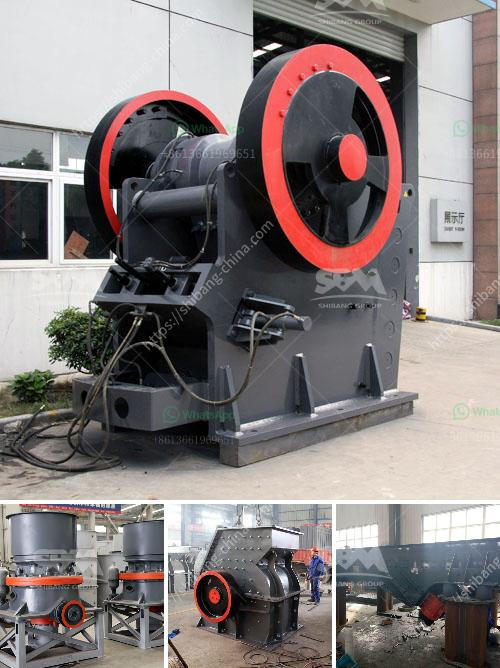

<h3>آلة سحق الدولوميت للبيع في دبي</h3>
تعد آلة سحق الدولوميت من أهم المعدات المستخدمة في صناعة التعدين ومعالجة المواد الصلبة. وتعتبر دبي وجهة مهمة لشراء وبيع معدات التعدين والبناء على مستوى العالم. تتميز دبي بتوفر العديد من الشركات والمؤسسات التي تشتري وتبيع معدات التعدين المستخدمة بأسعار مناسبة.

تستخدم آلة سحق الدولوميت لسحق الدولوميت إلى حجم صغير بحجم يتراوح بين 0-5 مم. يتم تصنيع الدولوميت من صخور الحجر الجيري التي تحتوي على نسبة عالية من الكربونات، وتتواجد بكثرة في عدة مناطق حول العالم بما في ذلك دبي.

تستخدم آلة سحق الدولوميت بشكل رئيسي في صناعة البناء والمواد الكيميائية والصناعات الزجاجية والأسمنتية والحجرية ومعالجة المواد الخام. تضمن هذه الآلة سحق الدولوميت عملية سحق فعالة وموثوقة للغاية.

تتوفر آلة سحق الدولوميت في العديد من النماذج والأحجام، وتنتج في شكل ثابت ومحمول. تتميز النماذج الثابتة بأداء مستقر وقدرة إنتاجية عالية، وتعتبر مثالية للمشاريع الكبيرة. بالإضافة إلى ذلك، النماذج المحمولة متعددة الاستخدامات وقابلة للنقل بسهولة حول موقع البناء.

قد تتراوح أسعار آلة سحق الدولوميت المستخدمة في دبي بين 200-400 ألف درهم إماراتي، وهذا يعتمد على الحجم والمواصفات التي تحددها الشركة المشترية. يمكن للمشتري أيضًا العثور على تلك الآلات بأسعار أقل في المزادات أو من خلال البائعين المحليين.

بالنظر إلى أهمية آلة سحق الدولوميت في صناعة التعدين، يوصى بالتعاون مع بائعين موثوقين وذوي خبرة في دبي. يجب على المشتري أيضًا الاهتمام بشكل كبير بحالة الآلة وصيانتها الدورية لضمان أداءها الأمثل واستمراريتها.

باختصار، يعد شراء آلة سحق الدولوميت مهمة للغاية في صناعة التعدين ومعالجة المواد الصلبة، وتتوفر بأسعار مناسبة في دبي. يُوصى بالتعاون مع بائعين ذوي خبرة والاهتمام بصيانة الآلة لتحقيق أداء مثالي ومتانة عالية.
<h3>Contact us</h3><ul><li><strong>Whatsapp:&nbsp;<a href="https://wa.me/8613661969651">+8613661969651</a></strong></li><li><a href="https://swt.shibang-china.com/?git&amp;zhl&amp;آلة سحق الدولوميت للبيع في دبي"><strong>Online Service(chat now)</strong></a></li></ul><h3>Related</h3><ul><li><a href='كسارة حجر في المملكة المتحدة.md'>كسارة حجر في المملكة المتحدة</a></li><li><a href='مختلف طرق سحق وطحن السيراميك.md'>مختلف طرق سحق وطحن السيراميك</a></li><li><a href='صورة لمصنع معالجة رمل السيليكا.md'>صورة لمصنع معالجة رمل السيليكا</a></li><li><a href='آلة سحق الحجر المحمولة في أمريكا.md'>آلة سحق الحجر المحمولة في أمريكا</a></li><li><a href='استخدام كسارة الفك المتنقلة.md'>استخدام كسارة الفك المتنقلة</a></li></ul>