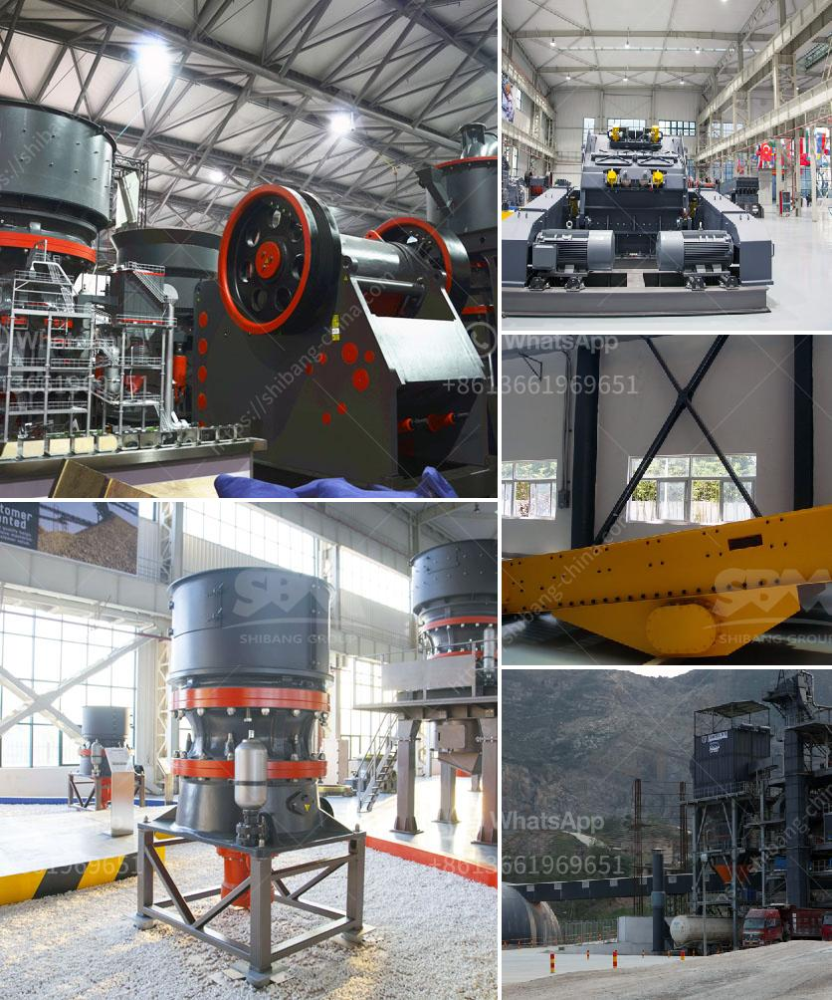

<h3>آلة سحق الطين</h3>
تعتبر آلة سحق الطين من الآلات المهمة في صناعة الطين، حيث تقوم بتكسير وسحق الطين الخام لتحويله إلى شكل مناسب لإنتاج المنتجات الطينية المختلفة. تُستخدم هذه الآلة في عدة صناعات مثل صناعة الأواني والفخار والألواح الطينية والبلاط، وتُعتبر جزءًا أساسيًا من سلسلة عمليات التصنيع في هذه الصناعات.

تتكون آلة سحق الطين من أجزاء عديدة تعمل معًا لتحقيق عملية السحق الفعالة. من بين هذه الأجزاء، الكسارة الأولية التي تعمل على تكسير الطين الخام إلى قطع صغيرة. تلي ذلك إدخال القطع الصغيرة إلى الكسارة الثانوية التي تُحطمها إلى جزيئات طينية أصغر بحجم محدد. تستخدم الأنظمة الحديثة أجهزة المغناطيس لإزالة الشوائب المعدنية من الطين أثناء عملية السحق، مما يضمن جودة الطين النهائية.

تعتبر آلة سحق الطين ضرورية للحصول على مخرجات عالية الجودة وخالية من الشوائب. فالطين السليم والناعم يُستخدم في صناعة المنتجات الطينية المتنوعة، فهو يمتاز بقوة التصاقه ومرونته في التشكيل وقدرته على تحمل درجات الحرارة العالية. لذا، يتطلب إنتاج المنتجات عالية الجودة استخدام آلة سحق الطين التي تعمل بالكفاءة العالية والدقة.

إن آلة سحق الطين تسهم في تحسين إنتاجية صناعة الطين، حيث تعمل على توفير الوقت والجهد وتحسين جودة المنتج النهائي. تعتمد كفاءتها على الجودة والاستدامة العالية للآلة نفسها وعلى مهارة المشغلين الذين يعملونها. لذا، يجب على مشغلي الآلة أن يكونوا مدربين جيدًا على طرق استخدامها وصيانتها.

بشكل عام، تعتبر آلة سحق الطين من الأدوات الأساسية في صناعة الطين، فهي تسهم في تقليل تكاليف الإنتاج وزيادة جودة المنتجات النهائية.
<h3>Contact us</h3><ul><li><strong>Whatsapp:&nbsp;<a href="https://wa.me/8613661969651">+8613661969651</a></strong></li><li><a href="https://swt.shibang-china.com/?git&amp;zhl&amp;آلة سحق الطين"><strong>Online Service(chat now)</strong></a></li></ul><h3>Related</h3><ul><li><a href='حساب تكلفة سحق الركام.md'>حساب تكلفة سحق الركام</a></li><li><a href='آلة معالجة النحاس.md'>آلة معالجة النحاس</a></li><li><a href='تكاليف مطاحن الكرة.md'>تكاليف مطاحن الكرة</a></li><li><a href='قائمة معدات وآلات التعدين عن الذهب.md'>قائمة معدات وآلات التعدين عن الذهب</a></li><li><a href='بيان طريقة لناقلات الحزام.md'>بيان طريقة لناقلات الحزام</a></li></ul>