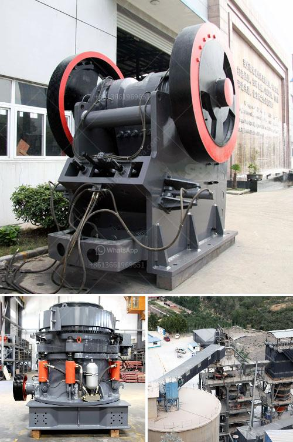

<h3>آلة سحق الكالسيت</h3>
يعتبر الكالسيت من المعادن الهشة المتواجدة بشكل رئيسي في التربة والصخور الطبيعية. وتستخدم الكالسيت في العديد من الصناعات مثل البناء والمواد الكيميائية والصناعات الزراعية وغيرها. لكن قبل استخدام الكالسيت في هذه الصناعات، يجب سحقها للحصول على الحجم المطلوب.

وهنا تأتي أهمية آلة سحق الكالسيت، فهي تعتبر الأداة الرئيسية لسحق الكالسيت بشكل فعال وسريع. تتكون هذه الآلة عادةً من مجموعة من الأسنان الصلبة المتداخلة تسمى الأسنان المخروطية، وتعمل عن طريق دوران الأسطوانة وسحق الكالسيت بين الأسنان المخروطية.

تتميز آلة سحق الكالسيت بعدة مزايا. أحد هذه المزايا هو السرعة العالية للسحق، حيث تمكن الآلة من سحق الكالسيت بكميات كبيرة في وقت قصير. كما أنها توفر جودة عالية للمنتج النهائي، فإن الكالسيت المسحوق الناتج يكون طبيعيًا ناعمًا ومتجانسًا.

تعد آلة سحق الكالسيت متعددة الوظائف أيضًا، حيث يمكن استخدامها لسحق الكثير من المواد الأخرى غير الكالسيت. يمكن أيضًا ضبط حجم الجسيمات المطلوبة عن طريق ضبط فتحة الفتحة بين الأسنان المخروطية.

بالإضافة إلى ذلك، فإن آلة سحق الكالسيت تعتمد على تقنية تشحيم فعالة لضمان عملية سحق سلسة وطويلة الأمد. كما أنها تستهلك طاقة قليلة وتكون صديقة للبيئة.

يجب الانتباه أيضًا إلى العناية والصيانة الدورية لآلة سحق الكالسيت لضمان أداء مستقر وطويل الأمد. يجب تنظيف الآلة بانتظام وتزييت المكونات المتحركة وفحص جميع الأجزاء للتأكد من عدم وجود أي تلف. كما ينبغي استبدال الأجزاء المهترئة أو التالفة فورًا لضمان سلامة عمل الآلة.

في الختام، تعتبر آلة سحق الكالسيت أداة أساسية لسحق الكالسيت بفعالية وسرعة. وباستخدام هذه الآلة، يمكن الحصول على الحجم المطلوب من الكالسيت المسحوق بشكل سهل وعملي. يجب الاهتمام بالعناية والصيانة المنتظمة للآلة لضمان عملها السلس والفعال لفترة طويلة.
<h3>Contact us</h3><ul><li><strong>Whatsapp:&nbsp;<a href="https://wa.me/8613661969651">+8613661969651</a></strong></li><li><a href="https://swt.shibang-china.com/?git&amp;zhl&amp;آلة سحق الكالسيت"><strong>Online Service(chat now)</strong></a></li></ul><h3>Related</h3><ul><li><a href='كسارات الحجر الجيري المحمولة الصغيرة.md'>كسارات الحجر الجيري المحمولة الصغيرة</a></li><li><a href='كسارة حجر لصنع رمل البناء.md'>كسارة حجر لصنع رمل البناء</a></li><li><a href='مصانع التكسير والفحص.md'>مصانع التكسير والفحص</a></li><li><a href='كسارة البليت في كينيا.md'>كسارة البليت في كينيا</a></li><li><a href='مطاحن الكرة لتعدين ٦ × ٦.md'>مطاحن الكرة لتعدين ٦ × ٦</a></li></ul>