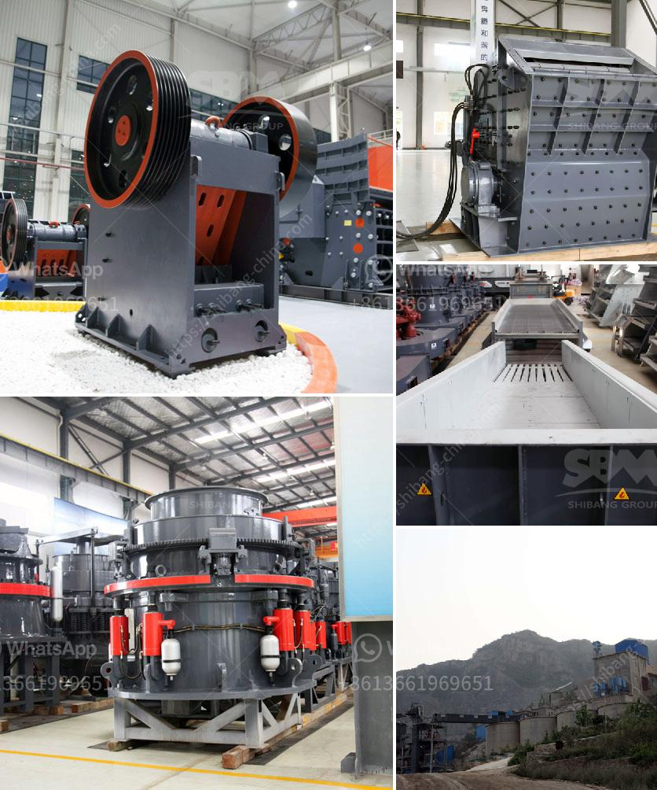

<h3>آلة سحق جوز الهند</h3>
1. آلة سحق جوز الهند: تكنولوجيا حديثة لتحقيق الكفاءة والجودة!

تعد آلة سحق جوز الهند إحدى أفضل الابتكارات التكنولوجية في عصرنا الحديث، حيث تتيح للمزارعين والصناعيين فرصة لاستخراج زيت جوز الهند بكفاءة عالية وجودة ممتازة. تعد آلة سحق جوز الهند بديلاً مثالياً للعمل اليدوي التقليدي الذي كان معروفًا سابقًا والذي كان يحتاج إلى الكثير من الجهود والوقت.

تعمل آلة سحق جوز الهند على المبدأ البسيط لطحن الثمار واستخلاص الزيت منها. تتكون الآلة عادةً من مجموعة من الأسطوانات الدوارة ذات القرص الحلزوني المتزايد التدريجي. يتم وضع ثمار جوز الهند الناضجة في فتحة الآلة وتتحرك عبر الأسطوانات حيث يتم سحقها وتدفع ببطء نحو النهاية. يتم تقسيم الثمار إلى قشور خارجية وجوز داخلي بفضل التصميم المبتكر للآلة.

إحدى الميزات الرئيسية لآلة سحق جوز الهند هي سهولة الاستخدام والتشغيل الآلي. ببساطة، يضع المستخدم الثمار في الآلة وتقوم الآلة بالعمل بشكل آلي تمامًا وتنتج الناتج المرغوب. بالإضافة إلى ذلك، تتمتع الآلة بقدرة كبيرة على السحق وتعمل بكفاءة عالية، مما يساهم في توفير الوقت والجهد للمستخدم.

من أهم الفوائد التي يوفرها استخدام آلة سحق جوز الهند هو جودة المنتج النهائي. فإن الزيت الذي يتم استخراجه من ثمار جوز الهند بواسطة هذه الآلة يكون نقيًا وخاليًا من الشوائب بشكل كبير. وبفضل هذه الجودة العالية، يستخدم الزيت في العديد من الصناعات مثل صناعة المواد الغذائية، ومستحضرات التجميل، والأدوية.

لا يمكننا إغفال أن استخدام آلة سحق جوز الهند يعزز أيضًا الاستدامة البيئية. فمن خلال تحسين كفاءة استخراج الزيت، يجري تقليل الهدر والفاقد ومن ثم تقليل الكمية الكبيرة من ثمار جوز الهند المهدرة. كما أن استخدام آلة واحدة قادرة على معالجة كمية كبيرة من الثمار يؤدي إلى توفير المساحة اللازمة واستخدام الموارد بشكل فعال.

للختام، تعتبر آلة سحق جوز الهند ابتكارًا مهمًا في صناعة استخراج الزيت. تمنح الآلة المزارعين والصناعيين فرصة لاستخدام التكنولوجيا المتقدمة لتحقيق الكفاءة والجودة في إنتاج زيت جوز الهند. بفضل سهولة الاستخدام والتشغيل الآلي، يمكن أن تصبح هذه الآلة وسيلة فعالة لتحويل ثمار جوز الهند إلى منتجات قيمة تستفيد منها العديد من الصناعات.
<h3>Contact us</h3><ul><li><strong>Whatsapp:&nbsp;<a href="https://wa.me/8613661969651">+8613661969651</a></strong></li><li><a href="https://swt.shibang-china.com/?git&amp;zhl&amp;آلة سحق جوز الهند"><strong>Online Service(chat now)</strong></a></li></ul><h3>Related</h3><ul><li><a href='كسارة هيدروليكية.md'>كسارة هيدروليكية</a></li><li><a href='شركة كسارة الحجر.md'>شركة كسارة الحجر</a></li><li><a href='كسارة حجرية بسعة 100 طن في الساعة استهلاك الديزل.md'>كسارة حجرية بسعة 100 طن في الساعة استهلاك الديزل</a></li><li><a href='آلات معالجة الجير.md'>آلات معالجة الجير</a></li><li><a href='أرض الجرانيت الأسود للبيع في تاميل نادو.md'>أرض الجرانيت الأسود للبيع في تاميل نادو</a></li></ul>