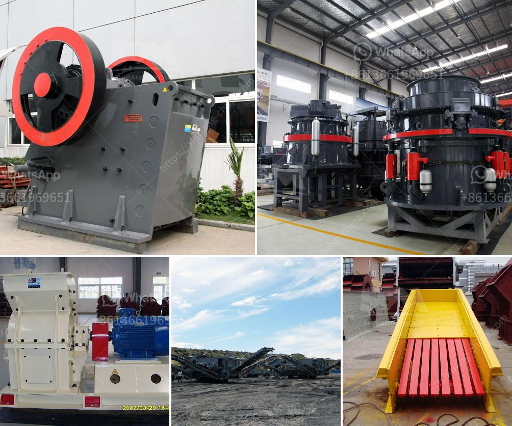

<h3>آلة سحق في الفلبين</h3>
تعد آلة السحق في الفلبين أحد التكنولوجيات المتقدمة التي تستخدم في صناعة التعدين والبناء. وتعتبر الفلبين واحدة من الدول التي تشتهر بإنتاج الأحجار الكبيرة والكسارات المتنقلة المصممة للعمل في المحاجر ومواقع البناء.

تستخدم آلات السحق في الفلبين لسحق الصخور والحجارة إلى قطع أصغر التي يمكن استخدامها في تصنيع المواد الإنشائية. ويتم ذلك عن طريق تحميل الصخور في الجزء العلوي من الكسارة وتمريرها عبر الفك المتحرك والثابت بقوة عالية لتمزيقها إلى شظايا صغيرة.

توجد عدة أنواع من آلات السحق في الفلبين، بما في ذلك كسارات الفك وكسارات الصدم وكسارات المخروط والكسارات المحورية. تختلف هذه الآلات في التصميم والقدرة والطاقة التشغيلية المطلوبة.

تعتبر آلات السحق ذات أهمية كبيرة في صناعة التعدين والبناء في الفلبين. فهي تساهم في إعداد المواد الأساسية لإنشاء الطرق والجسور والمباني. وتساعد أيضًا في استخراج المعادن القيمة من الأرض، مما يدعم قطاع التعدين في البلاد.

يتم استخدام آلات السحق أيضًا في معالجة النفايات وإعادة تدوير المواد البنائية. فعلى سبيل المثال، توجد محاجر تعمل على سحق الأنقاض الناتجة عن الهدم البنائي بغرض استخدامها في مشاريع البناء المستقبلية.

بالإضافة إلى ذلك، توجد في الفلبين كسارات متنقلة مصممة خصيصًا للعمل في البيئات الصعبة والتضاريس الوعرة. ويمكن نقل هذه الكسارات بسهولة من مكان إلى آخر، مما يزيد من كفاءة الإنتاج وتوفر الوقت والمال.

باختصار، فإن آلة السحق في الفلبين تعتبر تكنولوجيا حيوية في صناعة التعدين والبناء. إن استخدام الآلات الحديثة والفعالة يساهم في تعزيز البنية التحتية في البلاد وتحسين قدرتها على استخدام الموارد الطبيعية بكفاءة.
<h3>Contact us</h3><ul><li><strong>Whatsapp:&nbsp;<a href="https://wa.me/8613661969651">+8613661969651</a></strong></li><li><a href="https://swt.shibang-china.com/?git&amp;zhl&amp;آلة سحق في الفلبين"><strong>Online Service(chat now)</strong></a></li></ul><h3>Related</h3><ul><li><a href='مصانع تكسير الحجر في الهند.md'>مصانع تكسير الحجر في الهند</a></li><li><a href='شركة مطحنة الكرة في تاميل نادو.md'>شركة مطحنة الكرة في تاميل نادو</a></li><li><a href='مصانع غسل الفحم المحمولة.md'>مصانع غسل الفحم المحمولة</a></li><li><a href='آلة قطع الحجر المستخدمة من اليابان.md'>آلة قطع الحجر المستخدمة من اليابان</a></li><li><a href='الفارق بين الرمل ومسحوق الحجر المكسر.md'>الفارق بين الرمل ومسحوق الحجر المكسر</a></li></ul>