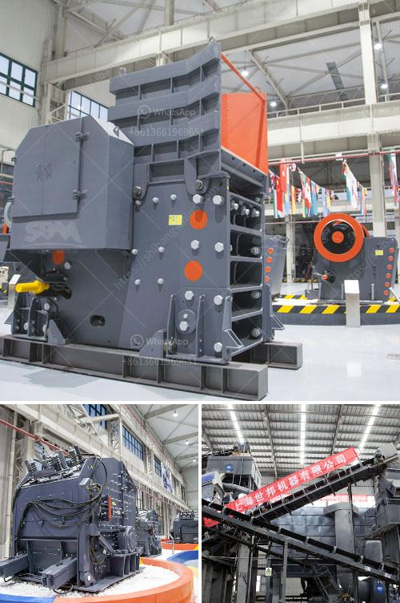

<h3>آلة سحق كبيرة</h3>
تُعد الآلات الكبيرة للسحق من أهم الأدوات التي يستخدمها العديد من القطاعات الصناعية. وتعتبر هذه الآلات جزءًا أساسيًا في صناعة التعدين والبناء وإعادة التدوير وغيرها من الصناعات التي تتطلب تكسير وسحق المواد الخام أو المواد المعاد تدويرها.

تتوفر هذه الآلات بمدى مختلف من الأحجام والسعات، ومن بينها الآلة السحق الكبيرة التي تتراوح سعتها بين 200-400 طن في الساعة. تمتاز هذه الآلات بكونها آلات متعددة المراحل، حيث يتم تجهيز المواد الخام بواسطة مصعد أو حزام ناقل، ثم تتم إزالة الشوائب باستخدام آلة فرز قبل أن يتم تغذية المواد في آلة السحق الرئيسية.

يتم استخدام الآلة الكبيرة للسحق لسحق المواد الخام إلى أحجام أصغر وتحويلها إلى مواد مناسبة للاستخدام. يتم تحميل المواد في الآلة من الأعلى، وتكون الآلة مجهزة بمطرقة تدور بسرعة عالية لتحطيم المواد على حواجز معدنية. بعد السحق الأولي، تمر المواد عبر فتحات صغيرة في الحواجز لتحويلها إلى الحجم النهائي المطلوب.

تعتبر الآلة الكبيرة للسحق أكثر كفاءة في توفير التكاليف وتحقيق الإنتاجية العالية. وتعمل هذه الآلات على زيادة سرعة وكفاءة عملية السحق وتحويل مجموعة متنوعة من المواد إلى مواد قابلة للاستخدام. كما أنها تقلل من تكاليف النقل والتخزين للمواد الخام، حيث يتم سحق المواد في الموقع وتحويلها مباشرة إلى المنتج النهائي.

باختصار، الآلة الكبيرة للسحق بسعة 200-400 طن في الساعة تعتبر أداة حاسمة في الصناعات المختلفة. فهي تعمل على تحويل المواد الخام إلى مواد قابلة للاستخدام وتحقيق الإنتاجية العالية. كما أنها تساعد في توفير التكاليف وتقليل وقت التشغيل والإجهاد البدني للعمال. إن استخدام آلة السحق الكبيرة يمثل استثمارًا مهمًا لتحقيق أفضل النتائج في العمل وتحسين كفاءة الإنتاج في أي صناعة تعتمد على تكسير وسحق المواد.
<h3>Contact us</h3><ul><li><strong>Whatsapp:&nbsp;<a href="https://wa.me/8613661969651">+8613661969651</a></strong></li><li><a href="https://swt.shibang-china.com/?git&amp;zhl&amp;آلة سحق كبيرة"><strong>Online Service(chat now)</strong></a></li></ul><h3>Related</h3><ul><li><a href='محجر مستعمل بشكل معقول في نيجيريا.md'>محجر مستعمل بشكل معقول في نيجيريا</a></li><li><a href='صورة لمصنع معالجة رمل السيليكا.md'>صورة لمصنع معالجة رمل السيليكا</a></li><li><a href='شركة تصنيع كسارة في جوجارات.md'>شركة تصنيع كسارة في جوجارات</a></li><li><a href='آلة سحق محمولة من إسبانيا.md'>آلة سحق محمولة من إسبانيا</a></li><li><a href='آلة طحن الحجر الجيري المصنع.md'>آلة طحن الحجر الجيري المصنع</a></li></ul>