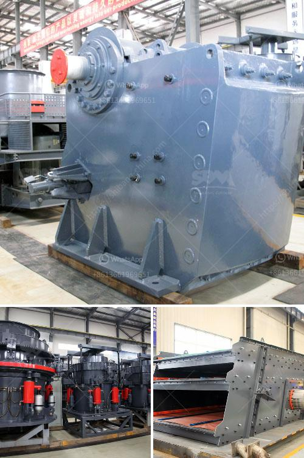

<h3>آلة سحق نقاء الشورا</h3>
آلة سحق نقاء الشورا هي جهاز تقني يستخدم لاستخلاص النقاء الشورا من الحبوب الزراعية. الشورا هي الغلاف الخارجي للحبوب مثل القمح والأرز والشعير والذرة. وعادة ما تعتبر الشورا غير صالحة للاستهلاك البشري وقد تستخدم في عمليات تغذية الحيوانات أو تستبعد تماما.

تعد آلة سحق نقاء الشورا أداة حديثة وفعالة تساهم في استخراج الشورا وتحسين جودة المنتج النهائي. تتكون الآلة من مجموعة من الأسطوانات المدمجة مع بعضها البعض في ترتيب مُعين. وتحتوي هذه الأسطوانات على سطح مشطوف يشبه الأسطوانات الحديدية. كل مجموعة من الأسطوانات يتم توزيعها بشكل مُنسق لتحقيق التأثير المطلوب.

تُعتبر آلة سحق نقاء الشورا جهازًا ذو تصميم متطور يتيح استخلاص الشورا من الحبوب بطريقة سريعة وفعالة. عند تشغيل الآلة، تمتد الأسطوانات المشطوفة على طول سطح الحبوب وتستمر في خلع الشورا عن الحبوب. يتم جمع الشورا المستخرج في حاوية خاصة أسفل الآلة، في حين تُعيد الأسطوانات المشطوفة الحبوب النقية إلى الخارج للاستخدام الآخر.

آلة سحق نقاء الشورا تُعتبر حلا مهما في صناعة تجهيز الحبوب. فهي تساهم في زيادة جودة المنتج النهائي وتحسين القيمة الغذائية. يتم استخدام الشورا المستخلص في تصنيع العديد من المنتجات الأخرى مثل العلف والمكملات الغذائية والأغذية الصحية. وبالتالي فإن آلة سحق نقاء الشورا تحقق عائداً اقتصاديًا عاليًا للصناعة وتُعتبر استثمارًا مجديًا.

بالاعتماد على التكنولوجيا والابتكار المستخدمين فيها، فإن آلة سحق نقاء الشورا توفر عملية سحق سريعة وموحدة، مما يقلل من تكلفة الإنتاج ويزيد من كفاءة العمل. تُستخدم الآلة في مختلف المزارع والمصانع ومنشآت تجهيز الحبوب حول العالم، حيث يُعتبر استخلاص الشورا أمرًا أساسيًا في تحسين جودة المنتجات النهائية.

باختصار، آلة سحق نقاء الشورا تعتبر ابتكارًا فعالًا يُحسن عمليات استخلاص الشورا من الحبوب، مما يؤدي إلى تحسين جودة المنتجات النهائية وزيادة العائد الاقتصادي. تمثل تلك الآلة إضافة قيمة لصناعة تجهيز الحبوب وتلبي احتياجات السوق المتزايدة للمنتجات النقية والمغذية.
<h3>Contact us</h3><ul><li><strong>Whatsapp:&nbsp;<a href="https://wa.me/8613661969651">+8613661969651</a></strong></li><li><a href="https://swt.shibang-china.com/?git&amp;zhl&amp;آلة سحق نقاء الشورا"><strong>Online Service(chat now)</strong></a></li></ul><h3>Related</h3><ul><li><a href='كيفية سحق خام الذهب في ماين كرافت.md'>كيفية سحق خام الذهب في ماين كرافت</a></li><li><a href='طحن الكرة الرطبة مقابل الطحن الجاف.md'>طحن الكرة الرطبة مقابل الطحن الجاف</a></li><li><a href='شركة تصنيع معدات كسارة الحجر في ألمانيا.md'>شركة تصنيع معدات كسارة الحجر في ألمانيا</a></li><li><a href='أسطوانات لكسارات في بوغوتا.md'>أسطوانات لكسارات في بوغوتا</a></li><li><a href='معدات صنع مسحوق كربونات الكالسيوم في ألمانيا.md'>معدات صنع مسحوق كربونات الكالسيوم في ألمانيا</a></li></ul>