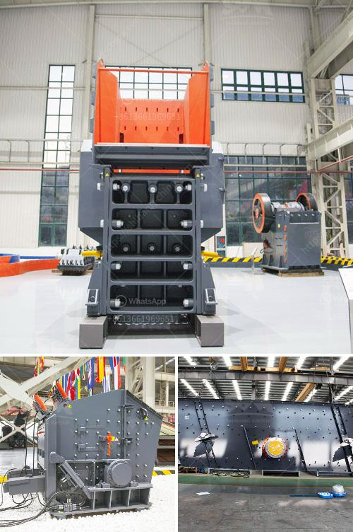

<h3>آلة صغيرة لصنع المسحوق</h3>
التكنولوجيا الحديثة وسرعة التطور في مختلف المجالات، قد جعلت حياتنا أسهل وأكثر سلاسة. ومن بين الاختراعات الحديثة التي أحدثت تحولاً كبيراً في عالم الصناعة والذي يستخدمه الكثيرون في حياتهم اليومية هي آلة صغيرة لصنع المسحوق.

تعتبر آلة صنع المسحوق جهازًا صغيرًا يستخدم لتحويل المواد الصلبة إلى شكل مسحوق. تُستخدم هذه الآلة في العديد من المجالات مثل الصناعة الغذائية وصناعة المستحضرات الصيدلانية وصناعة المواد الكيميائية وغيرها.

تعتمد آلة صنع المسحوق على مبدأ تحطيم المادة الصلبة إلى جزيئات صغيرة باستخدام القوة الدورانية. تتكون الآلة من جزأين رئيسيين: الجزء الخارجي والجزء الداخلي. الجزء الخارجي يحتوي على محرك قوي يقوم بتوليد القوة الدورانية اللازمة لتحطيم المادة الصلبة. أما الجزء الداخلي فيحتوي على مطحنة صغيرة تحتوي على شفرات حادة تقوم بتقطيع المادة الصلبة إلى جزيئات صغيرة.

يتم استخدام آلة صنع المسحوق في الصناعة الغذائية لتحويل الفواكه والخضروات الطازجة إلى مسحوق لمدة طويلة الأمد. فعندما يتم تحويل الفواكه والخضروات إلى مسحوق، يتم الحفاظ على العناصر الغذائية الهامة التي قد تفقد بسرعة بسبب التعرض للهواء. بالإضافة إلى ذلك، يتم استخدام المسحوق في إعداد العديد من المنتجات الغذائية مثل الحلويات والمشروبات ومنتجات الألبان.

كما يتم استخدام آلة صنع المسحوق في صناعة المستحضرات الصيدلانية، حيث يتم تحويل المكونات العشبية والمعدنية إلى مسحوق لإنتاج الأدوية والمكملات الغذائية. يساعد الاستخدام المتزايد لآلة صنع المسحوق في توحيد الجودة والتأكد من أن جميع المنتجات المصنوعة تحتوي على نسبة مطابقة من المكونات النشطة.

بالإضافة إلى ذلك، يستخدم هذا الجهاز في صناعة المواد الكيميائية. فمن خلال تحويل المواد الصلبة إلى مسحوق، يمكن تحقيق توزيع أفضل وتحسين الخواص الفيزيائية للمواد المستخدمة في العديد من التطبيقات الصناعية.

بالنظر إلى فوائدها المتعددة واستخداماتها في العديد من المجالات، فإن آلة صنع المسحوق لديها دور هام في تسهيل العملية الصناعية وتحسين الجودة والكفاءة. باستخدام هذا الجهاز، يمكن تحويل المواد الصلبة إلى شكل مسحوق بسرعة وسهولة ودقة. وبالتالي، يسهم استخدام آلة صغيرة لصنع المسحوق في تحسين عمليات التصنيع وتوفير الوقت والجهد المبذولين في العملية التقليدية لتحويل المواد الصلبة إلى شكل مسحوق.
<h3>Contact us</h3><ul><li><strong>Whatsapp:&nbsp;<a href="https://wa.me/8613661969651">+8613661969651</a></strong></li><li><a href="https://swt.shibang-china.com/?git&amp;zhl&amp;آلة صغيرة لصنع المسحوق"><strong>Online Service(chat now)</strong></a></li></ul><h3>Related</h3><ul><li><a href='أسعار مصانع التكسير الكاملة لعلامة باكستر.md'>أسعار مصانع التكسير الكاملة لعلامة باكستر</a></li><li><a href='مطاحن تعدين الذهب المحمولة.md'>مطاحن تعدين الذهب المحمولة</a></li><li><a href='اقتباسات مطحنة الكرة.md'>اقتباسات مطحنة الكرة</a></li><li><a href='آلات إنتاج الكالسيوم.md'>آلات إنتاج الكالسيوم</a></li><li><a href='قطع غيار لكسارات الحجر.md'>قطع غيار لكسارات الحجر</a></li></ul>