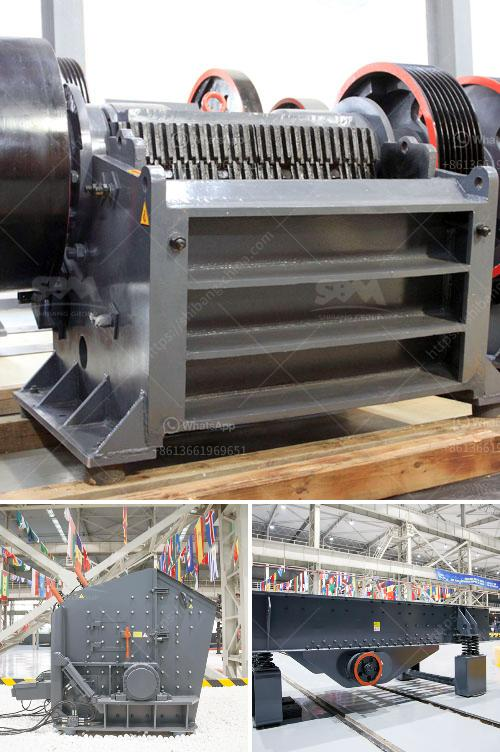

<h3>آلة صنع البليت الصغيرة للبيع في كينيا</h3>
إذا كنت تبحث عن آلة صنع البليت الصغيرة للبيع في كينيا، فقد تكون مهتمًا بمعرفة المزيد عن هذه الآلة وفوائدها وأهميتها في السوق المحلي. في هذه المقالة، سوف نستعرض بعض المعلومات حول آلة صنع البليت الصغيرة وكيف يمكن الاستفادة منها في كينيا.

تعد آلة صنع البليت الصغيرة من المعدات الحديثة التي تُستخدم لتصنيع البليت البلاستيكية بطريقة فعالة وسريعة. تحظى هذه الآلة بشعبية متزايدة في الصناعات المختلفة، مثل النقل والتخزين والتوزيع والزراعة وغيرها. واحدة من أهم وظائف آلة صنع البليت الصغيرة هي تقليل تكلفة الإنتاج وتحسين عمليات النقل والتوزيع للشركات.

في السابق، كان يعتمد العديد من الشركات والمؤسسات في كينيا على البليت الخشبية التقليدية في عملياتها اليومية. ومع ذلك، بدأت البليت البلاستيكية في الظهور في السوق كبديل مستدام وقوي واقتصادي للبليت الخشبية. تعتبر آلة صنع البليت الصغيرة الآن أداة حاسمة للشركات والمزارعين في كينيا الذين يرغبون في مواكبة التكنولوجيا الحديثة وتحسين كفاءة عملياتهم.

باستخدام آلة صنع البليت الصغيرة، يمكن للمزارعين والشركات تصنيع البليت البلاستيكية الصغيرة الخاصة بهم داخل المصنع. تقدم هذه الآلة العديد من المزايا. أولاً، تعتبر البليت البلاستيكية خفيفة الوزن، مما يجعلها أسهل في عمليات النقل والتوزيع. ثانياً، فإن البليت البلاستيكية ذات قوة عالية ومقاومة للتآكل والعوامل الجوية مثل المطر والشمس، مما يجعلها تدوم لفترة أطول. هذه الميزات تساعد على تقليل تكاليف الصيانة وشراء البليت بشكل مستمر.

بالإضافة إلى ذلك، تعتبر البليت البلاستيكية أكثر صحة ونظافة من البليت الخشبية. فهي لا تجمع الحشرات أو البكتيريا ولا تنشر الروائح الكريهة التي قد تؤثر على جودة المنتجات المخزنة على البليت. يعزز استخدام البليت البلاستيكية النظافة والجودة في سلسلة التوريد، مما قد يزيد من ثقة العملاء في المنتجات المقدمة من قبل الشركة.

بالنظر إلى نمو الصناعات المختلفة في كينيا وزيادة الطلب على البليت البلاستيكية، فإن الآلة الصغيرة لصنع البليت البلاستيكية تشكل فرصة رائعة للشركات المحلية لتوفير هذا المنتج في السوق. يمكن لمصنعي البليت في كينيا تلبية الطلب المتزايد على البليت البلاستيكية وتحقيق أرباح جيدة من خلال العمل مع هذه الآلة.

تحتاج الشركات وأصحاب الأعمال في كينيا إلى البحث عن مزودي آلات صنع البليت الصغيرة الموثوق بهم والذين يمكنهم تقديم منتجات عالية الجودة وخدمة ما بعد البيع الممتازة. بشكل عام، يجب أن تكون الآلة سهلة الاستخدام وموثوقة وصديقة للبيئة.

توضح هذه المقالة أهمية آلة صنع البليت الصغيرة للبيع في كينيا وفوائدها. من المتوقع أن تستمر الطلبات المحلية والإقليمية على البليت البلاستيكية في الارتفاع، مما يعني أن هذه الآلة تعد استثمارًا جيدًا للشركات التي ترغب في توسيع نطاق عملياتها وزيادة ربحيتها.
<h3>Contact us</h3><ul><li><strong>Whatsapp:&nbsp;<a href="https://wa.me/8613661969651">+8613661969651</a></strong></li><li><a href="https://swt.shibang-china.com/?git&amp;zhl&amp;آلة صنع البليت الصغيرة للبيع في كينيا"><strong>Online Service(chat now)</strong></a></li></ul><h3>Related</h3><ul><li><a href='كسارات الحجر للبيع في كينيا.md'>كسارات الحجر للبيع في كينيا</a></li><li><a href='معدات تعدين الذهب للبيع في نيجيريا.md'>معدات تعدين الذهب للبيع في نيجيريا</a></li><li><a href='مصنعي مطاحن الرايموند في الهند.md'>مصنعي مطاحن الرايموند في الهند</a></li><li><a href='تعدين رمال النهر والحجر في صباح.md'>تعدين رمال النهر والحجر في صباح</a></li><li><a href='سعر كسارة الرول.md'>سعر كسارة الرول</a></li></ul>