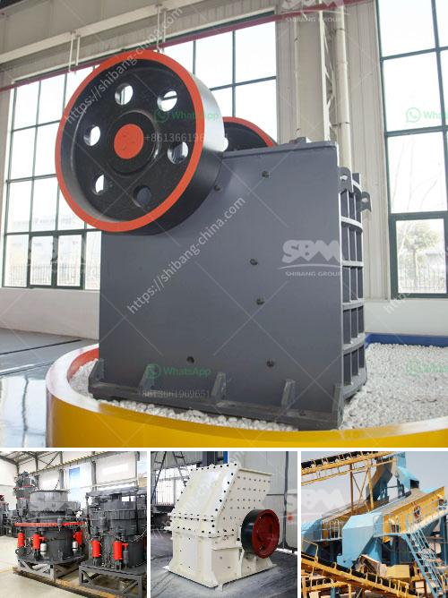

<h3>آلة صنع الحجر الجيري</h3>
يلعب الحجر الجيري دورًا حاسمًا في صناعة البناء والعمارة والصناعات الأخرى. يتم استخدامه لإنتاج الأسمنت ومواد البناء والجبس والكالسيت وغيرها الكثير. ولكن، هل سبق وتساءلت كيف يتم صنع هذا الحجر الجيري؟

آلة صنع الحجر الجيري هي عبارة عن معدات تستخدم في عملية تحويل الحجر الجيري الخام إلى صخور جيرية جاهزة للاستخدام. تأتي هذه الآلة في أحجام وتصميمات مختلفة بناءً على احتياجات العملاء والتطبيقات المختلفة.

تتألف آلة صنع الحجر الجيري الأساسية من مضرب يدور بسرعة عالية وفوهة تقوم برش الماء والمواد الكيميائية على الحجر الجيري الخام. يتم وضع الحجر الجيري المكسور في الجهاز، ثم يتم رشه بالماء والمواد الكيميائية مثل اللايسين والسليسين وغيرها. تعمل هذه المواد الكيميائية كعامل مرطب وتساعد في زيادة قابلية الحجر الجيري للتشكيل.

بعد رش الماء والمواد الكيميائية، يتم تشغيل المضرب بسرعة عالية لفترة من الوقت. تندفع الكرات المعدنية الموجودة داخل الآلة بواسطة الهواء وتصطدم بالحجر الجيري، مما يؤدي إلى تحطيمه وسحقه إلى قطع صغيرة. بعد ذلك، يتم تنظيف الحجر الجيري من الأوساخ والشوائب الأخرى بواسطة مواد كيميائية أخرى.

ثم، يتم نقل قطع الحجر الجيري النهائية إلى تجهيزات أخرى للتصنيع النهائي. يتم تقطيعها إلى قطع أصغر أو تشكيلها بواسطة آلات أخرى حسب الحاجة. يتم تجفيف الحجر الجيري في أفران خاصة وتجهيزه للاستخدام في مختلف الصناعات.

يمكن القول أن آلة صنع الحجر الجيري تلعب دورًا حاسمًا في تصنيع هذه المادة الحيوية. بفضل تكنولوجيا التصنيع المتقدمة والتحسين المستمر في هذه الآلات، بات بإمكان الصناعة تلبية الطلب المتزايد على الحجر الجيري بطريقة فعالة واقتصادية.

لذا، من المهم الاهتمام بتطوير آلات صنع الحجر الجيري والاستثمار في البحث والتطوير لتحسين كفاءتها وجودتها. فبتطوير هذه الآلات، يمكن تحسين جودة الحجر الجيري وتقليل التكاليف الإنتاجية، مما يؤدي إلى تعزيز الصناعة وتلبية الاحتياجات المتزايدة للمواد الإنشائية.
<h3>Contact us</h3><ul><li><strong>Whatsapp:&nbsp;<a href="https://wa.me/8613661969651">+8613661969651</a></strong></li><li><a href="https://swt.shibang-china.com/?git&amp;zhl&amp;آلة صنع الحجر الجيري"><strong>Online Service(chat now)</strong></a></li></ul><h3>Related</h3><ul><li><a href='محطة سحق تينوفا.md'>محطة سحق تينوفا</a></li><li><a href='كسارة الصدم PF لآلة تكسير الحجر للبيع.md'>كسارة الصدم PF لآلة تكسير الحجر للبيع</a></li><li><a href='مصنع كسارة المحاجر في إيطاليا.md'>مصنع كسارة المحاجر في إيطاليا</a></li><li><a href='سحق الحجر الأسود تايلاند.md'>سحق الحجر الأسود تايلاند</a></li><li><a href='مخروط سحق 700 1000.md'>مخروط سحق 700 1000</a></li></ul>