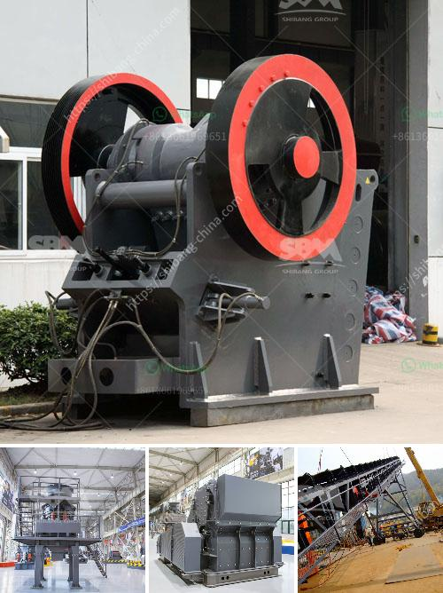

<h3>آلة صنع الحجر الخرساني في جنوب أفريقيا</h3>
تعد آلة صنع الحجر الخرساني أحد الأدوات الحديثة التي تستخدم في صناعة البناء والتشييد في جنوب أفريقيا. تتيح هذه الآلة صنع الأحجار الخرسانية بسهولة وبطريقة أكثر كفاءة من ذلك المستخدمة في الماضي.

تعتبر صناعة الحجر الخرساني من الصناعات الحيوية في جنوب أفريقيا حيث تستخدم هذه الأحجار في بناء المنازل والمباني التجارية والصناعية. تعتبر الآلة المستخدمة في صنع الحجر الخرساني في جنوب أفريقيا بديلاً مثالياً للتقنيات التقليدية لصنع الحجر الخرساني يدوياً.

تتميز هذه الآلة بقدرتها على تصنيع الأحجار بأحجام وأشكال مختلفة وبجودة عالية. وتعمل الآلة عن طريق خلط الخرسانة وصبها في قوالب معدنية خاصة. وبعد ذلك، يتم نقل القوالب إلى الآلة حيث تتم عملية الكبس والضغط لتكوين الحجارة. تعتمد عملية التكسير والطحن على تقنيات حديثة تساعد على الحصول على حجارة متماثلة وذات جودة عالية.

منفعة هذه الآلة تكمن في توفير الوقت والجهد للعمالة، فهي تستطيع صنع عدد كبير من الأحجار في وقت قصير. وبالتالي فإن صناعة الحجر الخرساني بواسطة الآلة تساهم في تسريع عملية البناء وتقليل تكاليف الإنتاج.

يجب الإشارة أيضاً إلى أن استخدام آلة صنع الحجر الخرساني يساعد على الحفاظ على البيئة. فهي لا تحتاج إلى عمليات تكسير وطحن تقليدية تستهلك كميات كبيرة من الطاقة وتسبب آثاراً بيئية سلبية. كما تعمل الآلة بواسطة محرك كهربائي يعمل بالطاقة المستدامة ولا يسبب انبعاثات ضارة.

باختصار، تعتبر الآلة المستخدمة في صنع الحجر الخرساني في جنوب أفريقيا مرافق حديثة وفعالة تسهم في تطور صناعة البناء والتشييد في البلاد. تساهم هذه الآلة في تسريع وتسهيل عمليات البناء بجودة عالية مع الحفاظ على البيئة وتقليل التكاليف. من المتوقع أن يستمر استخدام هذه الآلة في النمو والتطور في المستقبل القريب، حيث تعتبر حلاً حديثاً وفعالاً لصناعة الحجر الخرساني في جنوب أفريقيا.
<h3>Contact us</h3><ul><li><strong>Whatsapp:&nbsp;<a href="https://wa.me/8613661969651">+8613661969651</a></strong></li><li><a href="https://swt.shibang-china.com/?git&amp;zhl&amp;آلة صنع الحجر الخرساني في جنوب أفريقيا"><strong>Online Service(chat now)</strong></a></li></ul><h3>Related</h3><ul><li><a href='مصنعي آلات المحجر.md'>مصنعي آلات المحجر</a></li><li><a href='كسارة الحجر ساياجي.md'>كسارة الحجر ساياجي</a></li><li><a href='محطة تكسير الصخور.md'>محطة تكسير الصخور</a></li><li><a href='كسارة الفك من الصين.md'>كسارة الفك من الصين</a></li><li><a href='مصنع الكرة.md'>مصنع الكرة</a></li></ul>