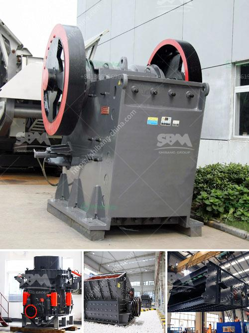

<h3>آلة صنع الدولوميت</h3>
تعتبر الدولوميت معدنًا طبيعيًا يوجد في الطبيعة ويتكون أساسًا من ترسبات الكالسيوم والمغنيسيوم. يتم استخدام الدولوميت في العديد من الصناعات بما في ذلك الزراعة والبناء وصناعة السيراميك والزجاج والصناعة الكيميائية. ولتحويل الدولوميت الخام إلى منتج نهائي قابل للاستخدام، يتم استخدام آلة صنع الدولوميت.

تتكون آلة صنع الدولوميت من عدة مراحل. في المرحلة الأولى، يتم سحق الدولوميت الخام إلى قطع صغيرة باستخدام كسارة الفك أو الكسارة المخروطية. يجب أن يكون حجم الدولوميت سحق صغيرًا للتحكم في حجم الجسيمات النهائي. يتم استخدام الفك المتحرك والثابت لكسر الدولوميت عن طريق الضغط والتكسير.

بعد طحن الدولوميت، يتم نقل المواد إلى آلة طحن الدولوميت. تتألف آلة طحن الدولوميت من مطحنة الكرة أو مطحنة الأسطوانة. يتم استخدام الطحن لتفتيت الدولوميت إلى مسحوق ناعم. يعتمد حجم المسحوق المطلوب على احتياجات الصناعة المستخدمة. يتم ضبط سرعة الدوران وفتحة الإعداد بواسطة المشغل لتحقيق الحجم الدقيق للمسحوق.

بعد الطحن، يتم نقل المسحوق المعدني إلى آلة فرز الدولوميت. يتم استخدام آلة فرز الدولوميت لفصل المسحوق إلى حجم الجسيمات المختلفة. تتم فرز الدولوميت وفقًا لحجم الجسيمات المختلفة لتلبية متطلبات الصناعة. يتم استخدام طبقات شاشة الفرز المختلفة لفصل المسحوق وتحويله إلى منتجات متعددة الاستخدامات.

بعد عملية فرز الدولوميت، يتم تعبئة وتخزين المنتجات النهائية. يتم تعبئة المسحوق النهائي المنفصل في أكياس أو حاويات مناسبة. تحتوي تلك الأكياس أو الحاويات على معلومات المنتج ورمز الشركة وموعد الانتهاء. يتم تخزين المسحوق النهائي في مستودعات جافة وجيدة التهوية لضمان استقرار الجودة وحماية المنتجات من أي ضرر.

تحظى آلة صنع الدولوميت بشعبية كبيرة في الصناعات المختلفة بسبب فعاليتها ودقتها في تصنيع المنتجات. يساعد استخدام هذه الآلة في تحقيق إنتاج أعلى جودة وكفاءة بتكلفة منخفضة، مما يساهم في تطوير الصناعات وتلبية الاحتياجات المتزايدة للسوق.

باختصار، تتميز آلة صنع الدولوميت بقدرتها على تحويل الدولوميت الخام إلى منتج نهائي قابل للاستخدام في العديد من الصناعات المختلفة. تساهم تقنيات السحق والطحن والفرز في تحقيق جودة المنتج ورفع الإنتاجية، وبالتالي تعزز تنمية الصناعات وتلبية الطلب المستمر على الدولوميت.
<h3>Contact us</h3><ul><li><strong>Whatsapp:&nbsp;<a href="https://wa.me/8613661969651">+8613661969651</a></strong></li><li><a href="https://swt.shibang-china.com/?git&amp;zhl&amp;آلة صنع الدولوميت"><strong>Online Service(chat now)</strong></a></li></ul><h3>Related</h3><ul><li><a href='مطحنة فحم رولر.md'>مطحنة فحم رولر</a></li><li><a href='مخطط تدفق التعدين ومعالجة المعادن للنيكل.md'>مخطط تدفق التعدين ومعالجة المعادن للنيكل</a></li><li><a href='كوماتسو بي آر كسارة للبيع.md'>كوماتسو بي آر كسارة للبيع</a></li><li><a href='كسارة الصخور 250 طن في الساعة.md'>كسارة الصخور 250 طن في الساعة</a></li><li><a href='عملية الطحن الرطب.md'>عملية الطحن الرطب</a></li></ul>