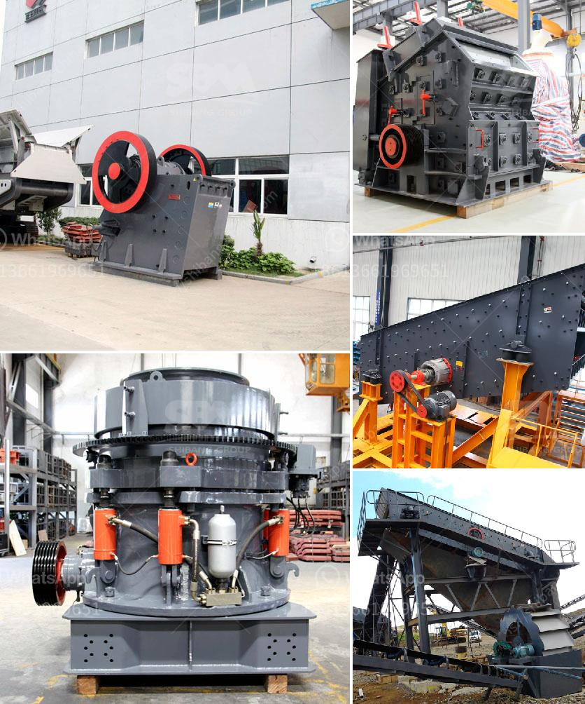

<h3>آلة صنع الرمل VSI.</h3>
آلة صنع الرمل VSI هي آلة مبتكرة تستخدم في صناعة الرمال الاصطناعية. ويشير اختصار VSI إلى "التكسير بالصدم"، الذي يعبر عن العملية التي تقدمها تلك الآلة.

تعمل آلة VSI عن طريق تحويل الصخور الكبيرة إلى حصى صغيرة باستخدام قوة الصدم. تتكون الآلة من جزئين رئيسيين؛ الدوران العمودي الموجود في الوسط وقوس الحماية الخارجي. تدخل الصخور المسحوقة من الأعلى وتتأرجح داخل الماكينة بواسطة القرص الدوراني. ثم تصطدم الصخور ببعضها البعض، مما يؤدي إلى تحطيمها.

يعتمد أداء VSI على سرعة الدوران وتصميم السلسلة الدوارة. تحتوي الآلة على دوارة مباشرة مثبتة على الدوران الرأسي بواسطة تروس السلسلة. عند دخول الصخور في الآلة، تنساب تلك الدوارة عكس اتجاه الدوران، مما يؤدي إلى تكسيرها بشكل فعال.

تعد آلة VSI مفيدة في صناعة الرمال الاصطناعية لعدة أسباب. أولاً وقبل كل شيء، فإنها تنتج رمالًا عالية الجودة ومتجانسة حيث يمكن خلطها بسهولة مع الخرسانة والمواد الأخرى. كما يتم استخدامها أيضًا في صناعة الركام الاسفلتي للطرق السريعة والرصف السطحي.

ثانياً، فإن آلة VSI لديها قدرة على تجنب مشكلة زيادة نسبة الإنتاج النسبي بين الحصى والرمال المنتجة. وبالتالي، فإنه يمكن استغلال الصخور بشكل أفضل وتقليل استخدام الموارد الطبيعية مثل الرمل.

وأخيراً، تعمل آلة VSI بكفاءة عالية وتكاليف تشغيل منخفضة. نظرًا لاستخدامها للتكسير بالصدمة بدلاً من التكسير بالضغط، فإنها تحتاج إلى قدر أقل من الطاقة لتشغيلها بشكل فعال. بالإضافة إلى ذلك، فإن صيانة الجهاز بسيطة وتتطلب وقتًا أقل من الجهود البشرية.

باختصار، تعتبر آلة صناعة الرمل VSI تكنولوجيا حديثة رائعة تساعد في إنتاج رمال اصطناعية عالية الجودة وفعالة من حيث التكلفة. توفر هذه الآلة العديد من المزايا البيئية والاقتصادية مما يجعلها خيارًا مثاليًا في صناعة البناء والبنية التحتية.
<h3>Contact us</h3><ul><li><strong>Whatsapp:&nbsp;<a href="https://wa.me/8613661969651">+8613661969651</a></strong></li><li><a href="https://swt.shibang-china.com/?git&amp;zhl&amp;آلة صنع الرمل VSI"><strong>Online Service(chat now)</strong></a></li></ul><h3>Related</h3><ul><li><a href='مصنع كسارة الكاولين في أوزبكستان.md'>مصنع كسارة الكاولين في أوزبكستان</a></li><li><a href='سعة كسارة الحجر.md'>سعة كسارة الحجر</a></li><li><a href='آلة تكسير الفحم.md'>آلة تكسير الفحم</a></li><li><a href='شاشة محمولة وكسارة.md'>شاشة محمولة وكسارة</a></li><li><a href='مورد لكسارة.md'>مورد لكسارة</a></li></ul>